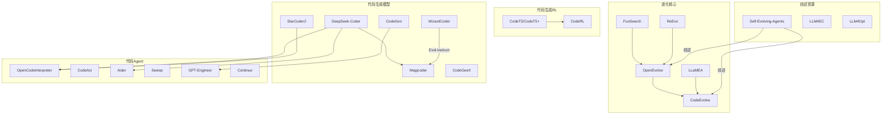

# 代码生成+进化 (Code Generation + Evolution) 项目索引

> 研究方向：LLM 驱动的代码生成、进化优化、自我改进编程系统
> 分析人：Researcher-2
> 日期：2026-05-22
> 项目总数：30

---

## 分类概览

| 类别 | 项目数 | 说明 |
|------|--------|------|
| 进化代码优化 | 6 | LLM+进化算法自动发现/优化代码 |
| 代码生成 RL | 2 | 强化学习驱动的代码生成 |
| 代码生成模型 | 8 | 基础代码 LLM |
| 代码 Agent 工具 | 6 | AI 编程助手/Agent |
| 评测基准 | 3 | 代码生成评测数据集 |
| 综述/资源库 | 5 | 论文索引、综述、工具集合 |

---

## Self Evolve 关联度

| 等级 | 项目 |
|------|------|
| **核心 (HIGH)** | OpenEvolve, CodeEvolve, ReEvo, LLaMEA, FunSearch, WizardCoder, OpenCodeInterpreter, CodeAct, CodeRL, EvoPrompt, Self-Evolving-Agents |
| **相关 (MEDIUM)** | Magicoder, DeepSeek-Coder, CodeT5, CodeContests, Aider, LLM4EC, LLM4Opt, Continue, Sweep, GPT-Engineer |
| **基础 (LOW)** | CodeGen, StarCoder2, Tabby, CodeGeeX, CodeBERT, SQLCoder, LLM_EA, Awesome-Code-LLM, EvoCodeBench |

---

## 项目清单

详细分析见各子文件：

- [01-进化代码优化](./01-evolutionary-code-optimization.md) — OpenEvolve, CodeEvolve, ReEvo, LLaMEA, FunSearch, EvoPrompt
- [02-代码生成RL](./02-code-generation-rl.md) — CodeRL, CodeT5
- [03-代码生成模型](./03-code-generation-models.md) — CodeGen, Magicoder, WizardCoder, DeepSeek-Coder, StarCoder2, CodeGeeX, CodeBERT, SQLCoder
- [04-代码Agent工具](./04-code-agent-tools.md) — OpenCodeInterpreter, CodeAct, Aider, Sweep, GPT-Engineer, Continue
- [05-评测基准](./05-benchmarks.md) — CodeContests/AlphaCode, EvoCodeBench, Tabby
- [06-综述资源](./06-surveys-resources.md) — Self-Evolving-Agents, LLM4EC, LLM4Opt, LLM_EA, Awesome-Code-LLM

---

## Mermaid 关联图谱

