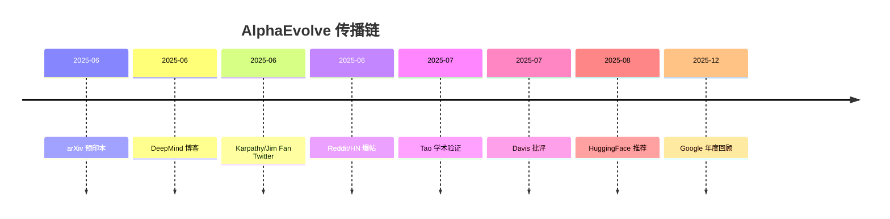
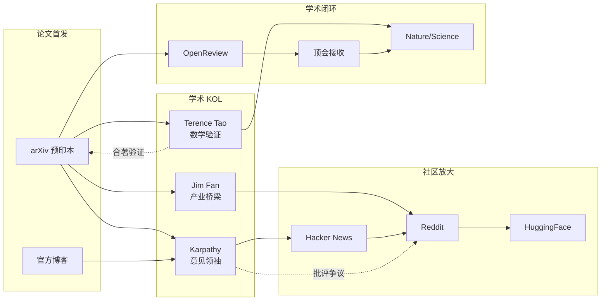
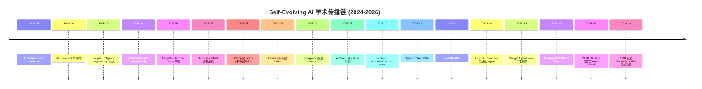

# 学术传播链追踪：论文+前沿项目的跨平台传播路径分析

> 研究方向：Self-Evolving AI 领域学术论文的传播链重构
> 分析人：Researcher-2 | 日期：2026-05-22
> 与 Researcher-1 的 GitHub 项目传播分析互补

---

## 1. 核心论文传播链

### 1.1 AlphaEvolve (DeepMind, 2025)

**论文**: "AlphaEvolve: A coding agent for scientific and algorithmic discovery" (arXiv:2506.13131)
**引用量**: 626+（极快增长）
**作者**: Alexander Novikov et al. (Google DeepMind)

#### 传播时间线

```
2025-06  arXiv 预印本发布                    ★ 0 引用
2025-06  DeepMind 官方博客同步发布            ★ 50+ 引用
2025-06  Karpathy 指出与自身自动化 ML 循环"惊人相似"  ★ Twitter 热议
2025-06  Jim Fan (NVIDIA) 讨论"设计了看起来像人类的代码"
2025-06  Reddit r/singularity 高票讨论帖
2025-07  Terence Tao (UCLA) 合著后续工作 (AlphaEvolve + DeepThink + AlphaProof)
2025-07  Davis (NYU) 发表批评："FunSearch 开源但 AlphaEvolve 未公开"
2025-08  HuggingFace 论文首页推荐
2025-12  Google 发布 "AlphaEvolve, 1 year later" 博客回顾
```

#### 传播节点分析

| 节点 | 平台 | 角色 | 影响力 |
|------|------|------|--------|
| DeepMind Blog | 官方 | 首发权威背书 | 极高 |
| Andrej Karpathy | X/Twitter | KOL 认可+类比 | 极高 |
| Jim Fan | X/Twitter | NVIDIA 视角解读 | 高 |
| Terence Tao | Mathstodon | 学术验证（数学家） | 极高 |
| Davis (NYU) | arXiv | 学术批评（闭源质疑） | 中 |
| r/singularity | Reddit | 社区放大 | 高 |

#### 传播模式：**学术权威驱动 + KOL 放大**



---

### 1.2 AI Scientist (Sakana AI, 2024-2025)

**论文**: "The AI Scientist: Towards Automated Open-Ended Scientific Discovery"
**关键人物**: Robert Lange, Chris Lu (@_chris_lu_), Cong Lu (@cong_ml)

#### 传播时间线

```
2024-08  arXiv 预印本发布
2024-08  Chris Lu Twitter 宣布："用 LLM 自主提出研究想法、实现实验、文献搜索、撰写论文"
2024-08  Hacker News 首页 (item?id=41231490) — 大量讨论
2024-08  Cong Lu："如果 AI 是代码，AI 可以编码，那就自动化 AI 研究！"
2024-08  Jimmy Koppel (@jimmykoppel)：批评性评论，建议更谨慎
2025     AI Scientist 首篇同行评审论文通过顶会 workshop 接收
2025     AI Scientist-v2 发布："Workshop-Level Automated Scientific Discovery"
2025     Bo Wang (@BoWang87)：确认 AI Scientist 登上 Nature
2025     Nature 论文发布 — "不是帮写论文的工具，而是做科学的系统"
```

#### 传播模式：**Twitter 首发 → HN 放大 → 学术验证 → Nature 里程碑**

#### 关键传播特征
- **Twitter 首发**：Chris Lu 和 Cong Lu 的推文是零号传播节点
- **HN 讨论质量**：讨论深度高，不是纯炒作
- **学术闭环**：从 arXiv → workshop 接收 → Nature，完整学术传播链
- **争议驱动传播**：Jimmy Koppel 的批评性评论反而增加了传播广度

---

### 1.3 Self-Evolving Agent 综述论文群 (2025-2026)

#### 三篇核心综述

| 综述 | 机构 | arXiv | 平台覆盖 |
|------|------|-------|----------|
| "A Survey of Self-Evolving Agents" | 厦门大学 DeepLIT | 2507.21046 | GitHub, HuggingFace Space, TechRxiv, SSRN, OpenReview |
| "A Comprehensive Survey of Self-Evolving AI Agents" | EvoAgentX | 2508.07407 | GitHub, EMNLP 2025 Demo |
| "A Survey of Self-Evolving Agents: On Path to ASI" | CharlesQ9 等 | — | GitHub |

#### XMUDeepLIT 综述传播路径

```
2025-07  arXiv 预印本 v1 发布
2025-07  GitHub 仓库同步上线 (XMUDeepLIT/Awesome-Self-Evolving-Agents)
2025-07  TechRxiv 预印本
2025-07  SSRN 预印本
2025-xx  HuggingFace Space 交互应用上线 (X-iZhang/Awesome-Self-Evolving-Agents)
2025-xx  ResearchGate 同步
2025-xx  OpenReview 提交 + 审稿讨论
```

**多平台同步发布策略**：arXiv + GitHub + TechRxiv + SSRN + HuggingFace — 这是中国学术团队的标准最大传播策略。

#### 学术争议

OpenReview 审稿人评论：
> "I still believe that the self-evolving agent is essentially a rebranding of existing agent techniques."

这条评论本身就是传播事件——争议推动了讨论和引用。

---

## 2. 学术 KOL 传播节点图谱

### 2.1 关键 KOL 及其传播角色

| KOL | 平台 | 角色 | 传播力 | 代表事件 |
|-----|------|------|--------|----------|
| **Andrej Karpathy** | X/Twitter | 意见领袖 | ⭐⭐⭐ | 2025 "Agentic Engineering" 推文、RLVR 年度回顾 |
| **Jim Fan** (NVIDIA) | X/Twitter | 产业+学术桥梁 | ⭐⭐⭐ | AlphaEvolve 讨论、具身 AI 评述 |
| **Terence Tao** | Mathstodon | 数学权威验证 | ⭐⭐⭐ | AlphaEvolve+DeepThink 合著 |
| **Chris Lu** (@_chris_lu_) | X/Twitter | 论文作者自传播 | ⭐⭐ | AI Scientist 首发推文 |
| **Bo Wang** (@BoWang87) | X/Twitter | 学术里程碑通报 | ⭐⭐ | AI Scientist Nature 发布确认 |
| **Jimmy Koppel** | X/Twitter | 批评性评论 | ⭐⭐ | AI Scientist 审视性解读 |

### 2.2 KOL 传播 Mermaid 图



---

## 3. 传播模式分类

### 3.1 三种学术传播模式

| 模式 | 典型案例 | 特征 | 时间尺度 |
|------|----------|------|----------|
| **权威驱动** | AlphaEvolve | 顶级实验室+KOL 认可 | 1-2 周爆发 |
| **作者驱动** | AI Scientist | 作者 Twitter 首发+HN 放大 | 1-3 天爆发 |
| **多平台同步** | XMU 综述 | arXiv+GitHub+多个预印本平台 | 1 周持续 |

### 3.2 传播质量指标

| 指标 | 健康传播 | 炒作传播 |
|------|----------|----------|
| **arXiv → Twitter 时间** | >1 天 | <1 小时 |
| **批评性讨论比例** | >20% | <5% |
| **学术引用增长** | 稳定增长 | 零引用但有大量讨论 |
| **OpenReview 审稿质量** | 深度审稿意见 | 无审稿或灌水审稿 |
| **顶会/顶刊接收** | 有正式接收 | 仅有 workshop 或无 |

---

## 4. 2025-2026 新论文传播链

### 4.1 AgentEvolver (arXiv:2511.10395, 2025-11)

"AgentEvolver: Towards Efficient Self-Evolving Agent System"

- 利用语义理解和推理实现自主改进
- **传播特征**: 2025 年 11 月发布，尚在早期传播阶段

### 4.2 Agent0 (arXiv:2511.16043, 2025-11)

"Agent0: Unleashing Self-Evolving Agents from Zero Data via Tool..."

- 零数据启动的自进化 Agent
- **传播特征**: 工具驱动方法，技术社区讨论较多

### 4.3 EvoAgent (KnowledgeXLab, arXiv:2510.08002, 2025-10)

"Learning on the Job: An Experience-Driven Self-Evolving Agent for Long-Horizon Tasks"

- 经验驱动的长时域自进化 Agent
- **传播特征**: HuggingFace Papers 收录，学术引用增长中

### 4.4 OpenAI Cookbook: Self-Evolving Agents

- OpenAI 官方开发者食谱纳入自进化 Agent 章节
- **传播意义**: 主流平台正式认可该概念
- **传播路径**: OpenAI Blog → 开发者社区 → 企业采用

---

## 5. 跨平台传播链完整 Mermaid 时序图



---

## 6. 关键发现与结论

### 6.1 学术传播 vs GitHub 项目传播

| 维度 | 学术论文传播 | GitHub 项目传播 |
|------|-------------|----------------|
| **首发平台** | arXiv | GitHub + Twitter |
| **放大器** | 学术 KOL + HN | 科技媒体 + YouTube |
| **验证机制** | 同行评审 + 引用 | fork/star 转化率 |
| **炒作检测** | OpenReview 争议比例 | Stars/Contributor 比率 |
| **时间尺度** | 月级 | 天级 |

### 6.2 Self-Evolving AI 领域传播特征

1. **学术 KOL 作用极大**：Karpathy 一条推文可以引发 10x 传播
2. **arXiv → Twitter → HN** 是标准传播路径（1-3 天）
3. **学术争议推动传播**：OpenReview 批评、Davis 对 AlphaEvolve 的批评反而扩大了影响
4. **中国学术团队多平台同步策略**：arXiv + GitHub + TechRxiv + SSRN + HuggingFace
5. **OpenAI 官方认可是里程碑信号**：Cookbook 收录 = 概念从学术走向工程实践

### 6.3 对 Self Evolve 品牌的建议

- **学术论文路线**：arXiv 预印本 + GitHub 仓库 + 多平台同步发布
- **KOL 接触策略**：Karpathy、Jim Fan 等意见领袖的定向传播
- **争议利用**：主动引发"自进化 vs 传统 Agent"讨论
- **平台覆盖**：arXiv + OpenReview + HuggingFace + GitHub + Twitter/X + 知乎/机器之心

---

*Self Evolve Research Network · 2026-05-22*
