# Self Evolve Research: Author Network & Collaboration Graph

> Generated: 2026-05-22, Enriched: 2026-05-22 | Coverage: 10+ core papers, 70+ researchers
> Sources: arXiv metadata, Semantic Scholar, Google Scholar, DBLP, institutional pages, background research agents

---

## 0. The Three Foundational Lineages

Self Evolve research draws from **three converging intellectual traditions**:

1. **Evolutionary Computation Lineage**: Stanley → Miikkulainen → Clune → Hu/Lu/Zhang (NEAT → POET → ADAS/DGM)
2. **Language Agent Reasoning Lineage**: Narasimhan → Yao (Princeton NLP: ReAct → Reflexion → ToT → SWE-agent)
3. **LLM Self-Improvement Lineage**: Madaan/Clark/Welleck (CMU/AI2/Google: Self-Refine → RISE → broader self-improvement)

The convergence of these three traditions in 2024-2025 is what defines the Self Evolve field.

---

## 1. Core Researcher Profiles

### 1.1 Jeff Clune (University of Wyoming / formerly UBC)
- **Role**: Professor
- **Affiliation**: University of Wyoming (Clune Lab); formerly UBC, Vector Institute; previously Uber AI Labs
- **Homepage**: https://www.jeffclune.com/
- **DBLP**: https://dblp.org/pid/49/2799 (157 publications)
- **Key contributions**: AI-GAs (2019), POET, Quality Diversity, Open-endedness, OMNI-EPIC
- **Papers in Self Evolve**: ADAS (ICLR 2025), DGM (2025), Intelligent Go-Explore (ICLR 2025), Foundation Model Self-Play (2025)
- **Collaboration pattern**: Senior PI; top collaborators: Joel Lehman (42 papers), Kenneth O. Stanley (41 papers), Risto Miikkulainen
- **Influence**: Pioneer of open-ended AI evolution; his group is the most prolific in agent self-evolution

### 1.2 Shengran Hu (UBC / Vector Institute)
- **Role**: PhD Student (likely)
- **Affiliation**: University of British Columbia, Vector Institute
- **Advisor**: Jeff Clune (inferred)
- **Papers**: ADAS (ICLR 2025), DGM (2025)
- **Pattern**: First author on ADAS, co-author on DGM — rising researcher in the space

### 1.3 Cong Lu (UBC / Vector Institute)
- **Role**: Researcher
- **Affiliation**: University of British Columbia, Vector Institute
- **Papers**: ADAS (ICLR 2025), DGM (2025)
- **Pattern**: Co-author with Clune/Hu group

### 1.4 Wangchunshu Zhou (AIWaves Inc.)
- **Role**: Founder/Lead Researcher
- **Affiliation**: AIWaves Inc.
- **Papers**: Agent Symbolic Learning (NeurIPS 2024)
- **Company**: AIWaves (https://www.aiwaves.cn/) — Agent framework company
- **GitHub**: https://github.com/aiwaves-cn/agents

### 1.5 Ningyu Zhang (Zhejiang University)
- **Role**: Professor/Researcher
- **Affiliation**: Zhejiang University
- **Papers**: Agent Symbolic Learning (NeurIPS 2024)
- **Research area**: Knowledge graphs, NLP, agent systems

### 1.6 Noah Shinn (Northeastern University)
- **Role**: PhD Student
- **Affiliation**: Northeastern University
- **Papers**: Reflexion (NeurIPS 2023)
- **Pattern**: First author on seminal verbal RL paper

### 1.7 Shunyu Yao (OpenAI / formerly Princeton)
- **Role**: Research Scientist (formerly PhD Student)
- **Affiliation**: OpenAI (joined ~2024); formerly Princeton NLP Group
- **Advisor**: Karthik Narasimhan
- **Homepage**: https://www.shunyuyao.com
- **DBLP**: https://dblp.org/search?q=shunyu+yao
- **Papers**: ReAct (7,346 cit), Reflexion (3,452 cit), Tree of Thoughts (3,984 cit), SWE-agent, tau-bench (ICLR 2025), Contextual Experience Replay (ACL 2025), Multi-Objective Evolution of Heuristic Using LLM (AAAI 2025)
- **Pattern**: **Key figure** — authored 3+ seminal agent reasoning papers in one year; bridges agent reasoning and evolutionary methods; also authored evolutionary optimization paper

### 1.8 Karthik Narasimhan (Princeton University)
- **Role**: Assistant Professor
- **Affiliation**: Princeton NLP Group, Department of Computer Science
- **Homepage**: https://www.cs.princeton.edu/~karthikn/
- **DBLP**: https://dblp.org/search?q=karthik+narasimhan
- **Papers**: Co-authored GPT-1 (14,739 cit) with Alec Radford; ReAct, Reflexion, Tree of Thoughts, SWE-bench (2,212 cit), SWE-agent, PAL, tau-bench, Contextual Experience Replay
- **Advisees**: Shunyu Yao (now OpenAI), John Yang, Carlos E. Jimenez
- **Pattern**: **Central network node** — connects virtually every major paper in the language agent ecosystem; advisor thread for the agent reasoning lineage

### 1.9 Aman Madaan (CMU / Google)
- **Role**: Researcher
- **Affiliation**: Carnegie Mellon University / Google
- **Papers**: Self-Refine (NeurIPS 2023)
- **Pattern**: Also works on code generation, self-improvement methods

### 1.10 Peter Clark (Allen Institute for AI)
- **Role**: Senior Researcher
- **Affiliation**: AI2 (Allen Institute for AI)
- **Papers**: Self-Refine (NeurIPS 2023)
- **Pattern**: Leader in reasoning and NLP; AI2 is a major center

### 1.11 Alexander Novikov (Google DeepMind)
- **Role**: Research Scientist
- **Affiliation**: Google DeepMind
- **Papers**: AlphaEvolve (2025)
- **Pattern**: Part of DeepMind's AI-for-science team

### 1.12 Xunjian Yin (Peking University)
- **Role**: PhD Student
- **Affiliation**: Peking University
- **Papers**: Gödel Agent (ACL 2025)
- **Collaborators**: William Yang Wang (UCSB)

### 1.13 William Yang Wang (UCSB)
- **Role**: Associate Professor
- **Affiliation**: UCSB NLP Lab
- **Homepage**: https://www.cs.ucsb.edu/~william/
- **Papers**: Gödel Agent (ACL 2025)
- **Pattern**: Bridge between PKU and UCSB; collaborates with Chinese NLP groups

---

## 1.14 Kenneth O. Stanley (UCF)
- **Role**: Professor (formerly UCF Evolutionary Complexity Research Group)
- **DBLP**: https://dblp.org/pid/s/KennethOStanley (197 publications)
- **Key contributions**: NEAT (7,000+ cit), Novelty Search (3,000+ cit), HyperNEAT, CPPNs, POET, ELM, QDAIF
- **Top collaborators**: Joel Lehman (53 papers), Jeff Clune (41 papers), Risto Miikkulainen (31 papers), Sebastian Risi (24 papers)
- **Pattern**: Foundational figure — his work on NEAT and novelty search directly inspired all evolutionary agent design methods

### 1.15 Risto Miikkulainen (UT Austin)
- **Role**: Professor, Neural Networks Research Group
- **DBLP**: https://dblp.org/pid/m/RistoMiikkulainen (223+ publications, 362 coauthors)
- **Key contributions**: NEAT (co-authored with Stanley), Evolution Strategies at Scale for LLM Fine-Tuning, TerraLingua (open-ended LLM ecologies)
- **Pattern**: Bridge between classical neuroevolution and modern LLM fine-tuning

### 1.16 Joel Lehman
- **Role**: Researcher
- **Key contributions**: Novelty Search (with Stanley), POET, Enhanced POET
- **Collaboration**: 53 joint papers with Stanley, 42 with Clune — the "glue" of the evolutionary AI triangle

### 1.17 Eric Zelikman (Stanford)
- **Role**: PhD/Researcher
- **Affiliation**: Stanford (formerly MIT with Noah D. Goodman)
- **Papers**: STaR (Self-Taught Reasoner, 868 cit), Quiet-STaR (275 cit)
- **Pattern**: Bootstrapping reasoning from self-generated rationales — foundational for self-improvement

### 1.18 Juergen Schmidhuber
- **Role**: Co-author on MetaGPT (ICLR 2024)
- **Pattern**: His Gödel Machine (2003) directly inspired Gödel Agent and DGM; long history in meta-learning and self-referential systems

---

## 2. Institutional Clusters

### 2.1 Clune Lab (University of Wyoming / formerly UBC)
- **PI**: Jeff Clune
- **Members**: Shengran Hu, Cong Lu, Jie (Jenny) Zhang, Robert Tjarko Lange
- **Core contribution**: ADAS (ICLR 2025), DGM (2025), OMNI-EPIC (ICLR 2025), Intelligent Go-Explore (ICLR 2025)
- **Heritage**: Clune came from Uber AI Labs (POET, QD algorithms); collaborates with Stanley/Lehman/Miikkulainen evolutionary triangle

### 2.2 Princeton NLP Group (USA)
- **PI**: Karthik Narasimhan
- **Key members (current/recent)**: Shunyu Yao (now OpenAI), John Yang (PhD), Carlos E. Jimenez, Noah Shinn (collaborator)
- **Core contribution**: ReAct (7,346 cit), Reflexion (3,452 cit), Tree of Thoughts (3,984 cit), SWE-bench (2,212 cit), SWE-agent, tau-bench, Contextual Experience Replay
- **Pattern**: Highest-impact agent reasoning group; GPT-1 co-authorship (Narasimhan + Radford)

### 2.3 AIWaves + Zhejiang University (China)
- **Lead**: Wangchunshu Zhou (AIWaves)
- **Academic partner**: Ningyu Zhang, Huajun Chen (ZJU)
- **Core contribution**: Agent Symbolic Learning — textual backpropagation
- **Pattern**: Industry-academia collaboration

### 2.4 Google DeepMind (UK/USA)
- **Team**: Novikov, Vũ, Eisenberger, Dupont, Kohli
- **Core contribution**: AlphaEvolve, FunSearch — evolutionary coding agents
- **Scale**: Applied to Google infrastructure (data centers, chips, LLM training)

### 2.5 AI2 + CMU + Google (Multi-institution)
- **Key figures**: Aman Madaan (CMU/Google), Peter Clark (AI2)
- **Core contribution**: Self-Refine — iterative self-feedback
- **Pattern**: Distributed collaboration across top institutions

### 2.6 Peking University + UCSB (China/USA)
- **Key figures**: Xunjian Yin (PKU), William Yang Wang (UCSB)
- **Core contribution**: Gödel Agent — self-referential agent framework

### 2.7 UCF + UT Austin Evolutionary Triangle (USA)
- **Key figures**: Kenneth O. Stanley (UCF), Risto Miikkulainen (UT Austin), Joel Lehman
- **Core contribution**: NEAT, Novelty Search, HyperNEAT, ELM, QDAIF, Evolution Strategies at Scale for LLMs
- **Pattern**: Foundational evolutionary computation lineage; Stanley was Miikkulainen's PhD student (NEAT, 2002); Lehman was Stanley's PhD student (Novelty Search, 2011)
- **Connection to Self Evolve**: This triangle is the intellectual foundation for all evolutionary agent design (ADAS, DGM, AlphaEvolve)

### 2.8 Stanford + MIT Self-Improvement (USA)
- **Key figures**: Eric Zelikman (Stanford), Noah D. Goodman (Stanford/MIT), Joshua Tenenbaum (MIT)
- **Core contribution**: STaR, Quiet-STaR, DreamCoder
- **Pattern**: Bootstrapping and self-improvement from self-generated data

### 2.9 Meta FAIR (USA)
- **Key figures**: Jason Weston, Sainbayar Sukhbaatar, Weizhe Yuan
- **Core contribution**: Self-Rewarding Language Models (ICML 2024), Meta-Rewarding (EMNLP 2025)
- **Pattern**: Industrial self-improvement research

### 2.10 Anthropic (USA)
- **Key figures**: Yuntao Bai, Ethan Perez, Chris Olah
- **Core contribution**: Constitutional AI (self-critique, revision, RLAIF)
- **Pattern**: Safety-oriented self-improvement; 51-author paper demonstrates scale of effort

### 2.11 Tsinghua University (China)
- **Key figures**: Chen Qian, Maosong Sun, Zhiyuan Liu
- **Core contribution**: ChatDev (ACL 2024) — multi-agent software development
- **Pattern**: 14 co-authors from Tsinghua NLP

### 2.12 Microsoft Research
- **Key figures**: Qingyun Wu, Gagan Bansal, Jieyu Zhang
- **Core contribution**: AutoGen — multi-agent conversation framework
- **Note**: SelfEvolve paper reports 61.8% improvement over AutoGen baseline

---

## 3. Collaboration Graph (Mermaid)

```mermaid
graph TD
    subgraph CluneLab["Clune Lab (Wyoming/UBC)"]
        JClune["Jeff Clune (PI)"]
        SHu["Shengran Hu"]
        CLu["Cong Lu"]
        JZhang["Jie Zhang"]
    end

    subgraph Princeton["Princeton NLP"]
        KNarasimhan["Karthik Narasimhan (PI)"]
        SYao["Shunyu Yao → OpenAI"]
    end

    subgraph AIWaves["AIWaves + ZJU"]
        WZhou["Wangchunshu Zhou"]
        NZhang["Ningyu Zhang"]
        HChen["Huajun Chen"]
    end

    subgraph DeepMind["Google DeepMind"]
        ANovikov["Alexander Novikov"]
        PKohli["Pushmeet Kohli"]
        ASee["Abigail See"]
    end

    subgraph AI2CMU["AI2 + CMU + Google"]
        AMadaan["Aman Madaan"]
        PClark["Peter Clark"]
        SWelleck["Sean Welleck"]
    end

    subgraph PKU_UCSB["PKU + UCSB"]
        XYin["Xunjian Yin"]
        WWang["William Yang Wang"]
    end

    subgraph NEU["Northeastern + MIT"]
        NShinn["Noah Shinn"]
        FCassano["Federico Cassano"]
    end

    subgraph EC["Evolutionary Computation Lineage"]
        KStanley["Kenneth O. Stanley"]
        RMiikkulainen["Risto Miikkulainen"]
        JLehman["Joel Lehman"]
    end

    subgraph SelfImprove["Self-Improvement Lineage"]
        EZelikman["Eric Zelikman (Stanford)"]
        JWeston["Jason Weston (Meta)"]
    end

    %% EC lineage (foundational)
    RMiikkulainen -->|PhD advisor: NEAT 2002| KStanley
    KStanley -->|PhD advisor: Novelty Search| JLehman
    KStanley -->|41 joint papers| JClune
    JLehman -->|42 joint papers| JClune

    %% ADAS/DGM collaboration
    JClune -->|advisor| SHu
    JClune -->|advisor| CLu
    SHu -->|co-author| CLu
    SHu -->|co-author| JZhang

    %% Princeton chain
    KNarasimhan -->|advisor| SYao
    SYao -->|co-author: ReAct, Reflexion, ToT| KNarasimhan

    %% Cross-institution links
    SYao -->|co-author: Reflexion| NShinn
    NShinn -->|co-author: Reflexion| FCassano
    SYao -->|co-author: Reflexion| KNarasimhan

    %% AIWaves internal
    WZhou -->|co-author| NZhang
    NZhang -->|co-author| HChen

    %% DeepMind internal
    ANovikov -->|co-author| PKohli
    ANovikov -->|co-author| ASee

    %% Self-Refine network
    AMadaan -->|co-author: Self-Refine| PClark
    AMadaan -->|co-author| SWelleck

    %% Gödel Agent
    XYin -->|co-author| WWang

    %% Style
    classDef pi fill:#ff9999,stroke:#333
    classDef student fill:#99ccff,stroke:#333
    classDef company fill:#99ff99,stroke:#333
    classDef lineage fill:#ffcc99,stroke:#333
    class JClune,KNarasimhan,PKohli,PClark,WWang,HChen,KStanley,RMiikkulainen pi
    class SHu,CLu,JZhang,SYao,NShinn,XYin,AMadaan,EZelikman,JLehman student
    class WZhou,ANovikov,JWeston company
```

---

## 4. Advisor-Advisee Relationships (Confirmed)

| Advisor | Advisee | Institution | Evidence |
|---|---|---|---|
| Risto Miikkulainen | Kenneth O. Stanley | UT Austin | NEAT (2002) co-authorship; Stanley's PhD |
| Kenneth O. Stanley | Joel Lehman | UCF | 53 joint publications; Novelty Search co-authorship |
| Jeff Clune | Shengran Hu | Wyoming/UBC | Co-authored ADAS + DGM |
| Jeff Clune | Cong Lu | Wyoming/UBC | Co-authored ADAS + DGM |
| Karthik Narasimhan | Shunyu Yao | Princeton | 8+ co-authored papers |
| Karthik Narasimhan | John Yang | Princeton | SWE-agent, SWE-bench |
| Joshua Tenenbaum | Kevin Ellis | MIT | DreamCoder co-authorship (PLDI 2021) |
| Noah D. Goodman | Eric Zelikman | Stanford/MIT | STaR, Quiet-STaR co-authorship |

---

## 5. Cross-Paper Author Overlap

| Author | Papers | Role |
|---|---|---|
| **Shunyu Yao** | ReAct (7,346 cit), Reflexion (3,452), ToT (3,984), SWE-agent, Multi-Obj Evolution (AAAI'25) | Central figure bridging reasoning + evolution |
| **Karthik Narasimhan** | GPT-1 (14,739 cit), ReAct, Reflexion, ToT, SWE-bench | Network hub; connects to Radford/OpenAI |
| **Shengran Hu** | ADAS, DGM | Evolutionary agent design thread |
| **Cong Lu** | ADAS, DGM | Same thread as Hu |
| **Jeff Clune** | ADAS, DGM, OMNI-EPIC, POET | Senior thread owner |
| **Kenneth O. Stanley** | NEAT, Novelty Search, POET, ELM | Foundational lineage |
| **Aman Madaan** | Self-Refine, PAL, Memory-assisted prompt editing | Self-improvement thread |

---

## 6. Emerging Researchers to Watch

1. **Shengran Hu** (Clune Lab): Leading ADAS → DGM evolution
2. **Shunyu Yao** (now OpenAI): Produced 3 seminal papers + evolutionary optimization work
3. **Wangchunshu Zhou** (AIWaves): Bridging symbolic learning with agent frameworks
4. **Xunjian Yin** (PKU): Self-referential agent approach (Gödel Agent)
5. **Noah Shinn** (Northeastern): Verbal RL pioneer with Reflexion
6. **Eric Zelikman** (Stanford): STaR/Quiet-STaR — bootstrapping reasoning
7. **Jenny Zhang** (Clune Lab): Co-author on DGM, rising in evolutionary agent design

---

## 7. Conference Venues

| Venue | Papers | Year |
|---|---|---|
| **NeurIPS** | Reflexion, Self-Refine, Symbolic Learning, Absolute Zero, ReAct, CAMEL, SWE-agent | 2023-2025 |
| **ICLR** | ADAS, Gödel Agent, MetaGPT, QDAIF, OMNI-EPIC, tau-bench, WebRL | 2024-2025 |
| **ICML** | PAL, Self-Rewarding LMs, SPIN | 2023-2024 |
| **ACL** | Gödel Agent, ChatDev, Contextual Experience Replay | 2024-2025 |
| **Nature** | FunSearch (AlphaEvolve precursor) | 2023 |
| **GECCO** | POET, LLMatic, EC-APR | 2019-2024 |
| **SEAMS** | SelfEvolve | 2026 |
| **AAAI** | Regularized Evolution, Multi-Obj Evolution of Heuristic | 2019-2025 |
| **arXiv** | DGM, AlphaEvolve, RAGEN, RISE, ReVeal, CSE | 2024-2026 |

---

## 8. Key Takeaway

The Self Evolve research landscape is built on **three converging intellectual traditions**:

1. **Evolutionary Computation** (Stanley → Miikkulainen → Clune): NEAT, Novelty Search, Quality Diversity, Open-endedness → ADAS, DGM, AlphaEvolve
2. **Language Agent Reasoning** (Narasimhan → Yao): ReAct, Reflexion, Tree of Thoughts → SWE-agent, Contextual Experience Replay
3. **LLM Self-Improvement** (Madaan/Clark/Welleck, Zelikman/Goodman): Self-Refine, STaR → Self-Rewarding, Meta-Rewarding, Constitutional AI

These three traditions are now converging through shared methods: LLMs serve as intelligent variation operators in evolutionary frameworks, applied to agent architectures expressed as code. The field is early-stage with limited cross-citation between clusters, suggesting significant room for synthesis and new entrants.
