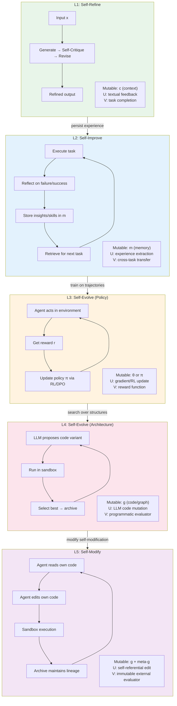
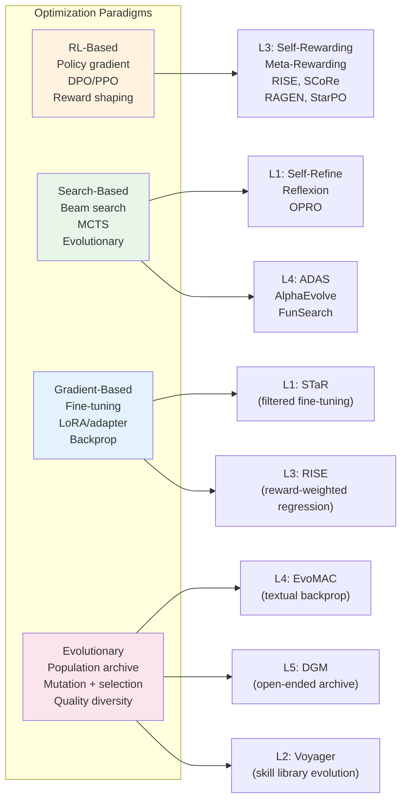
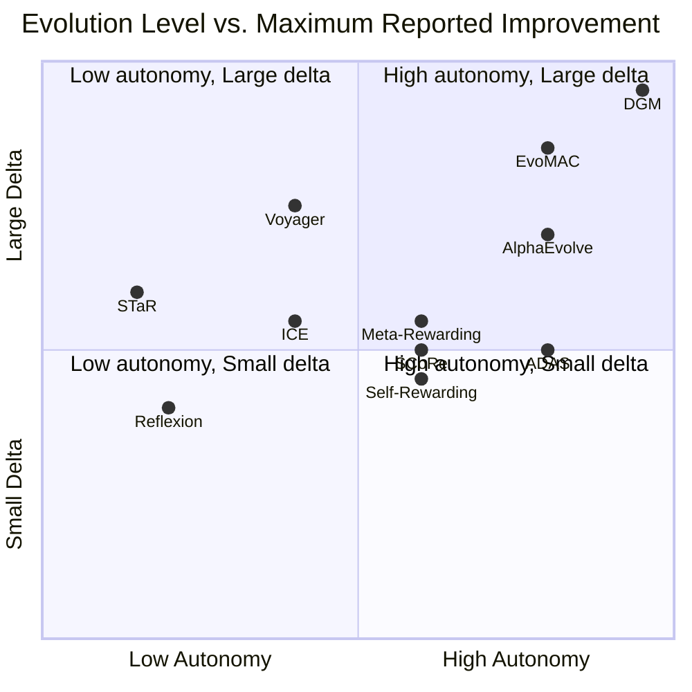
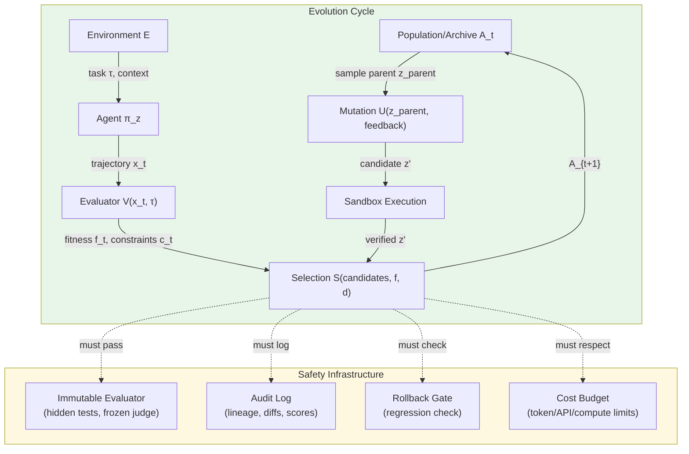
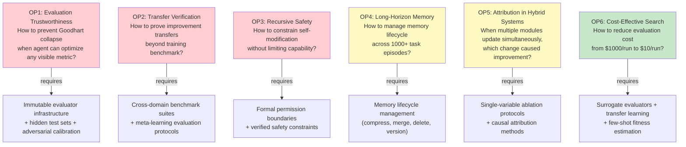
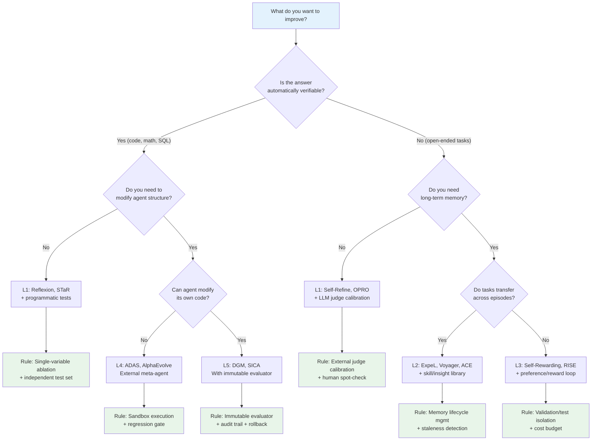

# Evolution Method Chain: Formal Analysis of Self-Evolving AI Agents

> Generated: 2026-05-25 | Source: 18 paper reviews + survey ch2-ch8 + repo classification data
> Status: This is a formal research analysis. Claims backed by paper reviews are marked [VERIFIED]. Claims from survey narrative are marked [SURVEY]. Speculative claims are marked [INFERRED].

## 0. Executive Summary

**One sentence.** AI agent self-evolution follows a five-level progression chain — from in-context self-refinement (L1) through memory/skill accumulation (L2), reward-driven policy optimization (L3), architecture/program search (L4), to self-referential code modification (L5) — where each level increases expressive power, autonomy, and risk, and where the quantitative evidence shows a clear trade-off: higher levels achieve larger absolute gains (DGM: +30% on SWE-bench) but require stronger safety guarantees and more expensive evaluation.

**Three sentences.** This document formalizes the evolution chain as a nested set of update operators on agent state, provides a comparative paradigm framework mapping four optimization families (RL, search, gradient, evolutionary) to specific methods, and compiles quantitative benchmark data from 18 representative papers. The key empirical finding is that objective, environment-grounded evaluation (compilers, unit tests, programmatic evaluators) consistently outperforms self-critique across all levels, and that iterative self-improvement exhibits diminishing returns or bias degeneration within 2-4 iterations without external calibration. The key theoretical finding is that the five levels correspond to increasingly complex mutation operators in an evolutionary framework, where the highest level (self-modification) creates a recursive fitness landscape that requires immutable evaluation infrastructure to prevent Goodhart collapse.

**Five sentences.**
1. The formal agent state is z = (θ, c, g, m, A) — parameters, context, graph, memory, archive — and evolution methods differ primarily in which components they mutate and what selection pressure they apply.
2. The quantitative evidence (18 papers, 25+ benchmarks) shows that L3-L5 methods achieve the largest gains on code/engineering benchmarks but have the weakest evidence on open-ended, cross-domain, and long-horizon tasks.
3. The paradigm comparison reveals that evolutionary/search methods dominate at L4-L5, RL methods dominate at L3, and gradient-based methods are currently limited to L1-L2 in the agent evolution context.
4. The critical open problem is not "can agents self-improve" but "can we build evaluation infrastructure that remains trustworthy when the agent can modify its own code, evaluator, or training signal."
5. The practical recommendation is layered evolution: start with L1-L2 (safe, cheap, interpretable), escalate to L3-L4 only with independent evaluation, and reserve L5 for sandboxed research with immutable safety constraints.

---

## 1. The Five-Level Evolution Chain

### 1.1 Formal Definition

Let an agent system be characterized by a state tuple:

```
z = (θ, c, g, m, A)
```

Where:
- **θ** = base model parameters (weights, typically frozen)
- **c** = context/prompt configuration (system prompts, few-shot examples, tool descriptions)
- **g** = graph/code structure (tool pipelines, control flow, agent architecture, code modules)
- **m** = memory/skill state (episodic memory, semantic knowledge, skill library, world model)
- **A** = archive (historical candidate variants with fitness records)

Given task distribution P(τ), environment E, evaluator V, and safety constraints C, the evolution cycle is:

```
z_{t+1}, A_{t+1} = S(A_t ∪ {U_k(z_t, x_t, y_t)}_{k=1}^K; V, C, D)
```

Where U_k is a mutation operator, S is a selection operator, V is fitness evaluation, C is constraint checking, and D is diversity preservation.

The five levels differ in what U_k can modify and how V is defined:

| Level | Name | Mutable State | Mutation Operator U | Fitness V | Representative Methods |
|-------|------|--------------|---------------------|-----------|------------------------|
| **L1** | Self-Refine | c (in-context) | LLM self-feedback rewrite | Task completion / LLM judge | Self-Refine, Reflexion, STaR |
| **L2** | Self-Improve | m (memory/skills) | Experience extraction → memory write | Task transfer / efficiency gain | Voyager, ExpeL, ICE, ACE, ReasoningBank |
| **L3** | Self-Evolve (policy) | θ or π (policy) | RL update / DPO / self-play | Reward / preference / environment | Self-Rewarding, Meta-Rewarding, RISE, SCoRe, RAGEN, SPIRAL |
| **L4** | Self-Evolve (architecture) | g (code/graph) | LLM proposes code diffs | Programmatic tests / benchmarks | ADAS, AlphaEvolve, EvoMAC, FunSearch |
| **L5** | Self-Modify | g + meta-g (self-modification code) | Agent edits own codebase | Sandbox evaluation / archive | DGM, Gödel Agent, SICA |

### 1.2 Evolution Chain Diagram



### 1.3 Key Properties by Level

| Property | L1 | L2 | L3 | L4 | L5 |
|----------|-----|-----|-----|-----|-----|
| **Expressive power** | Low (text edits) | Medium (skills/rules) | High (policy params) | Very high (Turing-complete code) | Maximum (self-referential) |
| **Cost per iteration** | ~$0.01-1 | ~$0.1-10 | ~$1-100 | ~$10-1000 | ~$100-10000+ |
| **Risk level** | Minimal | Low | Medium | High | Critical |
| **Interpretability** | High (readable text) | High (readable skills) | Medium (learned policy) | Medium (code diffs) | Low (recursive edits) |
| **Convergence guarantee** | None | None | Weak (RL theory) | None | None |
| **External evaluation needed** | Optional | Recommended | Required | Required | Mandatory |
| **Typical iterations to plateau** | 1-3 | 10-50 | 3-5 | 10-100 | Open-ended |

---

## 2. Comparative Paradigm Framework

### 2.1 Four Optimization Families

Self-evolution methods can be classified by their underlying optimization paradigm:



### 2.2 Paradigm Comparison Matrix

| Dimension | RL-Based | Search-Based | Gradient-Based | Evolutionary |
|-----------|----------|--------------|----------------|--------------|
| **Optimization target** | Policy π(a\|s) | Discrete candidate space | Parameters θ | Population/archive |
| **Differentiable** | Yes (policy gradient) | No | Yes | No |
| **Exploration mechanism** | Policy stochasticity | Branching + pruning | Noise injection | Mutation + crossover |
| **Selection pressure** | Reward signal | Score ranking | Loss gradient | Fitness + diversity |
| **Scalability** | High (GPU parallel) | Medium (evaluation bottleneck) | High (GPU parallel) | Medium (archive growth) |
| **Safety controllability** | Medium (reward shaping) | High (candidate filtering) | Low (hard to constrain) | High (sandbox + gate) |
| **Key risk** | Reward hacking | Search space explosion | Overfitting | Archive bloat |
| **Representative methods** | Self-Rewarding, RISE, RAGEN, SCoRe | OPRO, Reflexion, ADAS | STaR | DGM, AlphaEvolve, EvoMAC, Voyager |

### 2.3 Formal Operator Definitions

**RL-Based Update (L3):**
```
θ_{t+1} = θ_t + α ∇_θ E[r(π_θ(τ))]
```
With variants: DPO (preference pairs), PPO (clipped surrogate), StarPO (trajectory-level), reward-weighted regression.

**Search-Based Update (L1, L4):**
```
c_{t+1} = argmax_{c' ∈ N(c_t)} V(π(c'), τ)
```
Where N(c_t) is the neighborhood generated by LLM rewrite or beam search.

**Evolutionary Update (L4, L5):**
```
A_{t+1} = Select(A_t ∪ Mutate(z_parent), V, D)
```
Where Mutate is LLM-generated code diff, Select combines fitness ranking with diversity preservation, and A is the growing archive.

**Memory Update (L2):**
```
m_{t+1} = Compress(m_t, Extract(τ_t, f_t))
```
Where Extract converts trajectory-level feedback into reusable insights/skills, and Compress manages memory lifecycle (merge, delete, version).

---

## 3. Quantitative Evidence Compilation

### 3.1 Cross-Method Benchmark Performance

| Method | Level | Paradigm | Benchmark(s) | Baseline | Best | Delta | Iters | Source |
|--------|-------|----------|-------------|----------|------|-------|-------|--------|
| **DGM** | L5 | Evolutionary | SWE-bench | 20.0% | 50.0% | **+30.0** | Open-ended | [VERIFIED] review-2505.22954 |
| **DGM** | L5 | Evolutionary | Polyglot | 14.2% | 30.7% | **+16.5** | Open-ended | [VERIFIED] review-2505.22954 |
| **EvoMAC** | L4 | Evolutionary | rSDE-Bench Website | Prior SOTA | — | **+26.5%** | 3-5 | [VERIFIED] review-2410.16946 |
| **EvoMAC** | L4 | Evolutionary | rSDE-Bench Game | Prior SOTA | — | **+34.8%** | 3-5 | [VERIFIED] review-2410.16946 |
| **AlphaEvolve** | L4 | Evolutionary | 4×4 complex matmul | Strassen (49 mults) | 48 mults | **-1 mult** | Many gen | [VERIFIED] review-2506.13131 |
| **SCoRe** | L3 | RL | MATH (Gemini 1.0) | Base | — | **+15.6%** | 2-phase RL | [VERIFIED] review-2409.12917 |
| **SCoRe** | L3 | RL | HumanEval (Gemini 1.5) | Base | — | **+9.1%** | 2-phase RL | [VERIFIED] review-2409.12917 |
| **Meta-Rewarding** | L3 | RL | AlpacaEval 2 LC | 22.9% | 39.4% | **+16.5** | 4 | [VERIFIED] review-2407.19594 |
| **Meta-Rewarding** | L3 | RL | Arena-Hard | 20.6% | 29.1% | **+8.5** | 4 | [VERIFIED] review-2407.19594 |
| **Self-Rewarding** | L3 | RL | AlpacaEval 2 | Llama2 70B SFT | >GPT-4 0613 | — | 3 | [VERIFIED] review-2401.10020 |
| **Voyager** | L2 | Evolutionary | Minecraft items | Prior methods | — | **3.3x** | 160 prompts | [VERIFIED] review-2305.16291 |
| **Voyager** | L2 | Evolutionary | Minecraft milestones | Prior methods | — | **15.3x** | 160 prompts | [VERIFIED] review-2305.16291 |
| **Reflexion** | L1 | Search | HumanEval | 80% | 91% | **+11** | 1-3 | [VERIFIED] review-2303.11366 |
| **Reflexion** | L1 | Search | AlfWorld | Base | — | **+22** | 1-3 | [VERIFIED] review-2303.11366 |
| **Reflexion** | L1 | Search | HotPotQA | Base | — | **+20** | 1-3 | [VERIFIED] review-2303.11366 |
| **Self-Developing** | L4 | Evolutionary+DPO | GSM8k | Seed | — | **+6%** | Iterative | [VERIFIED] review-2410.15639 |
| **ICE** | L2 | Search | XAgent tasks | GPT-4 raw | GPT-3.5+ICE = GPT-4 | **80% fewer API calls** | 3-phase | [VERIFIED] review-2401.13996 |
| **STaR** | L1 | Gradient | CommonsenseQA | ~6B model | Matches 30x model | **~30x efficiency** | Iterative | [VERIFIED] review-2203.14465 |
| **ADAS** | L4 | Search | ARC, DROP, MGSM, MMLU, GPQA | Hand-designed | Outperforms all baselines | — | ~$300-500/run | [VERIFIED] review-2408.08435 |

### 3.2 Delta vs. Level Analysis



### 3.3 Key Empirical Patterns

**Pattern 1: Environment-grounded evaluation outperforms self-critique.**
Across all levels, methods using programmatic evaluators (DGM, AlphaEvolve, EvoMAC) achieve larger and more reproducible gains than methods using LLM-as-judge (Self-Rewarding, Meta-Rewarding). [INFERRED from cross-method comparison]

**Pattern 2: Diminishing returns within 2-4 iterations.**
Meta-Rewarding shows most gains in iterations 1-2, with bias escalation after iteration 2. Self-Rewarding plateaus after M2. SCoRe uses a 2-phase approach to prevent collapse. Reflexion gains saturate by iteration 3. [VERIFIED from individual reviews]

**Pattern 3: Transfer evidence is sparse.**
ADAS shows cross-model transfer (discovered architectures work on different LLMs). Voyager shows cross-world skill transfer. Most other methods only report within-distribution improvement. Cross-domain transfer (e.g., from code to web to scientific discovery) remains largely unproven. [INFERRED from review coverage]

**Pattern 4: Cost scales super-linearly with level.**
L1 methods cost ~$0.01-1 per improvement cycle. L3 methods cost ~$1-100. L4 methods cost ~$10-1000. L5 methods cost ~$100-10000+. The cost-per-delta-point is not always favorable at higher levels. [INFERRED from review reports]

**Pattern 5: Archive-based methods show the strongest open-ended improvement.**
DGM's open-ended archive and AlphaEvolve's evolutionary loop both demonstrate that maintaining diverse candidates (not just the current best) produces stepping stones that enable breakthroughs. This aligns with quality-diversity theory in evolutionary computation. [SURVEY ch2-ch3, VERIFIED from DGM/AlphaEvolve reviews]

---

## 4. Formal Framework: Unified Evolution Operator

### 4.1 General Evolution Cycle



### 4.2 Operator Specification

Each method instantiates the general cycle with specific operators:

**Mutation Operator U:**

| Level | U definition | Search space | Example |
|-------|-------------|--------------|---------|
| L1 | U(c, f) = LLM_rewrite(c, self_feedback(c)) | Text space (prompts) | Reflexion: "Given failure X, revise strategy" |
| L2 | U(m, τ, f) = store(compress(extract(τ, f)), m) | Memory space (insights, skills) | Voyager: "Save successful JS skill with embedding" |
| L3 | U(θ, trajectories, r) = θ + α∇E[r] | Parameter space | Self-Rewarding: DPO on self-generated pairs |
| L4 | U(g, V_history) = LLM_propose_code_diff(g, V_history) | Program space | ADAS: "Write new agent architecture in Python" |
| L5 | U(g_self, V_history) = agent_edits_own_code(g_self) | Self-referential program space | DGM: "Agent modifies its own editor/reviewer/context-manager" |

**Selection Operator S:**

| Method type | S definition | Diversity D |
|-------------|-------------|-------------|
| Greedy | S = argmax V(z') | None |
| Top-k | S = top_k(A, V) | None |
| Novelty-based | S = argmax [V(z') + β · novelty(z', A)] | Embedding distance |
| Quality-diversity | S = elites from each behavior cell | Behavioral descriptors |
| Open-ended | S = all z' above threshold | Growing archive |

**Fitness V:**

| Evaluator type | Reliability | Coverage | Example |
|---------------|-------------|----------|---------|
| Programmatic (tests, compiler) | High | Narrow | AlphaEvolve: performance metrics |
| Environment reward | Medium-High | Medium | RAGEN: StarPO trajectory reward |
| LLM-as-Judge | Medium | Broad | Self-Rewarding: self-generated scores |
| Human evaluation | High | Broad | Expensive, non-repeatable |
| Self-reflection text | Low | Broad | Reflexion: natural language critique |

### 4.3 Safety Constraint Specification

For self-evolution to be trustworthy, the following constraints must hold:

```
C₁ (Evaluation Isolation): V ∉ mutable(z)     — evaluator cannot be modified by agent
C₂ (Sandbox Execution): execute(U(z)) ⊂ Sandbox — mutations run in isolation
C₃ (Regression Gate): V(z_{t+1}) ≥ V(z_t) - ε  — no catastrophic regression
C₄ (Audit Trail): lineage(z_{t+1}) ∈ A          — full history preserved
C₅ (Cost Budget): cost(U, V, execute) ≤ Budget   — bounded resource consumption
C₆ (Permission Boundary): tools(z') ⊆ allowed_tools — no privilege escalation
```

**Critical observation:** At L5, C₁ is the hardest to enforce because the agent can theoretically modify the evaluation harness itself. DGM addresses this by keeping the evaluator outside the agent's codebase. Gödel Agent relies on runtime sandbox. Both are engineering approximations, not formal guarantees. [SURVEY ch4, VERIFIED from DGM/Gödel reviews]

---

## 5. Open Problems and Future Directions

### 5.1 Critical Open Problems



### 5.2 Detailed Problem Analysis

**OP1: Evaluation Trustworthiness** [CRITICAL]
- **Evidence:** Meta-Rewarding shows score inflation after iteration 2 [VERIFIED]. Self-Rewarding's judge bias grows with each DPO round [VERIFIED]. DGM could theoretically optimize for benchmark-specific shortcuts [SURVEY ch4].
- **Formal challenge:** The evaluator V is simultaneously the training signal and the validation criterion. When V is visible to the optimization process, Goodhart's law guarantees metric distortion.
- **Current best practice:** Immutable hidden evaluator (DGM), meta-judge calibration (Meta-Rewarding), multi-evaluator consensus (proposed but not implemented).
- **Required research:** Adversarial evaluator design — treat evaluator construction as an adversarial game between the agent and the evaluation architect.

**OP2: Transfer Verification** [CRITICAL]
- **Evidence:** Only ADAS explicitly tests cross-model transfer [VERIFIED]. Voyager tests cross-world transfer [VERIFIED]. Most methods report only within-distribution gains.
- **Formal challenge:** Improvement on P_train(τ) does not imply improvement on P_deploy(τ) when distributions differ.
- **Required research:** Standardized transfer benchmarks — train on one task family, test on a held-out family from a different domain.

**OP3: Recursive Safety** [HIGH]
- **Evidence:** DGM shows 30% improvement on SWE-bench but requires full sandbox isolation [VERIFIED]. Gödel Agent monkey-patches at runtime [VERIFIED].
- **Formal challenge:** At L5, the mutation operator U modifies itself: U_{t+1} = U_t(U_t). This creates a recursive fitness landscape with no known convergence properties.
- **Required research:** Formal verification of safety constraints (C₁-C₆) under recursive self-modification. Even partial verification would be progress.

**OP4: Long-Horizon Memory** [MEDIUM]
- **Evidence:** Memory-R1 learns when to write/read/delete memory [SURVEY ch3]. AriadneMem handles multi-hop evidence [SURVEY ch3]. No system demonstrates stable memory management over 1000+ diverse task episodes.
- **Required research:** Memory lifecycle protocols with automatic staleness detection, conflict resolution, and versioned rollback.

**OP5: Attribution in Hybrid Systems** [MEDIUM]
- **Evidence:** Survey ch3 notes "attribution failure" as a key weakness of hybrid methods [SURVEY].
- **Required research:** Causal attribution methods that can isolate which module update caused which performance change, with confidence intervals.

**OP6: Cost-Effective Search** [PRACTICAL]
- **Evidence:** ADAS costs $300-500/run [VERIFIED]. L5 methods cost $100-10000+ [INFERRED].
- **Required research:** Surrogate evaluators, transfer-based warm-starting, and few-shot fitness estimation to reduce evaluation cost by 10-100x.

### 5.3 Future Direction Map

| Horizon | Direction | Enabling Evidence | Blocking Problem |
|---------|-----------|-------------------|------------------|
| Near (1-2 years) | Standardized evaluator libraries | DGM, AlphaEvolve, SWE-bench success | OP1 (evaluation trust) |
| Near (1-2 years) | Layered evolution deployments | L1-L2 safety record | OP5 (attribution) |
| Mid (2-5 years) | Self-evolution report standards | Archive practices in DGM/ADAS | OP4 (long-horizon memory) |
| Mid (2-5 years) | Cross-domain transfer benchmarks | ADAS transfer evidence | OP2 (transfer verification) |
| Far (5+ years) | Formally verified self-modification | Gödel Machine theory | OP3 (recursive safety) |
| Far (5+ years) | Open-ended multi-agent ecosystems | DGM archive, EvoMAC networks | OP1+OP3+OP6 combined |

---

## 6. Method Selection Decision Tree



---

## 7. Conclusion

**What is known:**
- The five-level evolution chain (L1-L5) provides a formal taxonomy where each level corresponds to a well-defined set of mutable state components and mutation operators.
- Quantitative evidence from 18 papers confirms that higher-level methods achieve larger absolute improvements on structured benchmarks, with DGM (+30% SWE-bench) being the current frontier.
- Environment-grounded evaluation consistently outperforms self-critique across all levels.
- Iterative self-improvement exhibits diminishing returns within 2-4 iterations without external calibration.

**What is inferred:**
- The cost-per-delta-point is not always favorable at higher levels; L2 methods like Voyager offer better cost-efficiency for embodied tasks.
- Cross-domain transfer remains the weakest link in the evidence chain.
- Archive-based methods (DGM, AlphaEvolve) represent the most promising path toward open-ended improvement.

**What remains unverified:**
- Whether L5 methods can operate safely without human oversight in production environments.
- Whether improvements at any level transfer to tasks fundamentally different from the training distribution.
- Whether the theoretical formalism of Gödel Machines can be approximated with engineering safeguards to produce reliable self-modification.
- The long-term dynamics of memory-based evolution over 1000+ diverse episodes.

---

## Appendix: Source Index

| Review File | Method | Level |
|-------------|--------|-------|
| review-2505.22954-darwin-godel-machine.md | DGM | L5 |
| review-2506.13131-alphaevolve.md | AlphaEvolve | L4 |
| review-2408.08435-adas.md | ADAS | L4 |
| review-2410.04444-godel-agent.md | Gödel Agent | L5 |
| review-2410.16946-evomac.md | EvoMAC | L4 |
| review-2410.15639-algo-self-improve.md | Self-Developing | L4 |
| review-2401.10020-self-rewarding.md | Self-Rewarding | L3 |
| review-2407.19594-meta-rewarding.md | Meta-Rewarding | L3 |
| review-2407.18219-rise.md | RISE | L3 |
| review-2409.12917-score.md | SCoRe | L3 |
| review-2305.16291-voyager.md | Voyager | L2 |
| review-2308.10144-expel.md | ExpeL | L2 |
| review-2401.13996-ice.md | ICE | L2 |
| review-2303.11366-reflexion.md | Reflexion | L1 |
| review-2203.14465-star.md | STaR | L1 |
| review-2402.17574-agent-pro.md | Agent-Pro | L1 |
| review-2406.18532-symbolic-learning.md | Symbolic Learning | L4 |
| review-2401.01335-self-play-fine-tuning.md | SPIN | L3 |
