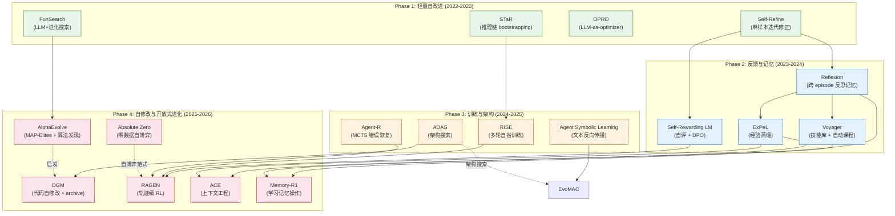
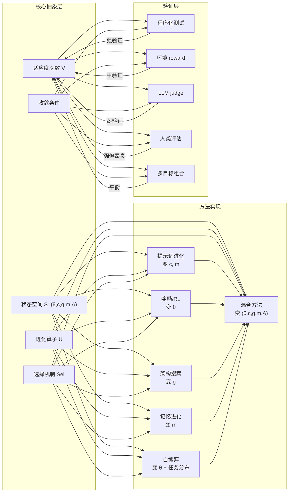
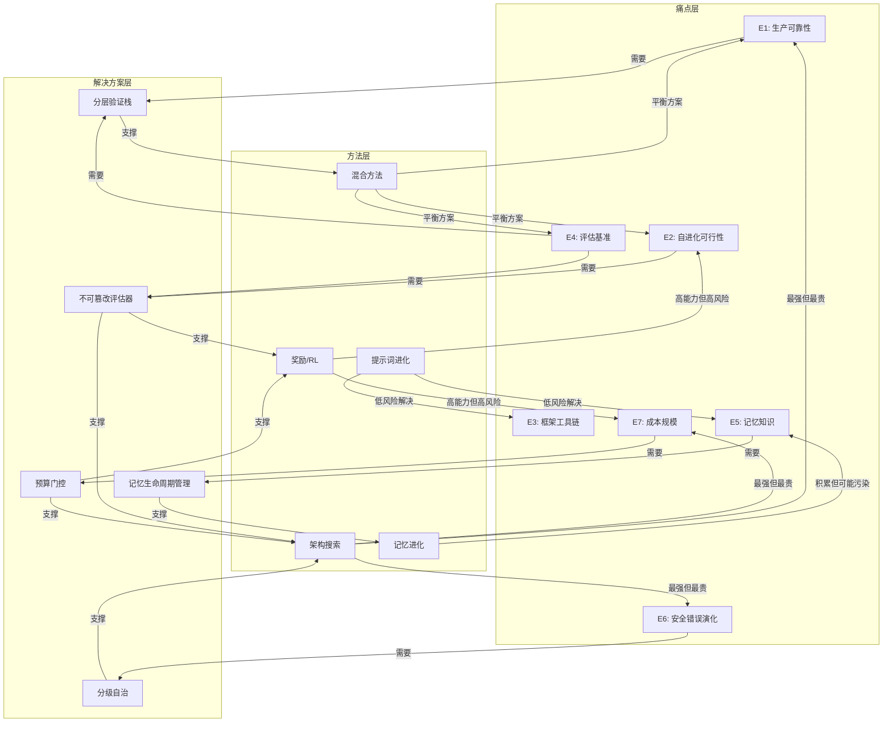

# Agent Evolution 形式化框架：共性抽象、痛点分类与判断体系

> **一句话**：从 196 篇分类论文、97 个用户痛点和 11 篇深度 review 中提取共性，构建统一的形式化框架，让读者判断哪种进化方法适合什么场景。

> **证据层级**：本文件所有断言均引用自 `survey/` 章节、`research/papers/` review 和 `raw-social/mom-test/mom-test-findings-ZH.md`。推断与已知事实已区分标注。

---

## 目录

1. [共性模式提取](#1-共性模式提取)
2. [统一形式化框架](#2-统一形式化框架)
3. [痛点分类学](#3-痛点分类学)
4. [判断与排序框架](#4-判断与排序框架)
5. [方法依赖与演进 DAG](#5-方法依赖与演进-dag)
6. [已知、推断与未验证](#6-已知推断与未验证)

---

## 1. 共性模式提取

### 1.1 五大跨论文共性模式

从 11 篇深度 review（Agent Symbolic Learning, DGM, Gödel Agent, ADAS, Reflexion, Absolute Zero, AlphaEvolve, RAGEN, SelfEvolve, ReVeal, AI Scientist）和 `survey/ch3-methods-cn.md` 的六类方法分类中，提取出五个稳定共性。

#### 模式 P1：代码作为通用可变异表征

**已知事实**：196 篇分类论文中 28 篇（14.3%）直接归入 code/self-modification 类（`survey/figures/method-taxonomy-mermaid.md`）。DGM 和 Gödel Agent 直接修改 Python 源代码；ADAS 用 Python 编写 agent 架构；AlphaEvolve 搜索算法程序；SelfEvolve 和 ReVeal 迭代生成代码；Agent Symbolic Learning 将 agent 组件编码为可组合的文本节点图。即便在 RL 方法（Absolute Zero, RAGEN）中，操作对象也是代码生成能力。

**形式化含义**：代码是 Agent Evolution 领域的"DNA"。它的三个性质使它成为理想的可变异表征：(1) 可组合——模块可自由拼接；(2) 可执行——修改效果可自动验证；(3) 可解释——人类可审查 diff。

#### 模式 P2：评估-变异-验证循环

**已知事实**：全部 11 篇 review 论文均实现某种形式的"执行→反馈→修改"三阶段循环。DGM 用进化 archive；Reflexion 用语言反思存入记忆；Absolute Zero 用代码执行器验证；Agent Symbolic Learning 用文本反向传播。循环结构相同，变异和验证机制不同。

**形式化含义**：这是 Agent Evolution 的 de facto 标准架构。任何自进化系统都可分解为 E(执行)→M(变异)→V(验证) 三相循环。

#### 模式 P3：LLM 作为变异算子

**已知事实**：11 篇论文中 9 篇以 LLM 作为主要变异机制——无论是"语言梯度"（Agent Symbolic Learning）、"monkey patch"（Gödel Agent）、"meta agent 设计"（ADAS）、"自反思"（Reflexion）还是"变异/交叉"（AlphaEvolve, DGM）。只有 Absolute Zero 和 RAGEN 使用 RL 梯度更新权重，但它们仍依赖 LLM 生成的轨迹作为操作基底。

**推断**：LLM 已替代传统遗传算子（随机翻转、均匀交叉）成为 Agent Evolution 的核心变异引擎。这是该领域与传统进化计算的关键区别。

#### 模式 P4：验证瓶颈

**已知事实**：几乎所有论文都将"可靠评估信号"标记为关键依赖和局限。AlphaEvolve 和 Absolute Zero 依赖可执行验证器。Reflexion 需要二元奖励。SelfEvolve 依赖测试用例执行。AI Scientist 使用 LLM 评审——但 review 明确指出其不可靠。成就最大的系统（AlphaEvolve, Absolute Zero）运行在具有干净自动验证的领域（数学、代码执行）。

**推断**：验证器的质量是 Agent Evolution 系统能力的理论上限。没有验证器的领域（开放式研究、用户体验优化、企业流程）是当前最大的未满足需求。

#### 模式 P5：规模-成本-无保证三重困境

**已知事实**：四个局限在所有论文中几乎完全相同地重现：(1) 计算开销——每篇论文都需要多次 LLM 调用或 RL 步骤；(2) 基础模型依赖——进化质量受底层 LLM 能力天花板约束；(3) 无理论收敛保证——没有形式化证明说明优化过程必然收敛；(4) 自修改安全——DGM、Gödel Agent、ADAS 均标记自修改代码的风险但未系统解决。

### 1.2 共用进化策略频率

| 进化策略 | 代表论文 | 出现频率（11 篇 review） | 占比 |
|---|---|---:|---:|
| 迭代自我修正循环 | Self-Refine, Reflexion, SelfEvolve, ReVeal | 9/11 | 82% |
| LLM-as-mutator（生成变体） | ADAS, DGM, AlphaEvolve, Gödel Agent | 9/11 | 82% |
| Archive/记忆保留 | DGM, Voyager, Reflexion, ExPeL, ReasoningBank | 7/11 | 64% |
| 程序化验证器 | AlphaEvolve, Absolute Zero, SelfEvolve, ReVeal | 5/11 | 45% |
| 自博弈/自课程 | Absolute Zero, SPIRAL, Self-Challenging | 3/11 | 27% |
| RL 策略更新 | RAGEN, Absolute Zero, ReVeal | 3/11 | 27% |
| 跨域迁移测试 | ADAS, DGM, Voyager | 3/11 | 27% |

### 1.3 共用评估方法频率

| 评估方法 | 代表基准 | 出现频率 |
|---|---|---:|
| 代码基准（SWE-Bench, HumanEval, MBPP） | DGM, SICA, Reflexion, SelfEvolve | 6/11 |
| 推理基准（GSM8K, MATH, ARC） | STaR, RISE, Absolute Zero | 5/11 |
| 环境交互（ALFWorld, WebShop, Minecraft） | Voyager, ExPeL, WebEvolver | 3/11 |
| LLM-as-judge | AI Scientist, Agent Symbolic Learning | 2/11 |
| 自动程序化验证器 | AlphaEvolve, Absolute Zero | 2/11 |

### 1.4 共用失败模式

| 失败模式 | 受影响方法族 | 来源 |
|---|---|---|
| Reward hacking / Goodhart | 奖励类、自奖励类 | survey/ch7 §7.4, P022/P067/P075 |
| 记忆污染 / 过期 / 检索噪声 | 记忆类、反思类 | survey/ch7 §7.2, P015/P064/P068 |
| 循环漂移 / 无收敛保证 | 反思类、进化类 | survey/ch3 §3.8, survey/ch2 §2.4 |
| 框架抽象掩盖调试 | 工程实践 | survey/ch7 §7.3, P004/P012/P050 |
| 评估器退化 / bias escalation | 自奖励类、LLM judge | survey/ch5 §5.3.2 |
| 计算成本不可控 | 所有方法 | survey/ch7 §7.5, P006/P020/P070 |

---

## 2. 统一形式化框架

### 2.1 核心抽象

基于 `survey/ch2-theory-cn.md` 的形式化基础，定义 Agent Evolution 的核心概念。

#### 2.1.1 智能体状态空间

**定义 S（Agent State）**：一个智能体的完整状态可分解为五元组：

```
S = (θ, c, g, m, A)
```

其中：
- **θ**（模型参数）：基础模型或可训练参数。可变范围：冻结 / LoRA / 全量更新。
- **c**（上下文与提示词）：系统提示、工具说明、few-shot examples、planner/critic 模板。可变范围：人工编辑 / 自动更新 / 进化搜索。
- **g**（工具、代码与控制流图）：工具集、代码模块、workflow graph、多智能体拓扑。可变范围：固定 / 工具添加 / 代码自修改 / 架构搜索。
- **m**（记忆、技能与经验）：情景记忆、语义记忆、程序性记忆、世界模型、技能库。可变范围：空 / 自由文本 / 结构化 / 可版本化。
- **A**（Archive / 候选集合）：历史变体、谱系、评估记录、失败候选。可变范围：空 / 单保留最优 / 多样性保留 / 全量。

**各方法的 S 映射表**：

| 方法 | θ | c | g | m | A |
|---|---|---|---|---|---|
| Self-Refine | 冻结 | 单次迭代内变化 | 固定 | 空 | 空 |
| Reflexion | 冻结 | 随记忆增长 | 固定 | 反思文本 | 空 |
| ExPeL/ACE | 冻结 | 动态更新 | 固定 | insights + 策略库 | 空 |
| Self-Rewarding LM | DPO更新 | 固定 | 固定 | 空 | 空 |
| RAGEN | RL更新 | 固定 | 固定 | 空 | 空 |
| ADAS | 冻结 | 随设计变化 | Python架构代码 | 空 | 设计archive |
| DGM | 冻结 | 随变体变化 | 自修改代码 | 空 | 变体archive |
| Gödel Agent | 冻结 | 动态 | runtime monkey patch | 空 | 空 |
| AlphaEvolve | 冻结 | 固定 | 算法代码 | 空 | MAP-Elites archive |
| Absolute Zero | RL更新 | 固定 | 固定 | 空 | 空 |
| Voyager | 冻结 | 动态更新 | 固定 | 技能库 | 空 |

#### 2.1.2 进化算子

**定义 U（Update Operator）**：状态转换函数。

```
S' = U(S, τ, f, E)
```

其中 τ 是执行轨迹，f 是反馈信号，E 是环境。

| 算子类型 | 形式 | 代表方法 |
|---|---|---|
| 文本修正 | c' = U_text(c, self_feedback) | Self-Refine |
| 反思写入 | m' = m ∪ {reflect(τ, f)} | Reflexion |
| 经验蒸馏 | m' = distill(m, {τ_1...τ_n}) | ExPeL, ReasoningBank |
| 偏好更新 | θ' = DPO(θ, (x_w, x_l)) | Self-Rewarding LM |
| 策略更新 | θ' = RL(θ, trajectories, r) | RAGEN, Absolute Zero |
| 代码变异 | g' = LLM_mutate(g, feedback) | DGM, Gödel Agent, ADAS |
| 架构搜索 | g' = meta_agent_search(history, tasks) | ADAS |
| 程序进化 | g' = evolve(g, evaluator) | AlphaEvolve, FunSearch |
| 技能写入 | m' = m ∪ {skill(τ)} | Voyager |
| 上下文重构 | c' = restructure(c, experience) | ACE, EvolveR |

#### 2.1.3 适应度函数

**定义 V（Fitness/Evaluation Function）**：映射到评估信号的函数。

```
v = V(x, τ, S, E) ∈ ℝ
```

| 适应度类型 | 形式 | 可靠性 | 适用范围 | 风险 |
|---|---|---|---|---|
| 程序化测试 | v = Σ pass(test_i) | 高 | 代码、算法 | 覆盖不足 |
| 环境 reward | v = R(trajectory) | 中 | 游戏、web、API | 稀疏、可被 hack |
| LLM-as-judge | v = LLM_score(output) | 低 | 开放文本 | 长度/位置 bias |
| 自我评分 | v = self_score(output) | 最低 | 任何 | 自洽幻觉 |
| 人类偏好 | v = human_rating(output) | 高 | 任何 | 成本高、主观 |
| 多目标组合 | v = αR - λCost + βDiversity | 视实现 | 生产系统 | 权重难调 |

**关键断言**：验证器质量 = 系统能力天花板。没有可靠验证器，进化退化为随机游走；验证器被污染，进化退化为指标投机。

#### 2.1.4 选择机制

**定义 Sel（Selection Function）**：

```
S_{t+1}, A_{t+1} = Sel(A_t ∪ {U_k(S_t, τ_t, f_t)}_{k=1}^K ; V, C, D)
```

| 选择策略 | 描述 | 代表方法 |
|---|---|---|
| 贪心保留最优 | A_{t+1} = {argmax V} | STaR, Self-Refine |
| 多样性保留 | A_{t+1} = QD_select(A_t, candidates) | AlphaEvolve (MAP-Elites), DGM |
| 阈值门控 | 保留所有 V > threshold 的变体 | ADAS |
| 谱系保留 | 全量保留，按谱系组织 | DGM (open-ended) |
| 滚动替换 | m_t = compress(m_{t-1} ∪ new) | ACE, EvolveR |

#### 2.1.5 收敛条件

Agent Evolution 没有统一的收敛定义。以下五个层次构成收敛的分层定义：

| 层次 | 定义 | 验证要求 | 当前可满足度 |
|---|---|---|---|
| **L1 局部改进** | V(当前任务集) 单调上升 | 多轮迭代曲线 | 大多数论文可满足 |
| **L2 稳健改进** | 独立测试集上升 + 方差可控 | train/test 隔离 + 多 seed | 约 60% 论文可满足 |
| **L3 迁移改进** | 新任务分布 / 新模型上上升 | 跨域测试 | 约 25% 论文可满足 |
| **L4 开放式改进** | A 持续产生新颖 stepping stones | archive 分析 + 长期追踪 | 仅 DGM/AlphaEvolve 类 |
| **L5 安全改进** | 能力增长不伴随约束违反增加 | 安全回归测试 + 人工审计 | 几乎无论文完全满足 |

**推断**：当前文献中"自进化有效"的声明大多数停留在 L1-L2。声称 L3 以上的论文需提供跨域消融实验。

---

## 3. 痛点分类学

基于 `raw-social/mom-test/mom-test-findings-ZH.md` 的 97 个独立痛点和 `survey/ch7-painpoints-cn.md` 的系统分析，构建三级分类树。

### 3.1 痛点分类树

```
Agent Evolution 痛点
├── E1: 生产可靠性
│   ├── E1.1: 80% 魔咒（P001, P030, P043, P046, P060）
│   ├── E1.2: 幻觉不可自纠（P009, P048, P052, P059, P069）
│   ├── E1.3: 长链任务乘法陷阱（P037, P051, P079）
│   ├── E1.4: 环境/工具层不稳定（P014, P026, P061, P078）
│   └── E1.5: 状态管理复杂度（P013, P037, P051）
│
├── E2: 自进化可行性
│   ├── E2.1: 循环漂移无收敛（P003, P015, P018, P040, P085）
│   ├── E2.2: 改进 plateau（P021, P054, P067, P070, P080）
│   ├── E2.3: 失败归因困难（P010, P040, P087）
│   ├── E2.4: 人工依赖（P002, P031, P058, P066, P073）
│   └── E2.5: 定义争议（P041, P088）
│
├── E3: 框架与工具链
│   ├── E3.1: 抽象掩盖调试（P004, P012, P050, P052）
│   ├── E3.2: 弃用/生态锁定（P005, P029, P038, P044）
│   ├── E3.3: 多 Agent 隐喻误导（P007, P039, P077）
│   └── E3.4: 工具链不完整（P006, P014, P065, P081）
│
├── E4: 评估与基准
│   ├── E4.1: 基准污染/饱和（P008, P022, P062, P083）
│   ├── E4.2: Goodhart 效应（P022, P054, P067, P075, P082）
│   ├── E4.3: 真实价值缺口（P008, P016, P031, P062, P088）
│   └── E4.4: 报告标准缺失（P007, P031, P040, P088）
│
├── E5: 记忆与知识
│   ├── E5.1: 记忆架构未定型（P023, P024, P036, P074）
│   ├── E5.2: 过期/漂移/污染（P017, P028, P064, P068）
│   ├── E5.3: 上下文膨胀（P015, P027, P053）
│   └── E5.4: 技能质量不可控（P011, P017, P064）
│
├── E6: 安全与错误演化
│   ├── E6.1: Prompt 注入/攻击面扩大（P025, P072, P086）
│   ├── E6.2: 错误演化方向（P086, P087）
│   └── E6.3: 权限与审计缺失（P019, P025, P045, P072）
│
└── E7: 成本与规模
    ├── E7.1: 循环失控烧钱（P006, P020, P070, P081, P084）
    ├── E7.2: 多步/多Agent放大（P016, P034, P070）
    └── E7.3: 改进成本超收益（P016, P020, P070）
```

### 3.2 痛点-方法映射矩阵

痛点与方法的交叉映射：哪种方法族主要受哪种痛点影响，以及哪种方法族最可能缓解哪种痛点。

| 痛点族 | 受影响最重的方法 | 最可能缓解的方法 | 关键证据 |
|---|---|---|---|
| E1 生产可靠性 | 所有方法（80% 魔咒是横向问题） | 分层验证 + 安全门控的混合方法 | DGM 的 sandbox + archive |
| E2 自进化可行性 | 反思类（无收敛保证）、自奖励类（judge drift） | 程序化验证器驱动的进化 | AlphaEvolve 式自动验证 |
| E3 框架工具链 | 框架类方法（LangChain/CrewAI） | 最小足够抽象原则 | survey/ch7 §7.3 |
| E4 评估基准 | 所有方法 | 多层评估治理栈 | survey/ch5 五层结构 |
| E5 记忆知识 | 记忆类、反思类 | 记忆生命周期管理（Memory-R1 式） | ACE 结构化上下文 |
| E6 安全错误演化 | 代码自修改类（DGM/Gödel Agent） | 不可篡改评估器 + 分级自治 | survey/ch7 §7.5 |
| E7 成本规模 | 搜索类（ADAS/AlphaEvolve） | 预算门控 + 渐进复杂度 | P006/P020/P070 |

---

## 4. 判断与排序框架

### 4.1 方法选择决策树

让读者判断"我该用哪种进化方法"的决策流程：

```
问题：你的任务答案能否被自动验证？
├── YES → 使用基于奖励/程序化评估的进化
│   ├── 问题：验证器是否可靠覆盖真实需求？
│   │   ├── YES → AlphaEvolve/DGM/Absolute Zero 模式
│   │   └── NO → 加入人类抽检层
│   └── 问题：需要修改 agent 自身吗？
│       ├── YES → DGM/SICA/ADAS 模式（代码自修改）
│       └── NO → STaR/SelfEvolve/ReVeal 模式（输出改进）
│
└── NO → 使用提示词/记忆/人类混合进化
    ├── 问题：需要跨任务长期积累吗？
    │   ├── YES → Voyager/ExPeL/ACE 模式（技能库 + 经验蒸馏）
    │   └── NO → Self-Refine/Reflexion 模式（单样本/短程反馈）
    └── 问题：有预算进行 RL 训练吗？
        ├── YES → RAGEN/Self-Rewarding LM 模式
        └── NO → 提示词进化 + 记忆（最低成本）
```

### 4.2 七维评估雷达

每个进化方法应在七个维度上被评估：

| 维度 | 定义 | 1分（最弱） | 5分（最强） |
|---|---|---|---|
| **Expressiveness** | 能表达多大的变化空间 | 仅改输出文本 | 能改代码/架构/权重 |
| **Verification** | 改进证据有多可靠 | 纯自评 | 独立程序化验证 |
| **Transferability** | 改进能否跨域迁移 | 单 benchmark 提升 | 跨模型/跨任务/跨环境 |
| **Safety** | 自修改的风险可控性 | 任意自修改 | 分级自治 + 不可篡改评估 |
| **Cost Efficiency** | 每单位提升的成本 | 需大规模基础设施 | 单 API 调用即可改进 |
| **Deployment Ready** | 生产可用程度 | 研究 demo | 有 SLO/监控/回滚/审计 |
| **Theoretical Grounding** | 理论保证强度 | 无保证 | 有收敛/边界证明 |

### 4.3 方法排序量表

基于七维评分，对六类方法族的典型排序：

| 方法族 | Expr. | Verif. | Trans. | Safety | Cost | Deploy | Theory | 综合 |
|---|---:|---:|---:|---:|---:|---:|---:|---:|
| 奖励/RL 训练 | 3 | 3 | 2 | 2 | 2 | 2 | 3 | 17 |
| 自博弈 | 3 | 3 | 3 | 2 | 1 | 1 | 2 | 15 |
| 提示词进化 | 2 | 2 | 3 | 4 | 4 | 4 | 1 | 20 |
| 架构搜索 | 5 | 3 | 3 | 1 | 1 | 1 | 1 | 15 |
| 记忆进化 | 2 | 2 | 3 | 3 | 4 | 3 | 1 | 18 |
| 混合方法 | 4 | 4 | 4 | 2 | 2 | 2 | 2 | 20 |

**解读**：
- **最安全起步**：提示词进化（安全、低成本、可部署），适合自进化的第一层。
- **最强表达力**：架构搜索（能改变一切），但成本高、风险高、理论空白。
- **最平衡选择**：混合方法（DGM + 记忆 + 验证器），理论分仍低但实践分高。
- **最需验证**：自博弈（理论上有自课程优势，但 curriculum collapse 风险高）。

### 4.4 场景推荐矩阵

| 场景 | 推荐首选 | 推荐次选 | 不推荐 | 理由 |
|---|---|---|---|---|
| 代码补全/修复 | SelfEvolve → ReVeal → DGM | 反思循环 | 纯记忆 | 验证器天然存在（测试） |
| 数学推理 | STaR → RISE → Absolute Zero | 提示词优化 | 架构搜索 | 有 ground truth，不需要改架构 |
| Web 自动化 | WebEvolver + 记忆 | RAGEN | 自博弈 | 环境复杂但可模拟 |
| 科研辅助 | AI Scientist + 人类审查 | 记忆 + 反思 | 纯自评 | 验证不可自动，必须有人 |
| 企业流程 | 记忆 + 提示词进化 | ACE/EvolveR | 代码自修改 | 安全要求高，变更必须可审计 |
| 多 Agent 协作 | EvoMAC + 审查 | 架构搜索 | 纯辩论 | 协作拓扑是可学习对象 |
| 算法发现 | AlphaEvolve | FunSearch | 反思/记忆 | 必须有程序化 evaluator |

---

## 5. 方法依赖与演进 DAG

### 5.1 方法依赖关系



### 5.2 核心抽象的依赖与演进



### 5.3 痛点-方法-解决方案三角



---

## 6. 已知、推断与未验证

### 已知（有直接证据支持）

1. **代码是当前 Agent Evolution 的核心可变异表征**：28 篇 code/self-modification 论文 + 9/11 篇 review 以 LLM 为变异算子。
2. **验证器质量决定系统能力上限**：成就最大的系统（AlphaEvolve, Absolute Zero）均运行在有干净自动验证的领域。
3. **所有方法都有共享的失败模式**：Goodhart、记忆污染、无收敛保证、成本失控在六类方法中反复出现。
4. **当前"自进化有效"的声明大多停留在 L1-L2**：跨域迁移证据仅约 25% 论文提供。
5. **用户痛点的核心是"可运营闭环缺失"**：97 个痛点中前五大类全部指向可靠、可评估、可控、可审计。
6. **提示词进化是最安全的起步选择**：低成本、可部署、可审计，但上限有限。
7. **混合方法是当前最有前景的方向**：DGM 式混合方法在表达力和实践性之间取得较好平衡。

### 推断（基于间接证据和模式分析）

1. **Agent Evolution 的理论将沿"分层形式化"路线发展**：从 L1（局部改进）到 L5（安全改进），每层需要不同的形式化工具。
2. **记忆生命周期管理将成为独立研究子领域**：Memory-R1 式的"学习何时读/写/删"将取代简单的存取模型。
3. **评估治理栈将从"排行榜"转向"分层审计"**：五层评估体系（survey/ch5 §5.4）将成为社区共识。
4. **"分级自治"将取代"一键自升级"成为工程实践标准**：从 P019/P072 等痛点可以看出，无约束自修改在生产中不可接受。

### 未验证（需要后续研究确认）

1. **是否存在统一收敛理论**：当前无形式化证明能覆盖全部六类方法。
2. **开放式进化（DGM 模式）是否能持续产生经济价值**：目前证据仅限 benchmark。
3. **自博弈的 curriculum collapse 是否可完全避免**：Absolute Zero 显示潜力但缺乏长期证据。
4. **成本效率是否会在基础模型能力提升后自然改善**：可能相反——更强模型更贵。
5. **多 Agent 协作进化是否能超越精心设计的单 Agent**：EvoMAC 显示希望但证据有限。
6. **记忆资产是否能在跨组织间迁移**：当前所有记忆方法均在单一环境内验证。

---

## 引用来源

- survey/ch2-theory-cn.md — 理论基础与数学形式化
- survey/ch3-methods-cn.md — 六类方法分类
- survey/ch5-evaluation-cn.md — 评估体系
- survey/ch7-painpoints-cn.md — 97 个用户痛点
- survey/figures/method-taxonomy-mermaid.md — 196 篇论文方法分类
- survey/figures/framework-comparison-radar.md — 框架对比
- research/papers/01-agent-symbolic-learning.md — Agent Symbolic Learning review
- research/papers/02-darwin-godel-machine.md — DGM review
- research/papers/03-godel-agent.md — Gödel Agent review
- research/papers/04-adas.md — ADAS review
- research/papers/05-reflexion.md — Reflexion review
- research/papers/07-absolute-zero.md — Absolute Zero review
- research/papers/08-alphaevolve.md — AlphaEvolve review
- research/papers/10-ragen.md — RAGEN review
- research/papers/11-selfevolve.md — SelfEvolve review
- research/papers/12-reveal.md — ReVeal review
- research/papers/13-ai-scientist.md — AI Scientist review
- raw-social/mom-test/mom-test-findings-ZH.md — 97 个 Mom Test 痛点
