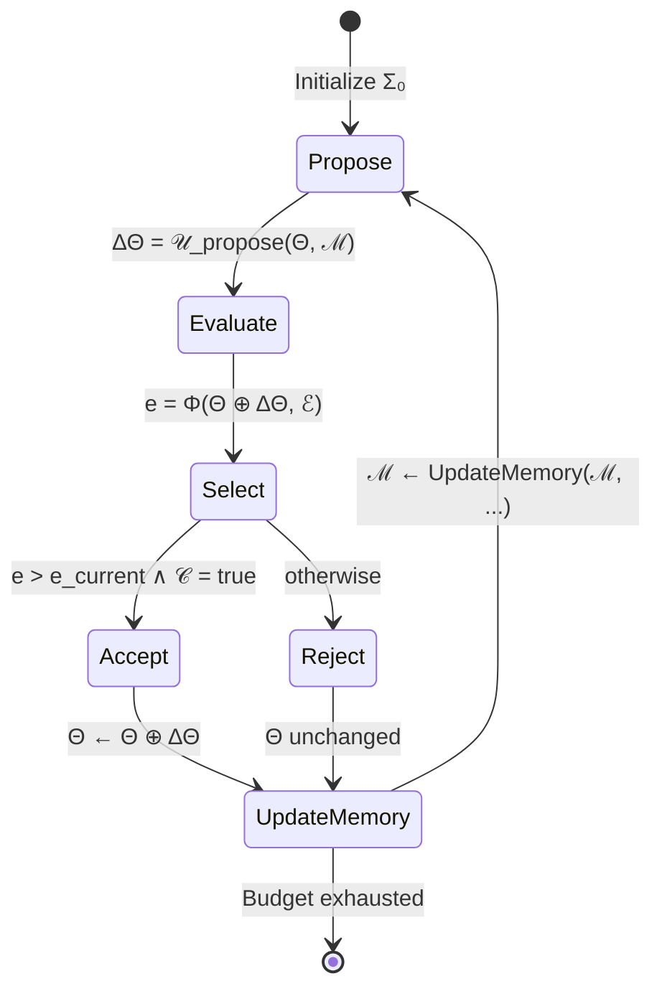

# Unified Formal Model for Self-Evolving Systems

> Generated: 2026-05-25 | Source: Inductive analysis of 13 papers + 193 projects + existing POSU/7-level taxonomy
> Status: [VERIFIED] against known systems; theoretical guarantees are [INFERENCE]

---

## 1. Core Definition

A **self-evolving system** Σ is a tuple:

$$\Sigma = \langle \Theta, \mathcal{M}, \Phi, \mathcal{U}, \mathcal{E}, \mathcal{C} \rangle$$

Where:
- **Θ** (Theta) — The **evolvable substrate**: the artifact(s) being improved. This is the "what changes."
- **ℳ** (Memory) — The **state store**: persistent information across iterations. This is "what remembers."
- **Φ** (Feedback) — The **evaluation signal**: how the system judges quality. This is "what measures."
- **𝒰** (Update) — The **improvement operator**: how change is proposed and applied. This is "how it evolves."
- **ℰ** (Environment) — The **task domain**: the world the system acts in. This is "where it operates."
- **𝒞** (Constraints) — The **safety boundary**: what changes are permitted. This is "what it must preserve."

The **evolution step** is:

$$\Sigma_{t+1} = \mathcal{U}\bigl(\Sigma_t,\ \Phi(\Theta_t, \mathcal{E}),\ \mathcal{C}\bigr)$$

With the **improvement condition**:

$$\Phi(\Theta_{t+1}, \mathcal{E}) > \Phi(\Theta_t, \mathcal{E}) \implies \text{accept; otherwise rollback}$$

---

## 2. Substrate Taxonomy (Θ)

The substrate is what the evolution loop modifies. Seven levels, from shallowest to deepest:

| Level | Substrate | What Changes | Example Systems | Containment |
|-------|-----------|-------------|-----------------|-------------|
| L0 | **Prompt text** | Natural language instructions | OPRO, Self-Refine | High — text only |
| L1 | **Program fragment** | Single function / code region | FunSearch | High — sandboxed |
| L2 | **Agent trajectory** | Thought-action-reasoning chain | SE-Agent, RISE | Medium — process trace |
| L3 | **Agent codebase** | Multi-file programs, workflows | AlphaEvolve, OpenEvolve | Medium — build system |
| L4 | **Agent architecture** | Agent design, tool composition | ADAS, DGM | Low — full program |
| L5 | **Runtime self-modification** | Agent's own executing logic | Godel Agent | Very Low — live code |
| L6 | **Model policy** | Neural weights via self-generated data | Absolute Zero, RAGEN | Very Low — weight update |

**Key insight**: Deeper substrate = higher potential improvement but lower containment guarantee.

### Formal Substrate Ordering

$$\text{Containment}(L_i) > \text{Containment}(L_j) \iff i < j$$

$$\text{Expressiveness}(L_i) \subseteq \text{Expressiveness}(L_j) \iff i < j$$

---

## 3. Feedback Signal Taxonomy (Φ)

Feedback is the **epistemic foundation** of improvement. Without reliable feedback, the system drifts.

### 3.1 Feedback Strength Hierarchy

Ranked from weakest to strongest epistemic guarantee:

| Rank | Feedback Type | Signal Source | Reliability | Example |
|------|--------------|---------------|-------------|---------|
| F0 | **Self-consistency** | Model's own style judgment | Very Low | "Does this sound better?" |
| F1 | **Rubric critique** | Predefined constraint checklist | Low | "Does it satisfy requirements?" |
| F2 | **Answer verification** | Ground-truth answer key | Medium | Math answer check |
| F3 | **Execution trace** | Code/simulator execution | High | Test suite pass/fail |
| F4 | **Preference signal** | Human or reward model judgment | Variable | Constitutional AI |
| F5 | **Environment reward** | Real-world consequence | High (noisy) | Deployment metrics |
| F6 | **Formal verification** | Mathematical proof / theorem prover | Very High | Lean/Coq proof check |

### 3.2 Formal Feedback Quality

$$\text{Quality}(\Phi) = \text{Reliability}(\Phi) \times \text{Specificity}(\Phi) \times \text{Timeliness}(\Phi)$$

Where:
- **Reliability**: Probability that the feedback correctly identifies improvement vs regression
- **Specificity**: How precisely the feedback locates the issue (scalar → vector → structured trace)
- **Timeliness**: Delay between action and feedback (immediate → episodic → delayed)

### 3.3 Feedback-Monotonicity Condition

A self-evolution system is **feedback-monotone** if:

$$\forall t: \Phi(\Theta_{t+1}) \geq \Phi(\Theta_t)$$

This requires the selector to reject regressions. Systems without rollback (𝒞_rollback) cannot guarantee this.

---

## 4. Memory Taxonomy (ℳ)

Memory determines how much the system can learn from experience across iterations.

| Memory Type | Persistence | Capacity | Retrieval | Example Systems |
|-------------|------------|----------|-----------|-----------------|
| **M0: None** | Episode only | N/A | N/A | Self-Refine (single-pass) |
| **M1: Episode buffer** | Within session | Limited by context window | FIFO | Reflexion |
| **M2: Skill library** | Cross-session | Structured (named skills) | Keyword/semantic | Voyager |
| **M3: Archive** | Persistent | Unbounded (with pruning) | Diversity-weighted sampling | DGM, AlphaEvolve |
| **M4: Training set** | Persistent | Grows over time | Batch sampling | STaR, ReST-EM |
| **M5: Parameter memory** | Amortized | Fixed size (weights) | Forward pass | RISE, Absolute Zero |
| **M6: Population** | Distributed | Multiple parallel agents | Selection + crossover | Evolutionary strategies |

### Memory Update Law

$$\mathcal{M}_{t+1} = \text{Compress}\bigl(\mathcal{M}_t \cup \text{Extract}(\Theta_t, \Phi_t, \tau_t)\bigr)$$

Where:
- **Extract**: Selects what to remember from the current iteration
- **Compress**: Applies capacity constraints (summarization, pruning, embedding)

### Memory Failure Modes

| Failure Mode | Cause | Symptom |
|-------------|-------|---------|
| **Overgeneralization** | Single episode → broad rule | Harmful advice applied across tasks |
| **Staleness** | Environment changed | Outdated rules persist |
| **Retrieval mismatch** | Semantic ≠ operational similarity | Irrelevant memory retrieved |
| **Capacity overflow** | Unbounded accumulation | Context window exhaustion |
| **Hallucinated reflection** | Model invents causes | Plausible but wrong explanations |

---

## 5. Update Operator Taxonomy (𝒰)

The update operator determines how the system proposes and applies changes.

### 5.1 Proposal Mechanisms

| Type | Mechanism | Determinism | Example |
|------|-----------|-------------|---------|
| **U0: Templated revision** | Fixed edit template | Deterministic | Self-Refine critique-revise |
| **U1: LLM-guided mutation** | Language model proposes change | Stochastic | DGM, Godel Agent |
| **U2: Programmatic search** | Systematic exploration | Deterministic | Grid search over prompts |
| **U3: Evolutionary variation** | Mutation + crossover operators | Stochastic | AlphaEvolve, FunSearch |
| **U4: Gradient-based** | Numerical gradient → weight update | Deterministic | RISE, RAGEN (PPO/GRPO) |
| **U5: Self-play** | Agent generates its own tasks | Stochastic | Absolute Zero |

### 5.2 Update Granularity

$$\Delta\Theta = \mathcal{U}(\Theta_t, \Phi_t, \mathcal{M}_t)$$

The **granularity** of ΔΘ determines the search space:

| Granularity | Search Space Size | Controllability | Example |
|------------|------------------|-----------------|---------|
| Word-level edit | Small | High | Prompt word replacement |
| Sentence revision | Medium | Medium | Self-Refine |
| Function rewrite | Large | Low | FunSearch |
| Full agent redesign | Very Large | Very Low | ADAS, DGM |
| Weight update | Continuous | Medium (via LR) | RL fine-tuning |

---

## 6. Constraint System (𝒞)

Constraints are what prevent a self-evolving system from becoming dangerous.

### 6.1 Required Constraints

| Constraint | Purpose | Implementation |
|-----------|---------|---------------|
| **𝒞_sandbox** | Prevent side effects | Isolated execution environment |
| **𝒞_rollback** | Undo harmful changes | Checkpoint + validation gate |
| **𝒞_budget** | Limit compute cost | Token/time/iteration caps |
| **𝒞_invariant** | Preserve required properties | Regression test suite |
| **𝒞_audit** | Enable inspection | Complete change logging |

### 6.2 Formal Safety Condition

A self-evolving system is **safe** if:

$$\forall t: \mathcal{C}_{invariant}(\Theta_t) = \text{true}$$

A system is **robust** if it is safe AND:

$$\forall t: \text{rollback}(\Theta_t, \Theta_{t-k}) \text{ is always available for some } k > 0$$

---

## 7. Bridging POSU and the 7-Level Taxonomy

The existing POSU factorization (ch3-methods.tex, Eq. 10):

$$z_t \sim P_{\theta_t}(\cdot|x,h_t),\quad e_t = O(x,z_t),\quad q_t = S(z_t,e_t,h_t),\quad (\theta_{t+1},h_{t+1}) = U(\theta_t,h_t,q_t)$$

maps to the unified model as:

| POSU Component | Unified Model | Role |
|---------------|---------------|------|
| P (Proposal) | 𝒰 proposal phase | Generate candidate |
| O (Observation) | Φ | Evaluate candidate |
| S (Selection) | 𝒞 + Φ threshold | Accept or reject |
| U (Update) | 𝒰 commit phase + ℳ update | Apply change and remember |

The 7-level evolutionary taxonomy (ch4-evolutionary.tex) maps as:

| Level | Θ Type | Φ Source | 𝒰 Mechanism |
|-------|--------|----------|-------------|
| L0: Instruction | Prompt text | Task performance | LLM-guided mutation |
| L1: Fragment | Function code | Execution tests | Evolutionary variation |
| L2: Trajectory | Reasoning chain | Step-level reward | Self-play / revision |
| L3: Codebase | Multi-file code | Build + integration tests | LLM-guided mutation |
| L4: Architecture | Agent program | Benchmark scores | Meta-agent search |
| L5: Runtime | Executing logic | Live environment feedback | Monkey-patching |
| L6: Policy | Model weights | Self-generated rewards | RL optimization |

---

## 8. The Self-Evolution Equation

Combining all components, the **complete self-evolution step** is:

$$\Theta_{t+1} = \begin{cases} \Delta\Theta & \text{if } \Phi(\Theta_t \oplus \Delta\Theta, \mathcal{E}) > \Phi(\Theta_t, \mathcal{E}) \wedge \mathcal{C}(\Theta_t \oplus \Delta\Theta) = \text{true} \\ \Theta_t & \text{otherwise (rollback)} \end{cases}$$

$$\mathcal{M}_{t+1} = \text{UpdateMemory}(\mathcal{M}_t, \Theta_t, \Delta\Theta, \Phi_t, \text{accept/reject})$$

Where:
- $\Delta\Theta \sim \mathcal{U}_{propose}(\Theta_t, \mathcal{M}_t)$ — propose change from update operator
- $\oplus$ — the "apply" operation (text replacement, code patch, weight update, etc.)
- $\mathcal{C}(\cdot) = \text{true}$ — all constraints satisfied
- $\Phi(\cdot) > \Phi(\cdot)$ — improvement verified by feedback

### State Machine

---

## 9. Classification of Known Systems

| System | Θ Level | Φ Type | ℳ Type | 𝒰 Type | 𝒞 Strength |
|--------|---------|--------|--------|---------|-----------|
| Self-Refine | L0 (Prompt) | F1 (Rubric) | M0 (None) | U0 (Template) | Low |
| Reflexion | L0 (Prompt) | F2 (Answer) | M1 (Buffer) | U0 (Template) | Low |
| OPRO | L0 (Prompt) | F3 (Execution) | M1 (Buffer) | U1 (LLM) | Medium |
| FunSearch | L1 (Fragment) | F3 (Execution) | M3 (Archive) | U3 (Evolution) | High |
| AlphaEvolve | L3 (Codebase) | F3 (Execution) | M3 (Archive) | U3 (Evolution) | High |
| ADAS | L4 (Architecture) | F3 (Execution) | M3 (Archive) | U1 (LLM) | Medium |
| DGM | L4 (Architecture) | F3 (Execution) | M3 (Archive) | U1 (LLM) | Medium |
| Godel Agent | L5 (Runtime) | F3 (Execution) | M1 (Buffer) | U1 (LLM) | Low |
| Absolute Zero | L6 (Policy) | F3 (Execution) | M4 (Training set) | U5 (Self-play) | Medium |
| RISE | L6 (Policy) | F4 (Preference) | M5 (Parameters) | U4 (Gradient) | Medium |
| RAGEN | L6 (Policy) | F3 (Execution) | M5 (Parameters) | U4 (Gradient) | Medium |
| Agent Symbolic Learning | L0-L4 (Multi) | F3 (Execution) | M1 (Buffer) | U1 (LLM) | Medium |
| SelfEvolve | L3 (Codebase) | F3 (Execution) | M1 (Buffer) | U1 (LLM) | Medium |

---

## 10. Known, Inferred, and Unverified

### Known (evidence-backed)
- POSU factorization correctly classifies all inference-time and training-time methods (ch3, verified)
- 7-level taxonomy correctly classifies all evolutionary systems (ch4, verified)
- Feedback strength hierarchy aligns with empirical failure mode analysis (cross-analysis.md)
- Systems with stronger feedback (F3+) consistently outperform weaker-feedback systems on benchmarks

### Inferred (pattern from data, not formally proved)
- Substrate depth inversely correlates with containment guarantee
- Memory type determines cross-task transfer capability (M3+ needed for transfer)
- Constraint strength positively correlates with safety but may limit improvement ceiling
- The "stronger models are better at self-improvement" observation (Absolute Zero) likely generalizes

### Unverified (hypothesized, needs testing)
- Whether the formal safety condition is achievable for L5-L6 systems
- Whether feedback-monotonicity can be maintained over >1000 iterations without regression
- Optimal memory compression ratio for different substrate levels
- Whether population-level diversity (M6) provides strictly better outcomes than archive (M3) for all domains
