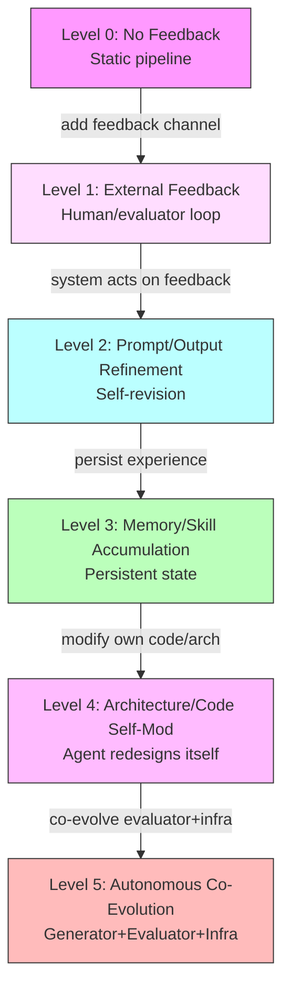
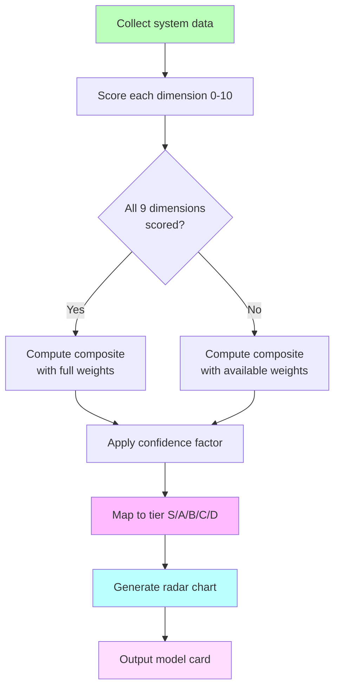
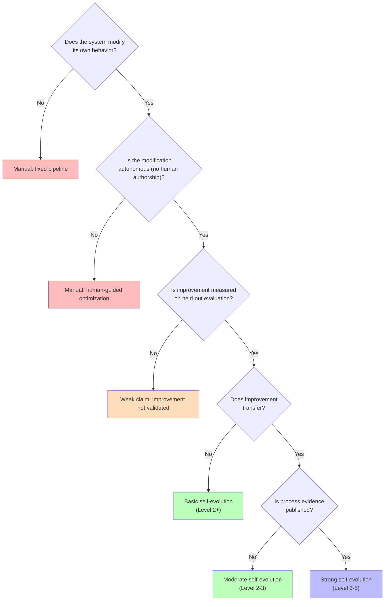
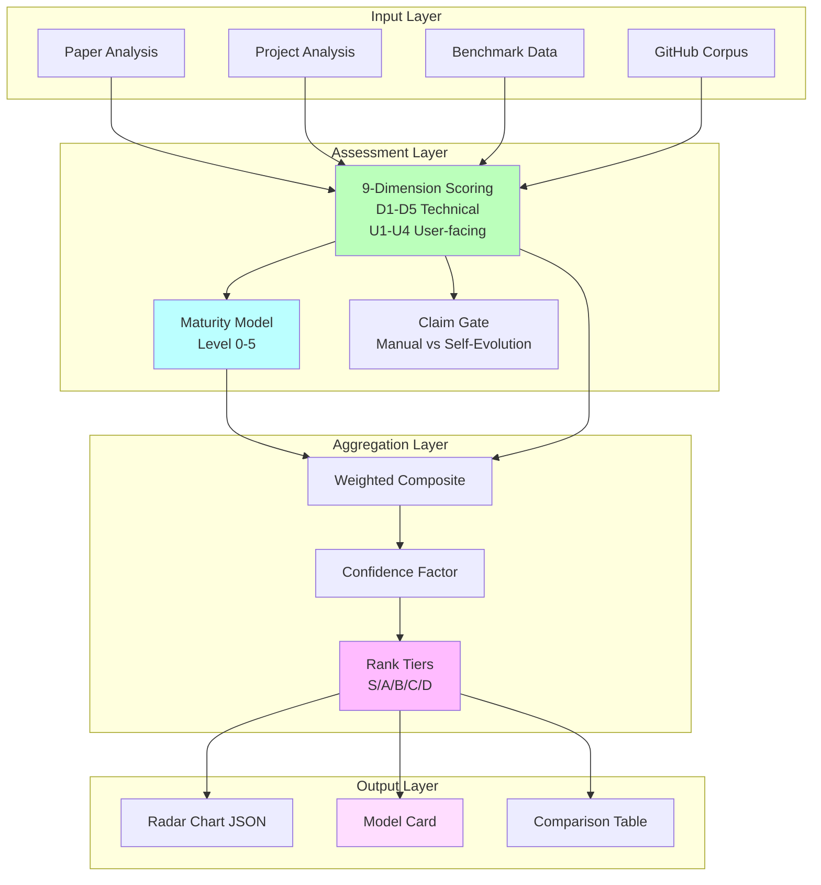

# Self-Evolution Rank/Judgment Framework

> Generated: 2026-05-25 | Status: v1 design draft
> Parent task: awesome-agent-evolution deep analysis

## One-Sentence

This framework defines a maturity model, multi-dimensional scoring system, rank aggregation algorithm, radar-chart data format, model-card evaluation template, and claim criteria for judging and ranking self-evolution AI systems.

## Relation to Existing Work

The survey ch5-evaluation.tex defines six evaluation dimensions (Correctness, Efficiency, Transfer, Robustness, Safety, Cost) and an eight-point protocol. This framework extends that foundation by adding:
1. A **maturity model** that classifies systems by evolutionary capability level
2. User-facing dimensions (Usability, Future-proof, Academic Rigor, Practical Value)
3. A formal **rank aggregation algorithm** with confidence intervals
4. A **claim criteria gate** distinguishing "self-evolution" from "manual optimization"
5. Reusable **model-card templates** and **radar-chart data format**

---

## 1. Self-Evolution Maturity Model (SEMM)

Inspired by CMMI and ML evaluation best practices, adapted for the specific properties of self-evolving systems.

### Level Definitions

| Level | Name | Definition | Key Signal | Example Systems |
|---:|---|---|---|---|
| **0** | No Feedback | System produces outputs with no feedback loop. | Static pipeline. | Zero-shot LLM, fixed prompt chains. |
| **1** | External Feedback | Human or external evaluator provides feedback; system does not self-modify. | Feedback exists but is consumed, not acted on. | Human-in-the-loop coding assistants. |
| **2** | Prompt/Output Refinement | System revises its own prompts, outputs, or search strategies based on feedback. | The evolving object is the output or prompt. | Reflexion, Self-Refine, DSPy, OPRO. |
| **3** | Memory/Skill Accumulation | System persists experience as reusable memory, skills, or workflows that improve future performance. | The evolving object includes persistent state. | Voyager, ExPeL, ACE, ReasoningBank. |
| **4** | Architecture/Code Self-Modification | System modifies its own code, architecture, agent design, or program search space. | The evolving object is the agent itself. | DGM, ADAS, AlphaEvolve, SICA. |
| **5** | Autonomous Co-Evolution | System autonomously co-evolves generators, evaluators, and infrastructure with audit, rollback, and governance. | Evaluator + generator + infrastructure all evolve under governance. | Hypothetical; partial signals in DGM + verified evaluator evolution. |

### Maturity Assessment Rules

- A system's level is the **highest sustained level** it operates at, not a one-time occurrence.
- Level claims require evidence: the system must demonstrate the behavior on at least **3 distinct tasks/domains** with documented improvement trajectories.
- Level is **not monotonic with quality**: a Level 4 system can be worse than a Level 2 system on specific benchmarks. Level measures evolutionary *capability*, not current *performance*.

### Mermaid: Maturity Model



---

## 2. Multi-Dimensional Scoring System

### 2.1 Technical Dimensions (from ch5, extended)

These are objective, measurable dimensions for system evaluation.

| Dimension | Core Question | Score Range | Key Metrics |
|---|---|---|---|
| **D1: Improvement Magnitude** | How much does the system improve over baseline? | 0-10 | Delta on held-out benchmarks, percentage-point gain, effect size |
| **D2: Evidence Strength** | How trustworthy is the improvement claim? | 0-10 | Seeds reported, confidence intervals, evaluator independence, held-out testing |
| **D3: Transferability** | Does improvement generalize beyond the search distribution? | 0-10 | Cross-domain score, frozen-agent transfer, train-val-test gap |
| **D4: Safety** | Does the evolution process preserve constraints? | 0-10 | Sandbox compliance, permission violations, rollback success, audit completeness |
| **D5: Cost Efficiency** | Is the gain worth the resources consumed? | 0-10 | Gain per dollar, tokens per improvement point, human review minutes |

### 2.2 User-Facing Dimensions (new)

These dimensions serve practitioners evaluating systems for adoption and researchers judging future potential.

| Dimension | Core Question | Score Range | Sub-Metrics |
|---|---|---|---|
| **U1: Usability** | How easy is it to deploy and use? | 0-10 | Deployment complexity (0=one-click, 10=custom infra), dependency count, documentation quality, config surface area |
| **U2: Future-proof** | How well will it age? | 0-10 | Extensibility (plugin/extension API), model-backbone independence, generalization capacity, maintenance signal |
| **U3: Academic Rigor** | How strong is the theoretical and experimental foundation? | 0-10 | Theory depth, experiment design, ablation completeness, reproducibility artifacts, peer review status |
| **U4: Practical Value** | How useful is it for real tasks? | 0-10 | SOTA on relevant benchmarks, real application coverage, production deployment evidence, user adoption signal |

### 2.3 Scoring Rubric (per dimension)

Each dimension uses a 0-10 scale with anchored descriptors:

| Score | Label | Descriptor |
|---:|---|---|
| 0-2 | **None/Minimal** | No evidence or negative evidence. |
| 3-4 | **Basic** | Limited evidence; significant gaps. |
| 5-6 | **Moderate** | Adequate evidence; some gaps remain. |
| 7-8 | **Strong** | Solid evidence; minor gaps. |
| 9-10 | **Exceptional** | Comprehensive evidence; best-in-class. |

### 2.4 Dimension Definitions (Operationalized)

**D1: Improvement Magnitude (0-10)**
- 0-2: No measurable improvement over baseline.
- 3-4: Improvement <5 pp on primary benchmark; small effect size.
- 5-6: Improvement 5-15 pp; moderate effect size; consistent across seeds.
- 7-8: Improvement 15-30 pp; large effect size; multiple benchmarks.
- 9-10: Improvement >30 pp; transformative gain; multiple domains + open-ended discovery.

**D2: Evidence Strength (0-10)**
- 0-2: Single run, no seeds, no held-out testing.
- 3-4: Multiple seeds but no held-out; evaluator coupling suspected.
- 5-6: Train/val/test separation; ≥3 seeds; confidence intervals reported.
- 7-8: Independent evaluator; hidden tests; contamination controls.
- 9-10: Full eight-point protocol; reproducible artifacts; independent reproduction confirmed.

**D3: Transferability (0-10)**
- 0-2: Improvement only on training distribution.
- 3-4: Some transfer to similar tasks; degrades on domain shift.
- 5-6: Transfer across task types within same modality (e.g., code).
- 7-8: Transfer across modalities (e.g., code to math); cross-model transfer.
- 9-10: Frozen-agent transfer across domains, models, and time periods with minimal degradation.

**D4: Safety (0-10)**
- 0-2: No sandbox; no permission model; no audit trail.
- 3-4: Basic sandbox; ad-hoc permission; partial logging.
- 5-6: Sandboxed execution; permission model; audit logging; rollback capability.
- 7-8: Evaluator isolation; policy enforcement; regression suite; incident reporting.
- 9-10: Formal verification of safety invariants; governance framework; proven capture of misevolution.

**D5: Cost Efficiency (0-10)**
- 0-2: Cost >100x baseline; no budget reporting.
- 3-4: Cost 10-100x baseline; partial budget reporting.
- 5-6: Cost 3-10x baseline; full budget reporting; reasonable for research.
- 7-8: Cost 1-3x baseline; competitive with non-evolving methods.
- 9-10: Cost <1x baseline (evolution reduces operational cost); amortized gains.

**U1: Usability (0-10)**
- 0-2: Requires custom infrastructure; >10 dependencies; no documentation.
- 3-4: Docker-based setup; 5-10 dependencies; basic docs.
- 5-6: pip/conda install; API docs; example notebooks; 3-5 core dependencies.
- 7-8: One-command setup; comprehensive docs; active community; CI/CD.
- 9-10: Managed service or zero-config; self-documenting; SDK in multiple languages.

**U2: Future-proof (0-10)**
- 0-2: Tied to specific model version; no extension API; abandoned.
- 3-4: Model-agnostic but framework-specific; limited extension points.
- 5-6: Pluggable model backend; extension API; modular architecture.
- 7-8: Model-agnostic + framework-agnostic; plugin ecosystem; active maintenance.
- 9-10: Standard interfaces; community extensions; cross-compatible with evolving ecosystem.

**U3: Academic Rigor (0-10)**
- 0-2: No paper; blog-post-only claims; no ablations.
- 3-4: Workshop paper; limited ablations; partial reproducibility.
- 5-6: Peer-reviewed publication; ablations; reproducible artifacts; clear baselines.
- 7-8: Top-venue publication; comprehensive ablations; independent reproduction; theoretical grounding.
- 9-10: Seminal work; sets evaluation standard; community-adopted methodology; formal proofs.

**U4: Practical Value (0-10)**
- 0-2: Demo only; no real-world use.
- 3-4: Works on curated examples; limited production signal.
- 5-6: Used in research pipelines; some production deployments reported.
- 7-8: Adopted by multiple organizations; measurable ROI; integration with standard tools.
- 9-10: Industry standard; significant economic impact; cited in production post-mortems.

---

## 3. Rank Aggregation Algorithm

### 3.1 Weighted Composite Score

The composite rank combines technical and user-facing dimensions:

```
CompositeScore = Σ(w_i * D_i) / Σ(w_i)

Where:
  D_i = normalized score for dimension i (0-10)
  w_i = configurable weight for dimension i
```

### 3.2 Default Weights

The default weight profile balances academic and practical concerns:

| Dimension | Default Weight | Rationale |
|---|---:|---|
| D1: Improvement Magnitude | 0.15 | Core signal but not sufficient alone |
| D2: Evidence Strength | 0.20 | Without evidence, claims are meaningless |
| D3: Transferability | 0.10 | Important but harder to measure |
| D4: Safety | 0.10 | Necessary but not the primary differentiator |
| D5: Cost Efficiency | 0.05 | Cost can be amortized; less discriminating |
| U1: Usability | 0.10 | Adoption friction |
| U2: Future-proof | 0.10 | Longevity signal |
| U3: Academic Rigor | 0.10 | Research quality signal |
| U4: Practical Value | 0.10 | Real-world impact |

### 3.3 Confidence-Adjusted Ranking

Raw composite scores are adjusted by evidence completeness:

```
ConfidenceFactor = (completed_dimensions / total_dimensions) * evidence_quality

AdjustedScore = CompositeScore * ConfidenceFactor

Where:
  completed_dimensions = dimensions with actual data (not imputed)
  total_dimensions = 9
  evidence_quality = 0.5 (estimated) to 1.0 (verified)
```

Systems with missing dimensions are penalized proportionally. A system scored on only 5 of 9 dimensions receives at most 5/9 = 55.6% of its raw composite score.

### 3.4 Rank Tiers

| Tier | Score Range | Interpretation |
|---|---|---|
| **S** | 8.0-10.0 | Exceptional: best-in-class across most dimensions |
| **A** | 6.5-7.9 | Strong: solid across most dimensions, excels in some |
| **B** | 5.0-6.4 | Moderate: adequate for research use, gaps in practice |
| **C** | 3.0-4.9 | Basic: limited evidence or capability |
| **D** | 0.0-2.9 | Minimal: insufficient evidence or capability |

### 3.5 Formalization

```
Given:
  S = {s_1, ..., s_n}  systems to rank
  D = {d_1, ..., d_9}   scoring dimensions
  w = {w_1, ..., w_9}   weights (Σw_i = 1)

For each system s_j:
  For each dimension d_i:
    score(s_j, d_i) ∈ [0, 10]  if evidence exists
    score(s_j, d_i) = NULL      if missing

  composite(s_j) = Σ(w_i * score(s_j, d_i)) / Σ(w_i for non-NULL scores)
  confidence(s_j) = (non-NULL count / 9) * evidence_quality(s_j)
  adjusted(s_j) = composite(s_j) * confidence(s_j)

Rank: sort systems by adjusted(s_j) descending
Tier: map adjusted score to S/A/B/C/D
```

### Mermaid: Ranking Flow



---

## 4. Self-Evolution Claim Criteria

### 4.1 Minimum Claim Gate

A system may claim "self-evolution" only if it satisfies ALL of:

1. **Feedback loop exists**: The system receives signal about its own performance (not just external human ratings).
2. **Autonomous update**: The system modifies at least one internal component without direct human authorship of the change.
3. **Measured improvement**: The modification produces measurable improvement on at least one held-out evaluation.
4. **Reproducible**: The improvement can be reproduced with documented budget and seeds.

### 4.2 Strong Claim Gate

A system may claim "strong self-evolution" if it additionally satisfies:

5. **Transfer**: Improvement generalizes beyond the training/search distribution.
6. **Process evidence**: Full evolution trace with gain curves, candidate statistics, and regression tests.
7. **Safety gate**: The system rejected at least one candidate for safety or regression reasons (demonstrating the gate works).

### 4.3 "Manual Optimization" vs "Self-Evolution" Decision Tree



---

## 5. Pitfall Checklist

Extended from ch5's five pitfalls with operational checks.

| # | Pitfall | Red Flag | Verification Check |
|---|---|---|---|
| 1 | **Benchmark overfitting** | Only tested on public tasks; no time-split or hidden tests | Require held-out score + contamination statement |
| 2 | **Conflating attempts with capability** | pass@k without reporting k or feedback type | Require pass@(k, F) notation with feedback description |
| 3 | **Evaluator coupling** | Same model family for generation and judging | Require heterogeneous evaluator check |
| 4 | **Hidden regressions** | Only best-score reported; no regression suite | Require regression test results + rejected candidate stats |
| 5 | **Missing cost/safety accounting** | No budget reporting; no sandbox documentation | Require cost-per-gain + safety incident log |
| 6 | **Metric gaming** | System improves score by exploiting evaluator quirks | Require evaluator sensitivity analysis |
| 7 | **Hidden human intervention** | "Autonomous" system with undocumented human steps | Require full disclosure of human-in-the-loop moments |
| 8 | **Cherry-picked results** | Best-of-many-runs reported as representative | Require mean over ≥3 seeds + variance |
| 9 | **Frozen-legacy claim** | System was self-evolving during dev but frozen at deploy | Distinguish training-time vs deployment-time evolution |
| 10 | **Evaluator drift** | Evaluator changed during experiment without documentation | Require evaluator versioning and lineage |

---

## 6. Radar Chart Data Format

### 6.1 JSON Schema

```json
{
  "$schema": "https://json-schema.org/draft/2020-12/schema",
  "title": "Self-Evolution Radar Profile",
  "type": "object",
  "required": ["system_id", "dimensions", "metadata"],
  "properties": {
    "system_id": {
      "type": "string",
      "description": "Unique identifier for the system being evaluated"
    },
    "dimensions": {
      "type": "object",
      "required": ["D1", "D2", "D3", "D4", "D5", "U1", "U2", "U3", "U4"],
      "properties": {
        "D1": {"type": "number", "minimum": 0, "maximum": 10, "description": "Improvement Magnitude"},
        "D2": {"type": "number", "minimum": 0, "maximum": 10, "description": "Evidence Strength"},
        "D3": {"type": "number", "minimum": 0, "maximum": 10, "description": "Transferability"},
        "D4": {"type": "number", "minimum": 0, "maximum": 10, "description": "Safety"},
        "D5": {"type": "number", "minimum": 0, "maximum": 10, "description": "Cost Efficiency"},
        "U1": {"type": "number", "minimum": 0, "maximum": 10, "description": "Usability"},
        "U2": {"type": "number", "minimum": 0, "maximum": 10, "description": "Future-proof"},
        "U3": {"type": "number", "minimum": 0, "maximum": 10, "description": "Academic Rigor"},
        "U4": {"type": "number", "minimum": 0, "maximum": 10, "description": "Practical Value"}
      }
    },
    "evidence": {
      "type": "object",
      "description": "Optional: links to evidence for each dimension",
      "additionalProperties": {
        "type": "array",
        "items": {
          "type": "object",
          "properties": {
            "url": {"type": "string"},
            "description": {"type": "string"},
            "verified": {"type": "boolean"}
          }
        }
      }
    },
    "metadata": {
      "type": "object",
      "required": ["evaluated_at", "evaluator", "maturity_level"],
      "properties": {
        "evaluated_at": {"type": "string", "format": "date-time"},
        "evaluator": {"type": "string", "description": "Who/what performed the evaluation"},
        "maturity_level": {"type": "integer", "minimum": 0, "maximum": 5},
        "tier": {"type": "string", "enum": ["S", "A", "B", "C", "D"]},
        "composite_score": {"type": "number"},
        "confidence_factor": {"type": "number"},
        "notes": {"type": "string"}
      }
    }
  }
}
```

### 6.2 Example: DGM Radar Profile

```json
{
  "system_id": "dgm-darwin-godel-machine",
  "dimensions": {
    "D1": 9.0,
    "D2": 7.5,
    "D3": 7.0,
    "D4": 6.0,
    "D5": 5.0,
    "U1": 4.0,
    "U2": 7.0,
    "U3": 8.5,
    "U4": 7.0
  },
  "evidence": {
    "D1": [{"url": "research/papers/02-darwin-godel-machine.md", "description": "SWE-bench 20%→50%, Polyglot 14.2%→30.7%", "verified": true}],
    "D2": [{"url": "paper-drafts/ch5-evaluation.tex", "description": "Archive-based evaluation with held-out tasks", "verified": true}],
    "U1": [{"description": "Research artifact; requires significant setup", "verified": false}]
  },
  "metadata": {
    "evaluated_at": "2026-05-25T15:30:00Z",
    "evaluator": "ranking-framework-v1",
    "maturity_level": 4,
    "tier": "A",
    "composite_score": 6.89,
    "confidence_factor": 0.85,
    "notes": "Exceptional improvement magnitude and academic rigor. Usability limited as research artifact."
  }
}
```

---

## 7. Model-Card Evaluation Template

### Template: Self-Evolution System Card

```markdown
# Model Card: [System Name]

## Identity
- **System**: [name and version]
- **Type**: [framework / tool / research-artifact / application]
- **Maturity Level**: [0-5, with evidence]
- **Tier**: [S/A/B/C/D]

## One-Sentence Summary
[What the system does, how it evolves, and what it improves.]

## Evolving Object
[What changes during self-evolution: prompt / memory / code / architecture / evaluator]

## Evaluation Profile

### Radar Scores

| Dimension | Score | Evidence |
|---|---:|---|
| D1: Improvement Magnitude | /10 | [link or description] |
| D2: Evidence Strength | /10 | [link or description] |
| D3: Transferability | /10 | [link or description] |
| D4: Safety | /10 | [link or description] |
| D5: Cost Efficiency | /10 | [link or description] |
| U1: Usability | /10 | [link or description] |
| U2: Future-proof | /10 | [link or description] |
| U3: Academic Rigor | /10 | [link or description] |
| U4: Practical Value | /10 | [link or description] |

**Composite Score**: /10 | **Tier**: X | **Confidence**: X%

### Radar Chart
[Insert radar chart image or Mermaid rendering here]

## Benchmark Results

| Benchmark | Baseline | Evolved | Gain | Budget | Seeds |
|---|---|---|---|---|---|
| [benchmark name] | [score] | [score] | [+X pp] | [turns/tokens/cost] | [N] |

## Evolution Process

- **Candidates generated**: [N]
- **Accepted**: [N] | **Rejected**: [N]
- **Rejection reasons**: [safety: N, regression: N, no improvement: N]
- **Gain curve**: [monotonic / plateau / volatile]
- **Archive diversity**: [low / moderate / high]

## Safety & Constraints

- [ ] Sandboxed execution
- [ ] Permission model
- [ ] Audit logging
- [ ] Rollback capability
- [ ] Regression suite
- [ ] Evaluator isolation

## Deployment

- **Dependencies**: [count and type]
- **Setup complexity**: [one-command / Docker / custom infra]
- **Documentation**: [none / basic / comprehensive]
- **Maintenance signal**: [active / steady / declining / abandoned]

## Limitations & Known Issues

- [Limitation 1]
- [Limitation 2]

## Self-Evolution Claim Assessment

- [ ] Feedback loop exists
- [ ] Autonomous update
- [ ] Measured improvement on held-out
- [ ] Reproducible
- [ ] Transfer demonstrated
- [ ] Process evidence published
- [ ] Safety gate demonstrated

**Claim level**: [none / basic / moderate / strong]

## References

- [Paper / repo / docs links]
```

---

## 8. Mermaid: Complete Framework Overview



---

## 9. Comparison with Existing Frameworks

| Aspect | ch5 Six Dimensions | Star Quality (ch5) | This Framework |
|---|---|---|---|
| Purpose | Evaluate evolution process | Evaluate project health | Rank & judge systems holistically |
| Dimensions | 6 technical | 5 ecosystem | 9 (5 technical + 4 user-facing) |
| Maturity model | No | No | Yes (Level 0-5) |
| Rank aggregation | Unified scorecard concept | Composite formula | Weighted + confidence-adjusted + tiers |
| Claim criteria | Eight-point protocol | No | Decision tree + minimum/strong gates |
| Radar format | No | No | JSON schema with evidence links |
| Template | Run/Evaluator/Improvement cards | Star ranking table | Full model-card template |
| Pitfall coverage | 5 pitfalls | No | 10 pitfalls with verification checks |

---

## 10. Usage Guide

### For Evaluators

1. **Score each dimension** using the rubric in Section 2.4.
2. **Assign maturity level** using the definitions in Section 1.
3. **Check claim gate** using the criteria in Section 4.
4. **Compute composite score** using the algorithm in Section 3.
5. **Generate radar profile** using the JSON schema in Section 6.
6. **Fill model card** using the template in Section 7.

### For System Builders

1. Use the **pitfall checklist** (Section 5) to audit your evaluation before publication.
2. Target **maturity level 3+** for meaningful self-evolution claims.
3. Report **all 9 dimensions** to avoid confidence penalty.
4. Use the **model-card template** as your evaluation section structure.

### For Survey Maintainers

1. Apply this framework to the **Top 20 projects** from the corpus.
2. Update radar profiles as new evidence emerges.
3. Recompute ranks quarterly; track tier changes over time.
4. Feed results back into README trend tracking section.
