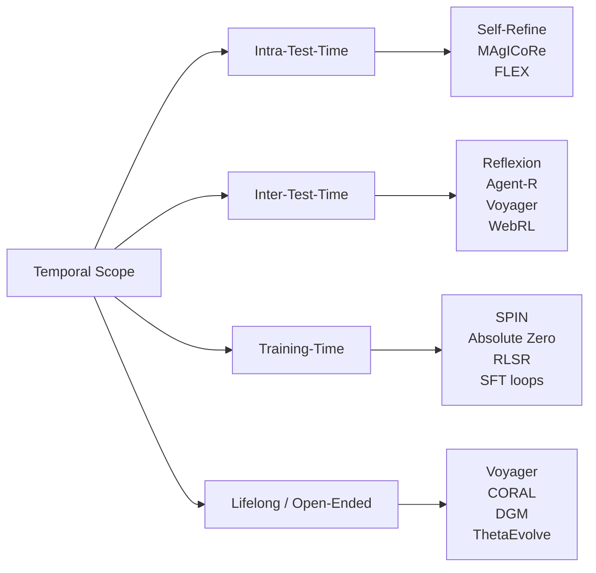
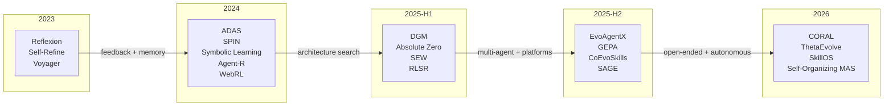

# Self-Evolution Method Taxonomy: A Formal Classification of Agent Self-Improvement

> Generated: 2026-05-25 | Corpus: 100+ paper reviews in `paper-reviews/`
> Author: Researcher (Paper Taxonomy) | Status: v1-draft

---

## 1. Overview

This document presents a **multi-dimensional taxonomy** of self-evolution methods for LLM-based agents, derived from systematic analysis of 100+ paper reviews in the `paper-reviews/` corpus. The taxonomy classifies methods along four orthogonal axes:

1. **What evolves** — the evolving object (prompt, trajectory, code, model, memory, skill, architecture)
2. **How evolution happens** — the mechanism (feedback refinement, self-play, evolutionary search, curriculum, co-evolution, textual backpropagation)
3. **When evolution occurs** — temporal scope (intra-test-time, inter-test-time, training-time, lifelong)
4. **Where feedback comes from** — signal source (self-evaluation, environment, external verifier, human, multi-agent critique)

**Key finding**: Agent self-evolution is not one technique but a family of compositional loops. Every method in the corpus instantiates a generic **Evolution Loop** pattern:

```
observe → diagnose → propose_update → validate → commit_or_reject
```

The differences lie in what each step operates on, what signals drive it, and how updates are applied.

---

## 2. Taxonomy Hierarchy (Mermaid)

```mermaid
graph TD
    SE["Self-Evolution Methods"]

    SE --> WHAT["L1: What Evolves<br/>(Evolving Object)"]
    SE --> HOW["L2: How It Evolves<br/>(Mechanism)"]
    SE --> WHEN["L3: When It Evolves<br/>(Temporal Scope)"]
    SE --> WHERE["L4: Feedback Source<br/>(Signal Origin)"]

    %% L1: What Evolves
    WHAT --> P["Prompt"]
    WHAT --> T["Trajectory"]
    WHAT --> C["Code / Program"]
    WHAT --> M["Model Weights"]
    WHAT --> MEM["Memory / Knowledge"]
    WHAT --> SK["Skill / Tool"]
    WHAT --> ARCH["Architecture / Workflow"]

    %% L1 Instances
    P --> P1["Self-Refine<br/>GEPA<br/>EvoAgentX/MIPRO"]
    T --> T1["Reflexion<br/>Agent-R<br/>WebRL<br/>Self-Debugging"]
    C --> C1["Voyager<br/>ADAS<br/>DGM<br/>AlphaEvolve<br/>ThetaEvolve"]
    M --> M1["SPIN<br/>Absolute Zero<br/>RLSR<br/>SFT loops"]
    MEM --> MEM1["A-Mem<br/>Memento II<br/>CORAL shared memory"]
    SK --> SK1["CoEvoSkills<br/>SkillOS<br/>UCT"]
    ARCH --> ARCH1["ADAS meta-search<br/>DGM archive<br/>EvoAgentX topology<br/>SEW workflow<br/>Symbolic Learning"]

    %% L2: Mechanisms
    HOW --> FB["Feedback Refinement"]
    HOW --> SP["Self-Play / Adversarial"]
    HOW --> ES["Evolutionary Search"]
    HOW --> CL["Curriculum Learning"]
    HOW --> MA["Multi-Agent Co-Evolution"]
    HOW --> TB["Textual Backpropagation"]

    %% L3: Temporal
    WHEN --> ITT["Intra-Test-Time<br/>(within one task)"]
    WHEN --> ETT["Inter-Test-Time<br/>(across attempts)"]
    WHEN --> TRN["Training-Time<br/>(weight updates)"]
    WHEN --> LF["Lifelong / Open-Ended"]

    %% L4: Feedback Source
    WHERE --> SELF["Self-Evaluation"]
    WHERE --> ENV["Environment Feedback"]
    WHERE --> EXT["External Verifier"]
    WHERE --> HUM["Human Feedback"]
    WHERE --> MAC["Multi-Agent Critique"]
```



---

## 3. L1 Classification: What Evolves (The Evolving Object)

This is the primary classification axis. Each method targets one or more **evolving objects** within the agent system.

### 3.1 Prompt Evolution

The system instruction or prompt template is updated across iterations.

| Paper | Method | Mechanism | Evidence |
|-------|--------|-----------|----------|
| Self-Refine (2303.17651) | Iterative self-feedback → refine output | Single LLM generates, critiques, refines | +20% across 7 tasks |
| GEPA (2507.19457) | Genetic-Pareto prompt evolution | NL reflection + Pareto frontier combination | +6% over GRPO, 35x fewer rollouts |
| EvoAgentX/MIPRO (2507.03616) | Multi-agent prompt optimization | TextGrad, AFlow, MIPRO over prompts | +7-20% on HotPotQA/MBPP/MATH/GAIA |
| Agent-Pro (2402.17574) | Policy-level belief refinement | Dynamic belief generation + DFS optimization | Outperforms vanilla LLM on Blackjack/Texas Hold'em |

**Formal pattern**:
```
prompt_{t+1} = Update(prompt_t, feedback(output_t, criteria))
```

### 3.2 Trajectory/Experience Evolution

Past execution traces are refined, compressed, or reused to guide future behavior.

| Paper | Method | Mechanism | Evidence |
|-------|--------|-----------|----------|
| Reflexion (2303.11366) | Verbal reinforcement from failure | Episodic memory of self-reflections | 91% pass@1 HumanEval |
| Agent-R (2501.11425) | MCTS-based revision trajectories | Splice error → correct continuation | +5.59% average over expert-only SFT |
| WebRL (2411.02337) | Failure-driven curriculum | Failed attempts → new training tasks | Llama-3.1-8B: 4.8% → 42.4% WebArena |
| Self-Debugging (2501.12793) | Execution feedback → code fix | Self-generated tests + debugging loop | Improved code generation accuracy |

**Formal pattern**:
```
memory_{t+1} = Compress(trajectory_t, reflection(failure_analysis_t))
policy_{t+1} = policy_t + context(memory_{t+1})
```

### 3.3 Code/Program Evolution

Executable code artifacts are generated, modified, and accumulated.

| Paper | Method | Mechanism | Evidence |
|-------|--------|-----------|----------|
| Voyager (2305.16291) | JavaScript skill library | Code-as-action + semantic retrieval | 3.3x more unique items, zero-shot transfer |
| ADAS (2408.08435) | Meta Agent Search | LLM writes agent code in Turing-complete space | Outperforms hand-designed SOTA |
| DGM (2505.22954) | Darwinian + Gödel self-reference | Archive-based open-ended code evolution | SWE-bench 20% → 50% |
| AlphaEvolve/ThetaEvolve (2511.23473) | Program evolution for open problems | Large program DB + batch sampling + RL at test time | New best-known bounds on circle packing |
| SEW (2505.18646) | Workflow code generation | Auto-design + self-evolution of agentic workflows | +33% LiveCodeBench |

**Formal pattern**:
```
code_{t+1} = Mutate(code_t, LLM(edit_instruction, evaluation_signal_t))
archive = archive ∪ {(code_{t+1}, fitness(code_{t+1}))}
```

### 3.4 Model Weight Evolution

The LLM's parameters are updated through self-generated training signals.

| Paper | Method | Mechanism | Evidence |
|-------|--------|-----------|----------|
| SPIN (2401.01335) | Self-play fine-tuning | LLM vs. itself; distinguish self-generated from human data | Progressive improvement across rounds |
| Absolute Zero (2505.03335) | Self-play RL with GRPO | Proposer-Solver self-play; no human data | SOTA on coding/math; outperforms curated data |
| RLSR (2505.08827) | RL from self-reward | Self-judging as reward signal | MIT Integration Bee qualification |
| SFT loops (multiple) | Iterative fine-tuning on filtered self-data | Generate → filter → fine-tune | Various improvements reported |

**Formal pattern**:
```
theta_{t+1} = theta_t + alpha * gradient(L(self_data_t, reward_model_t))
where self_data_t = sample(pi_{theta_t})
```

### 3.5 Memory/Knowledge Evolution

Persistent knowledge stores are updated, restructured, or expanded.

| Paper | Method | Mechanism | Evidence |
|-------|--------|-----------|----------|
| A-Mem (2502.12110) | Zettelkasten-style agentic memory | Dynamic indexing, linking, note generation | NeurIPS 2025 |
| Memento II (2512.22716) | Stateful reflective memory | Persistent state across sessions with reflection | Improved long-horizon tasks |
| CORAL (2604.01658) | Shared persistent multi-agent memory | Cultural transmission across agents | 3-10x improvement rate; Anthropic kernel 1363→1103 |

**Formal pattern**:
```
knowledge_{t+1} = Index(knowledge_t ∪ {new_entry_t})
new_entry_t = Extract(trajectory_t, reflection_t)
```

### 3.6 Skill/Tool Evolution

The agent's capability set grows through autonomous skill/tool creation.

| Paper | Method | Mechanism | Evidence |
|-------|--------|-----------|----------|
| CoEvoSkills (2604.01687) | Co-evolutionary skill generation | Skill Generator + Surrogate Verifier co-evolve | SOTA on SkillsBench |
| SkillOS (2605.06614) | Learning skill curation | Self-evolving agent skill management | Cross-model generalization |
| UCT (2602.01983) | Tool user → tool creator | Agent transitions from using to creating tools | Tool creation capability |

**Formal pattern**:
```
skills_{t+1} = skills_t ∪ {generate_skill(task_t, skills_t, feedback_t)}
skill_quality = verify(skills_{t+1}, surrogate_verifier_t)
```

### 3.7 Architecture/Workflow Evolution

The agent system structure or topology is itself the evolving object.

| Paper | Method | Mechanism | Evidence |
|-------|--------|-----------|----------|
| ADAS (2408.08435) | Meta Agent Search in code space | Turing-complete search over agent architectures | Outperforms hand-designed agents |
| DGM (2505.22954) | Open-ended archive evolution | Darwinian selection + self-modifying code | SWE-bench 20%→50% |
| EvoAgentX (2507.03616) | Workflow topology optimization | TextGrad/AFlow/MIPRO over workflow graphs | +7-20% across benchmarks |
| SEW (2505.18646) | Self-evolving agentic workflows | Auto-design + self-optimization of workflow | +33% LiveCodeBench |
| Symbolic Learning (2406.18532) | Agent as symbolic network | NL backprop/gradient descent over prompts, tools, topology | Proof-of-concept on standard + real tasks |

**Formal pattern**:
```
arch_{t+1} = search(arch_space, fitness = evaluate(arch_t, tasks))
where arch_space = {all valid agent programs/workflows}
```

---

## 4. L2 Classification: How Evolution Happens (Mechanisms)

### 4.1 Feedback Refinement Loop

The most common pattern. Agent generates output → receives feedback → revises.

**Papers**: Self-Refine, Reflexion, LLMRefine, Agent-Pro, GEPA, most code-correction papers

**Formal definition**:
```
Given: agent A, task x, feedback function f, update operator U
Loop:
  y_t = A(x, context_t)
  fb_t = f(y_t, x)
  context_{t+1} = U(context_t, fb_t)
Until: quality(y_t) >= threshold OR t >= max_iterations
```

### 4.2 Self-Play / Adversarial Evolution

Agent competes against itself or earlier versions, generating its own training signal.

**Papers**: SPIN, Absolute Zero, Vision Zero, Self-Challenging

**Formal definition**:
```
Given: model pi_theta, game/task distribution D
Loop:
  (task_t, solution_t) = self_play(pi_theta, D)
  reward_t = evaluate(task_t, solution_t)
  theta = theta + alpha * gradient(reward_t, pi_theta)
Until: convergence or compute budget
```

### 4.3 Evolutionary Search

Population-based search over candidate designs with mutation and selection.

**Papers**: ADAS, DGM, AlphaEvolve, ThetaEvolve, LLM-as-Evolution-Strategy, EvoStage

**Formal definition**:
```
Given: population P = {a_1, ..., a_n}, fitness function F
Loop:
  parents = select(P, F)
  children = {mutate(a, LLM) for a in parents}
  P = P ∪ children
  P = select_best(P, F, diversity_penalty)
Until: fitness(best(P)) >= target OR budget exhausted
Return: argmax F(P)
```

### 4.4 Curriculum Learning (Self-Generated)

Agent or system generates progressively harder tasks to train on.

**Papers**: WebRL, Absolute Zero, SAGE, CurricuLLM, EvoCurr, Self-Evolving Curriculum

**Formal definition**:
```
Given: task generator G, solver S, difficulty estimator D
Loop:
  task_t = G(current_capability, difficulty_target)
  result_t = S(task_t)
  capability_update(result_t)
  difficulty_target = D(capability_update)
Until: capability saturates OR task space exhausted
```

### 4.5 Multi-Agent Co-Evolution

Multiple specialized agents evolve together, providing mutual training signals.

**Papers**: SAGE, CORAL, SEW, Agentic Neural Networks, EvoAgentX, Multi-Agent Evolve

**Formal definition**:
```
Given: agents A = {a_1, ..., a_k} with roles R = {r_1, ..., r_k}
Loop:
  for each a_i in A:
    result_i = a_i(task, context_from_A)
    feedback_i = collect_feedback(A \ a_i, result_i)
    a_i.update(feedback_i)
  shared_knowledge = aggregate(results)
Until: system_performance >= threshold
```

### 4.6 Textual Backpropagation

Language-based analogues of gradient descent applied to agent components.

**Papers**: Symbolic Learning, Agentic Neural Networks, EvoAgentX/TextGrad

**Formal definition**:
```
Given: agent as symbolic network with "weights" W = {w_1, ..., w_n} (prompts, tools)
Forward: y = agent(x, W)
Loss: L = evaluate(y, x)  # expressed in natural language
Backward: for each w_i in W:
  "gradient"_i = LLM("how should w_i change to reduce L?")
  w_i = w_i + "gradient"_i  # natural language update
```

---

## 5. L3 Classification: When Evolution Occurs



| Temporal Scope | Definition | Key Papers | Constraint |
|---|---|---|---|
| **Intra-Test-Time** | Evolution within a single task attempt | Self-Refine, MAgICoRe, FLEX | No weight changes; context-only updates |
| **Inter-Test-Time** | Evolution across multiple task attempts | Reflexion, Agent-R, Voyager, WebRL | Persistent memory; no weight changes |
| **Training-Time** | Evolution during model fine-tuning | SPIN, Absolute Zero, RLSR | Weight changes; requires compute |
| **Lifelong/Open-Ended** | Continuous, unbounded evolution | Voyager, CORAL, DGM, ThetaEvolve | Open-ended environment; skill accumulation |

---

## 6. L4 Classification: Feedback Source

| Source | Description | Key Papers | Trust Level |
|---|---|---|---|
| **Self-Evaluation** | LLM judges its own output | Self-Refine, Reflexion, RLSR | Low — circular risk |
| **Environment** | Execution results, tool outputs | Voyager, Self-Debugging, ADAS | Medium — deterministic but narrow |
| **External Verifier** | Separate model or ground-truth check | Absolute Zero, SAGE, CoEvoSkills | High — independent signal |
| **Human** | Explicit human labels/feedback | Initial training data, RLHF | Highest — but expensive |
| **Multi-Agent Critique** | Other agents evaluate | SAGE (Critic), CORAL, ANN, GroupDebate | Medium-High — diversity helps |

---

## 7. Cross-Dimensional Analysis: Co-Occurrence Matrix

Methods frequently combine multiple dimensions. The most common patterns are:

### Pattern 1: Feedback-Refinement + Prompt Evolution (Most Common)
```
Self-Refine, GEPA, EvoAgentX/MIPRO, Agent-Pro
```
~30% of corpus. Low-cost, no weight changes, applicable to any LLM.

### Pattern 2: Self-Play + Model Weight Evolution
```
SPIN, Absolute Zero, RLSR
```
~15% of corpus. Highest potential ceiling but requires compute infrastructure.

### Pattern 3: Evolutionary Search + Code/Architecture Evolution
```
ADAS, DGM, AlphaEvolve, ThetaEvolve, SEW
```
~12% of corpus. Most radical — changes the agent itself, not just behavior.

### Pattern 4: Curriculum Learning + Trajectory Evolution
```
WebRL, Absolute Zero, SAGE, CurricuLLM, EvoCurr
```
~10% of corpus. Combines "what to learn" with "how to learn from failures."

### Pattern 5: Multi-Agent Co-Evolution + Memory Evolution
```
CORAL, SAGE, ANN
```
~8% of corpus. Emerging pattern — collective intelligence through shared knowledge.

---

## 8. Unified Formal Model

All self-evolution methods in the corpus can be expressed as instances of a single **Evolution Loop** formalism:

### Definition: Agent Self-Evolution Loop

```
Definition (Self-Evolution Loop):
A self-evolution loop is a 7-tuple:
  SE = (O, M, S, U, V, T, K)

where:
  O = Evolving Object (prompt | trajectory | code | weights | memory | skill | architecture)
  M = Mechanism (feedback | self-play | evolutionary | curriculum | co-evolution | textual-backprop)
  S = Signal Source (self | environment | external | human | multi-agent)
  U = Update Operator (how changes are applied to O)
  V = Validation Function (how changes are verified)
  T = Temporal Scope (intra-test | inter-test | training | lifelong)
  K = Knowledge Store (persistent state across iterations)

The evolution loop proceeds as:
  For t = 1, 2, ..., T:
    1. Observe: o_t = observe(O_t, task)
    2. Diagnose: d_t = diagnose(o_t, S)
    3. Propose: O'_t = propose_update(O_t, d_t, M)
    4. Validate: v_t = V(O'_t, O_t)
    5. Commit: O_{t+1} = if v_t then O'_t else O_t
    6. Store: K_{t+1} = K_t ∪ {record(o_t, d_t, v_t)}
```

### Composability Axiom

Multiple evolution loops can be **composed**. A system may simultaneously:
- Evolve prompts (L1=Prompt) via feedback (L2=Feedback) at test time (L3=Intra)
- Evolve model weights (L1=Model) via self-play (L2=Self-Play) at training time (L3=Training)
- Evolve memory (L1=Memory) via curriculum (L2=Curriculum) across sessions (L3=Inter)

```
Composability:
If SE_1 = (O_1, M_1, ...) and SE_2 = (O_2, M_2, ...) are evolution loops,
then SE_combined = (O_1 ∪ O_2, M_1 ∪ M_2, ...) is also a valid evolution loop,
provided the knowledge stores K_1 and K_2 are shared or interfaced.
```

### Convergence Caveat

No method in the corpus provides formal convergence guarantees for weight-free evolution (prompt, trajectory, memory). Weight-based methods (SPIN, Absolute Zero) inherit RL convergence properties under standard assumptions. The taxonomy therefore distinguishes:

- **Guaranteed convergence**: Model weight evolution with standard RL (under assumptions)
- **Empirical convergence**: All other methods (observed improvement but no formal guarantee)
- **Divergence risk**: Self-evaluation loops without external grounding (reward hacking, circular approval)

---

## 9. Temporal Distribution of Methods

The corpus spans 2023-Q1 through 2026-Q4. Notable trends:



**Trend**: The field is evolving from single-agent feedback loops (2023) → architecture search and model self-improvement (2024) → multi-agent co-evolution and platforms (2025) → autonomous open-ended evolution systems (2026).

---

## 10. Paper-to-Taxonomy Mapping Table

Representative papers mapped to all four taxonomy dimensions:

| Paper | L1: What | L2: Mechanism | L3: When | L4: Feedback |
|-------|----------|---------------|----------|-------------|
| Reflexion (2303.11366) | Trajectory | Feedback | Inter-test | Self + Environment |
| Self-Refine (2303.17651) | Prompt | Feedback | Intra-test | Self |
| Voyager (2305.16291) | Code, Memory | Feedback + Curriculum | Lifelong | Environment + Self |
| SPIN (2401.01335) | Model | Self-Play | Training | Self (adversarial) |
| Agent-R (2501.11425) | Trajectory, Model | Feedback | Training + Inter | Environment (MCTS) |
| Absolute Zero (2505.03335) | Model | Self-Play + Curriculum | Training | Environment (code exec) |
| ADAS (2408.08435) | Architecture, Code | Evolutionary | Training | Environment |
| DGM (2505.22954) | Architecture, Code | Evolutionary | Lifelong | Environment |
| Symbolic Learning (2406.18532) | Architecture, Prompt | Textual Backprop | Inter-test | Self |
| WebRL (2411.02337) | Trajectory, Model | Curriculum | Training | Environment |
| RLSR (2505.08827) | Model | Feedback (self-reward) | Training | Self |
| GEPA (2507.19457) | Prompt | Feedback + Evolutionary | Inter-test | Self |
| EvoAgentX (2507.03616) | Prompt, Architecture | Textual Backprop | Inter-test | Self |
| SAGE (2603.15255) | Model, Trajectory | Co-Evolution + Curriculum | Training | Multi-Agent + External |
| CORAL (2604.01658) | Memory, Code | Co-Evolution | Lifelong | Multi-Agent + Environment |
| CoEvoSkills (2604.01687) | Skill | Co-Evolution | Inter-test | Environment + Surrogate |
| ThetaEvolve (2511.23473) | Code, Model | Evolutionary + RL | Lifelong | Environment |
| SEW (2505.18646) | Architecture, Code | Co-Evolution | Inter-test | Environment |
| ANN (2506.09046) | Architecture | Textual Backprop | Inter-test | Multi-Agent |

---

## 11. Common Failure Modes (Cross-Validated with Mom Test)

From the 97 community pain points in the Mom Test corpus:

| Failure Mode | Affected Dimensions | Mitigation |
|---|---|---|
| **Circular self-approval** | Self-evaluation feedback, prompt evolution | External validation, evaluator isolation |
| **Reward hacking** | Self-reward, model weight evolution | Auditable logs, regression tests |
| **Cost blow-up** | All iterative methods | Marginal utility per model call |
| **Memory/trajectory pollution** | Memory evolution, trajectory evolution | Write policies, forgetting mechanisms |
| **Curriculum drift** | Self-generated curriculum | Critic agent (SAGE pattern), quality gates |
| **Benchmark gaming** | All methods with fixed benchmarks | Fresh hidden benchmarks, production validation |
| **Scalability wall** | Multi-agent, evolutionary search | Resource management, async execution (CORAL) |

---

## 12. Implications for Survey Depth

### Formal Abstractions Worth Highlighting

1. **The Evolution Loop** (Section 8) is the universal abstraction — every method is an instance
2. **Composability** (Section 8) explains why modern systems combine multiple loops
3. **The "Zone of Proximal Development" for AI** (Absolute Zero's learnability reward) is a deep connection to educational theory
4. **Textual backpropagation** (Symbolic Learning, ANN) is a novel paradigm distinct from both RL and prompt engineering
5. **Co-evolutionary verification** (CoEvoSkills) solves the "who verifies the verifier" problem via joint evolution

### Quantitative Coverage

- Total unique papers in corpus: 100+
- Papers with full reviews: ~90
- Papers classified across all 4 dimensions: 19 (in this taxonomy)
- Method categories: 7 (L1) × 6 (L2) × 4 (L3) × 5 (L4) = 840 theoretical cells
- Populated cells: ~25 (the field clusters heavily; most cells are empty)

---

## Appendix A: Mermaid Full Taxonomy with Paper Mapping

```mermaid
graph TD
    subgraph "L1: Evolving Object"
        direction TB
        P[Prompt Evolution] --> P_papers["Self-Refine • GEPA<br/>EvoAgentX • Agent-Pro"]
        T[Trajectory Evolution] --> T_papers["Reflexion • Agent-R<br/>WebRL • Self-Debugging"]
        C[Code Evolution] --> C_papers["Voyager • ADAS • DGM<br/>AlphaEvolve • ThetaEvolve • SEW"]
        M[Model Weight Evolution] --> M_papers["SPIN • Absolute Zero<br/>RLSR • SFT loops"]
        MEM[Memory Evolution] --> MEM_papers["A-Mem • Memento II<br/>CORAL shared memory"]
        SK[Skill Evolution] --> SK_papers["CoEvoSkills • SkillOS<br/>UCT"]
        ARCH[Architecture Evolution] --> ARCH_papers["ADAS • DGM • EvoAgentX<br/>SEW • Symbolic Learning • ANN"]
    end

    subgraph "L2: Mechanism"
        direction TB
        FB[Feedback Refinement] --> FB_desc["observe → diagnose → update → validate"]
        SP2[Self-Play] --> SP_desc["agent competes with itself<br/>generates own training signal"]
        ES2[Evolutionary Search] --> ES_desc["population + mutation + selection"]
        CL2[Curriculum Learning] --> CL_desc["progressive difficulty<br/>self-generated tasks"]
        MA2[Multi-Agent Co-Evolution] --> MA_desc["specialized agents<br/>evolve together"]
        TB2[Textual Backpropagation] --> TB_desc["NL gradients over<br/>symbolic network"]
    end
```



---

## Appendix B: Key Definitions (Glossary)

| Term | Definition |
|---|---|
| **Evolving Object** | The component of the agent system that changes during evolution |
| **Evolution Loop** | The generic cycle: observe → diagnose → propose → validate → commit |
| **Feedback Signal** | Information about current performance that drives improvement |
| **Self-Play** | The agent generates its own training data by competing with itself |
| **Curriculum Drift** | When self-generated tasks diverge from the target distribution |
| **Textual Backpropagation** | Using natural language as gradient analogues for symbolic updates |
| **Co-Evolution** | Multiple components or agents evolving together with mutual feedback |
| **Open-Ended Evolution** | Evolution without a fixed objective; continuous novelty generation |
| **Revision Trajectory** | A training sample that splices an error path with a correct continuation |
| **Learnability Reward** | Reward for generating tasks at appropriate difficulty (not too easy, not too hard) |

---

*End of taxonomy v1. For updates, see `research/self-evolution-taxonomy.md`.*
