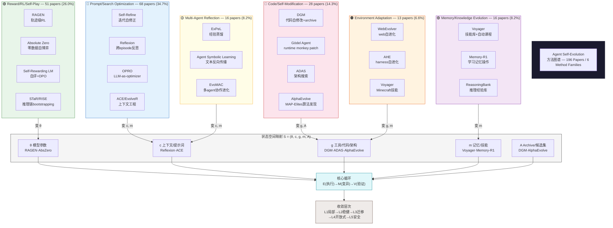

# Survey 方法图谱信息图（增强版）

- generated_at: 2026-05-25
- source: survey/figures/method-taxonomy-mermaid.md + research/formal-framework-agent-evolution.md
- papers: 196 classified
- purpose: 综合方法分类 + 状态空间映射 + 代表论文

## 信息图说明

| 方法族 | 论文数 | 占比 | 变异对象 | 代表论文 | 收敛证据层级 |
|---|---:|---:|---|---|---|
| Prompt/Search Optimization | 68 | 34.7% | c, m | Self-Refine, Reflexion, OPRO | L1-L2 |
| Reward/RL/Self-Play | 51 | 26.0% | θ | RAGEN, Absolute Zero, STaR | L1-L2 |
| Code/Self-Modification | 28 | 14.3% | g, A | DGM, ADAS, AlphaEvolve | L2-L4 |
| Multi-Agent Reflection | 16 | 8.2% | c, m | ExPeL, Agent Symbolic Learning | L1-L2 |
| Memory/Knowledge Evolution | 16 | 8.2% | m | Voyager, Memory-R1 | L1-L2 |
| Environment Adaptation | 13 | 6.6% | g, m | WebEvolver, AHE | L2-L3 |

**关键洞察**：代码自修改类虽然论文数最少之一（14.3%），但收敛证据层级最高（L2-L4），是最有深度但准入门槛最高的方向。
