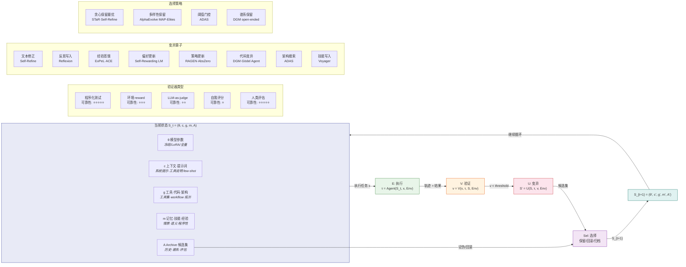

# 自进化循环形式化框架图

- generated_at: 2026-05-25
- source: research/formal-framework-agent-evolution.md
- purpose: 展示 S=(θ,c,g,m,A) 状态空间下的自进化闭环



## 形式化要素对照

| 形式化要素 | 符号 | 在图中的位置 | 关键方法 |
|---|---|---|---|
| 状态空间 | S=(θ,c,g,m,A) | STATE 节点组 | 全部方法 |
| 执行 | τ = Agent(S,x,Env) | EXECUTE | 全部方法 |
| 验证 | v = V(x,τ,S,Env) | EVAL + EVAL_TYPES | 取决于领域 |
| 变异 | S' = U(S,τ,v,Env) | MUTATE + MUTATORS | 10种算子 |
| 选择 | Sel(A∪candidates) | SELECT + SELECTION | 5种策略 |
| 收敛 | L1→L5 | 循环终止条件 | 5层定义 |

## 验证器可靠性 = 系统能力天花板

```
可靠性:  ⭐⭐⭐⭐⭐ 程序化测试 / 人类评估
         ⭐⭐⭐   环境 reward
         ⭐⭐    LLM-as-judge
         ⭐      自我评分

系统能力上限取决于验证器可靠性。
没有可靠验证器，进化退化为随机游走。
```
