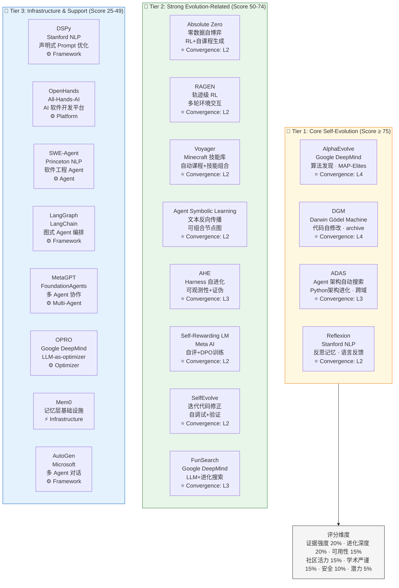

# Top 20 项目视觉摘要卡片

- generated_at: 2026-05-25
- source: analysis/github-project-data-analysis.md + projects/INDEX.md + README.md
- purpose: 20 个高影响力项目的视觉化概览，用于 README、网站和论文

## 项目卡片详细数据

| # | Project | Stars | Category | Evolution Pattern | Convergence | Key Result |
|---|---|---:|---|---|---|---|
| 1 | AlphaEvolve | — | 算法发现 | MAP-Elites + LLM mutation | L4 | 新矩阵乘法算法 |
| 2 | DGM | — | 代码自修改 | Archive + 代码进化 | L4 | SWE-Bench 20%→50% |
| 3 | ADAS | ~2k | 架构搜索 | Meta-agent 设计空间 | L3 | ARC+GFootball 跨域 |
| 4 | Reflexion | ~2k | 反思记忆 | 语言反思 → 记忆 | L2 | HumanEval 91% |
| 5 | Absolute Zero | — | 自博弈 | RL + 自课程生成 | L2 | HumanEval+/LiveCodeBench |
| 6 | RAGEN | — | 轨迹级 RL | 多轮环境策略更新 | L2 | Echo Trap 诊断 |
| 7 | Voyager | — | 技能库 | 技能组合 + 自动课程 | L2 | Minecraft 科技树 |
| 8 | Agent Symbolic Learning | — | 文本反向传播 | 可组合节点图 | L2 | 多域 agent 任务 |
| 9 | AHE | — | Harness 自进化 | 可观测性 + 证伪 | L3 | Terminal-Bench 69.7%→77.0% |
| 10 | Self-Rewarding LM | — | 自评训练 | DPO + 自生成偏好 | L2 | 对齐改善 |
| 11 | SelfEvolve | — | 迭代修正 | 自调试 + 验证 | L2 | DS-1000 57.2% |
| 12 | FunSearch | ~1k | 数学发现 | LLM + 进化搜索 | L3 | cap set 新记录 |
| 13 | DSPy | ~20k | Prompt 优化 | 声明式优化 | L1 | 模块化 pipeline |
| 14 | OpenHands | ~50k | 开发平台 | Agent 编排 | L1 | SWE-bench 集成 |
| 15 | SWE-Agent | ~15k | 软件工程 | 反馈-精炼 | L1 | SWE-Bench 基线 |
| 16 | LangGraph | ~15k | Agent 编排 | 图式编排 | L1 | workflow 自动化 |
| 17 | MetaGPT | ~50k | 多 Agent | 角色扮演协作 | L1 | 软件公司模拟 |
| 18 | OPRO | ~1k | 优化器 | LLM-as-optimizer | L1 | prompt 优化 |
| 19 | Mem0 | ~25k | 记忆层 | 记忆管理 | L1 | 记忆基础设施 |
| 20 | AutoGen | ~45k | 多 Agent | 对话框架 | L1 | 多 Agent 编排 |

## 视觉设计说明

- **Tier 1 (金)**: 核心自进化方法，有 L3+ 收敛证据
- **Tier 2 (绿)**: 强进化相关，有 L2 收敛证据
- **Tier 3 (蓝)**: 基础设施/支撑，进化间接相关

**卡片颜色编码**:
- 🔴 代码自修改类 (DGM, AlphaEvolve, ADAS)
- 🟢 RL/自博弈类 (RAGEN, Absolute Zero)
- 🔵 提示词/反思类 (Reflexion, Self-Rewarding LM)
- 🟣 记忆/技能类 (Voyager, Memory-R1)
- ⚙️ 框架/平台类 (DSPy, LangGraph, OpenHands)
