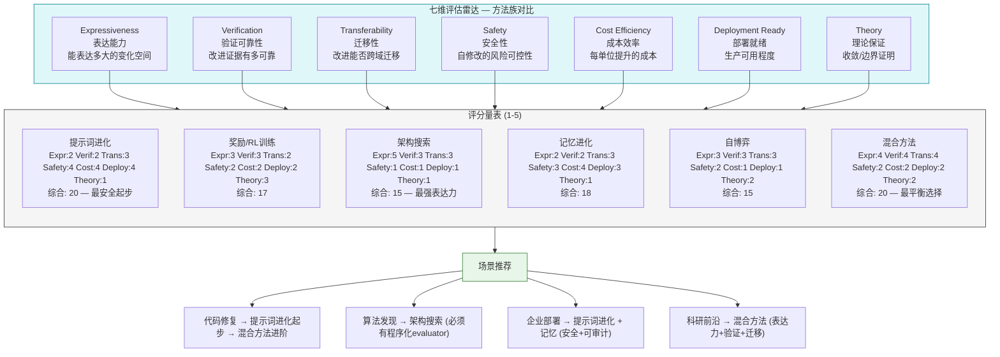

# 七维评估雷达图 — 方法族对比

- generated_at: 2026-05-25
- source: research/formal-framework-agent-evolution.md §4.3
- purpose: 六大方法族在七个维度上的可视化对比

## 评分详细表

| 方法族 | Expr. | Verif. | Trans. | Safety | Cost | Deploy | Theory | **综合** |
|---|---:|---:|---:|---:|---:|---:|---:|---:|
| 提示词进化 | 2 | 2 | 3 | 4 | 4 | 4 | 1 | **20** |
| 奖励/RL训练 | 3 | 3 | 2 | 2 | 2 | 2 | 3 | **17** |
| 架构搜索 | 5 | 3 | 3 | 1 | 1 | 1 | 1 | **15** |
| 记忆进化 | 2 | 2 | 3 | 3 | 4 | 3 | 1 | **18** |
| 自博弈 | 3 | 3 | 3 | 2 | 1 | 1 | 2 | **15** |
| **混合方法** | **4** | **4** | **4** | **2** | **2** | **2** | **2** | **20** |

## 维度定义

| 维度 | 1分 (最弱) | 3分 (中等) | 5分 (最强) |
|---|---|---|---|
| Expressiveness | 仅改输出文本 | 改 prompt+记忆 | 能改代码/架构/权重 |
| Verification | 纯自评 | LLM-as-judge | 独立程序化验证 |
| Transferability | 单 benchmark | 同域跨任务 | 跨模型/跨域/跨环境 |
| Safety | 任意自修改 | 人工审批门控 | 分级自治+不可篡改评估 |
| Cost Efficiency | 需大规模基础设施 | 中等资源 | 单 API 调用即可 |
| Deployment Ready | 研究 demo | 有基本监控 | SLO/监控/回滚/审计 |
| Theory | 无保证 | 经验性规律 | 有收敛/边界证明 |
