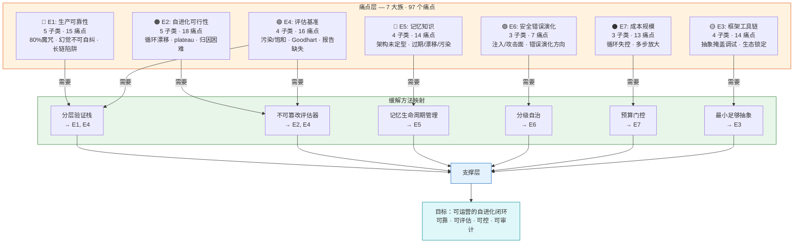

# 痛点分类学可视化

- generated_at: 2026-05-25
- source: research/formal-framework-agent-evolution.md §3 + mom-test-findings-ZH.md
- purpose: 97 个痛点在 7 大族中的分布 + 方法缓解映射

## 痛点频率 Top 10

| 痛点 ID | 描述 | 受影响方法族 | 严重度 |
|---|---|---|---|
| P022 | Leaderboard 过拟合 | 所有 | 高 |
| P062 | 基准污染 | 所有 | 高 |
| P067 | Goodhart 效应 | 奖励类、自奖励类 | 高 |
| P009 | 幻觉不可自纠 | 所有 | 高 |
| P015 | 循环漂移 | 反思类、进化类 | 高 |
| P070 | 计算成本不可控 | 所有 | 高 |
| P040 | 失败归因困难 | 混合方法 | 中 |
| P054 | 自评循环失真 | 自奖励类 | 中 |
| P004 | 框架抽象掩盖调试 | 框架类 | 中 |
| P031 | 人工依赖 | 所有 | 中 |

## 核心洞察

**97 个痛点的前五大类全部指向同一个核心矛盾：可运营闭环缺失。**

自进化系统需要同时满足：可靠（E1）、可评估（E4）、可控（E2/E6）、可审计（E3）、可承受（E7）。当前没有任何方法族能同时满足所有五项。
