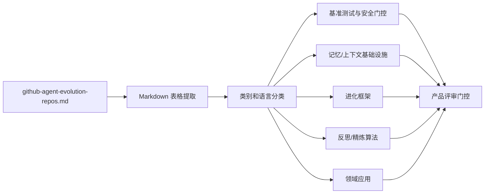

# GitNexus 智能体进化仓库评审报告

日期: 2026-05-20
任务: `Av0awMJt6E4j` — 项目级 GitNexus 技术/代码/领域提取与评审输出。
主要来源: [`github-agent-evolution-repos.md`](../../github-agent-evolution-repos.md)
GitNexus 证据: `gitnexus analyze --skip-git --index-only --name awesome-evolution .` 将此工作区作为非 Git 文件夹进行索引: **2 个节点, 1 条边, 0 个集群, 0 条流**。

## L1 结论

当前 `awesome-evolution` 工作区是一个策展型仓库语料库，而非代码密集型项目，因此可执行的输出是对 107 个智能体进化仓库的领域/技术分类评审，以及一份用于深入 PDF/LaTeX 评审的缺口清单。

## L2 证据摘要

- 已检查的工作区文件: `.aha` 之外仅存在 `github-agent-evolution-repos.md`; `wiki/log.md` 不存在。
- GitNexus 已安装 (`1.6.5`) 且可以索引该文件夹，但该工作区中没有本地源文件、符号、流、PDF 文件或 LaTeX 文件可供分析。
- 该语料库包含 **107 个仓库**: 47 个框架, 23 个应用, 16 个评测项目, 13 个论文代码仓库, 以及 8 个工具。

## 语料库提取

### 类别分布

| 类别 | 数量 | 总星标数 | 评审含义 |
|---|---:|---:|---|
| 框架 | 47 | 68,791 | 主导的实现层面: 运行时、记忆层、测试工具链、编排框架。 |
| 工具 | 8 | 27,684 | 项目较少但关注度极高; 上下文数据库和精选列表塑造了生态系统发现路径。 |
| 应用 | 23 | 18,705 | 特定领域的自我改进循环: 编程、交易、网页、操作系统、提示词、语音、生物医学。 |
| 评测 | 16 | 16,755 | 评测和基准测试工具链是安全进化的主要差异化因素。 |
| 论文代码 | 13 | 5,985 | 研究实现提供了核心机制，但需要生产级加固。 |

### 语言分布

| 语言 | 数量 | 评审含义 |
|---|---:|---|
| Python | 81 | 主流研究和智能体框架语言; 算法对比的最快路径。 |
| N/A | 8 | 大多为精选列表或仅含元数据的资源。 |
| Rust | 6 | 面向长时间运行智能体和更安全本地编排的系统/运行时方向。 |
| TypeScript | 5 | Web/UI、记忆操作系统和智能体平台集成层面。 |
| JavaScript | 2 | 进化引擎和精选工具生态系统。 |
| Jupyter Notebook | 2 | 探索性或教程风格的实现。 |
| Java | 1 | 记忆/上下文引擎细分领域。 |
| Shell | 1 | CLI 编排/元智能体工具。 |
| HTML | 1 | 轻量级记忆/系统产物。 |

## 按关注度排序的领先项目

| 排名 | 仓库 | 星标数 | 类别 | 语言 | 技术/领域信号 |
|---:|---|---:|---|---|---|
| 1 | `volcengine/OpenViking` | 24,247 | 工具 | Python | 智能体上下文数据库; 智能体的记忆/上下文基础设施。 |
| 2 | `letta-ai/letta` | 22,833 | 框架 | Python | 有状态智能体与支持记忆的学习/自我改进。 |
| 3 | `lsdefine/GenericAgent` | 11,837 | 框架 | Python | 具有技能树增长和系统控制能力的自我进化智能体。 |
| 4 | `MemTensor/MemOS` | 9,211 | 评测 | TypeScript | 自我进化记忆操作系统, 混合检索, 跨任务技能复用。 |
| 5 | `EvoMap/evolver` | 7,507 | 框架 | JavaScript | 基于基因/胶囊/事件的可审计进化引擎。 |
| 6 | `HKUDS/OpenSpace` | 6,277 | 框架 | Python | 低成本/自我进化智能体框架。 |
| 7 | `aiwaves-cn/agents` | 5,927 | 框架 | Python | 以数据为中心的自主语言智能体。 |
| 8 | `EverMind-AI/EverOS` | 5,128 | 评测 | Python | 长期记忆构建/评估/集成技术栈。 |
| 9 | `NousResearch/hermes-agent-self-evolution` | 3,401 | 应用 | Python | 使用 DSPy + GEPA 进行进化式技能/提示词/代码优化。 |
| 10 | `noahshinn/reflexion` | 3,155 | 论文代码 | Python | 基于反思记忆的言语强化学习。 |

## 技术分类

### 1. 记忆与上下文基础设施

代表性仓库: `volcengine/OpenViking`, `letta-ai/letta`, `MemTensor/MemOS`, `EverMind-AI/EverOS`, `openmemind/memind`, `memovai/memov`, `28naem-del/mnemosyne`。

评审: 记忆是持续自我进化的核心原语。最强的项目明确建模了长期记忆、情景记忆、混合检索、跨任务复用和可追溯性。对于基于此语料库构建的任何产品，记忆不能被视为聊天历史; 它需要生命周期管理、评估、来源追溯和回归门控。

### 2. 进化引擎与智能体框架

代表性仓库: `lsdefine/GenericAgent`, `EvoMap/evolver`, `HKUDS/OpenSpace`, `aiwaves-cn/agents`, `EvoAgentX/EvoAgentX`, `sentrux/sentrux`, `greyhaven-ai/autocontext`, `neosigmaai/auto-harness`, `ReflexioAI/reflexio`, `AgentToolkit/altk-evolve`。

评审: 框架集群拥有最大份额的仓库和星标数。常见机制包括技能树、提示词/测试工具优化、以数据为中心的反馈循环、事件驱动的进化、自我参照改进和持续代码质量感知。产品评审应优先考虑那些暴露可审计进化事件并具备回滚/审批边界的框架，而非黑盒自我修改。

### 3. 反思、精炼与言语强化学习

代表性仓库: `noahshinn/reflexion`, `madaan/self-refine`, `metauto-ai/GPTSwarm`, `ngoodman/metaprompt`, `mbchang/meta-prompt`, `faveos8758/reflexion-agent-ts`。

评审: 反思仍然是一个基础模式，但单独使用并不充分。这些项目作为算法基线非常有用: 生成、批评、修订、存储经验教训并重试。生产环境中的差距通常是证据质量: 反思必须与任务结果、测试、人工评审或可衡量的回归相关联。

### 4. 基准测试、评估与安全门控

代表性仓库: `Human-Agent-Society/CORAL`, `modelscope/AgentJet`, `OpenTracy/OpenTracy`, `OpenDataBox/Workspace-Bench`, `ShaoShuai0605/Misevolution`, `YinBo0927/FATE`, `sethkarten/continual-harness`。

评审: 评估项目构成了自我进化系统的安全防线。重要信号包括故障挖掘、轨迹回放、回归门控、审批工作流、基准测试工作区和明确的错误进化风险分析。任何路线图都应将每个自我改进机制与一个评估/测试工具对应项配对。

### 5. 领域应用

代表性仓库: `jennyzzt/dgm`, `facebookresearch/HyperAgents`, `chrisworsey55/atlas-gic`, `OS-Copilot/OS-Copilot`, `yologdev/yoyo-evolve`, `modelscope/AgentEvolver`, `AMAP-ML/SkillClaw`, `LYL1015/JarvisEvo`, `THUDM/WebRL`, `facebookresearch/drzero`, `zaixizhang/STELLA`, `zhang677/AccelOpt`。

评审: 应用项目展示了自我进化从通用智能体向编程智能体、操作系统智能体、网页智能体、搜索智能体、图片编辑、交易、生物医学研究和 AI 加速器优化的扩展。领域层倾向于引入专门的评估器; 这些评估器往往是真正的产品护城河。

## GitNexus / Mermaid 架构视图



自镜像节点映射:

- `awesome-evolution.corpus`: `github-agent-evolution-repos.md`; 上游搜索和 GitHub 元数据; 下游分类评审。
- `awesome-evolution.gitnexus-index`: 此工作区的本地 GitNexus 索引; 证据 `2 个节点 | 1 条边 | 0 个集群 | 0 条流`。
- `awesome-evolution.review`: 本报告; 下游候选 PDF/LaTeX 或稿件制作。

## PDF / LaTeX 评审状态

当前工作区中不存在 `.pdf`、`.tex`、`.bib` 或本地稿件文件。因此，在本轮任务中无法从本地文件完成实际的 PDF/LaTeX 源评审。推荐的下一步产物为:

1. 添加一个稿件源目录 (`paper/`、`latex/` 或 `docs/`) 并对声明、引用、表格、图表和可重复性进行结构化评审; 或
2. 在产品/学术大纲获得批准后，从此语料库创建 LaTeX 综述草稿。

## 评审发现

### 优势

- 语料库覆盖面足够广泛，可支撑生态系统综述: 跨越框架、应用、评测、工具和论文代码的 107 个仓库。
- 源表中的语料库截至 2026-05-20 仍是最新的，因此捕捉了当前的关注度模式。
- 类别已区分了实现意图，使产品评审比扁平的精选列表更有价值。

### 风险 / 缺口

- 星标数和更新日期是从现有本地语料库中读取的; 本任务未重新查询 GitHub 或克隆所有仓库。
- 源表中有若干描述被截断，因此详细的代码级声明需要特定仓库的 GitNexus 索引。
- 该工作区没有本地代码、PDF 或 LaTeX，因此"整体评审"目前是语料库评审而非稿件评审。
- 如 `评测` 等类别可能同时包含基准测试系统和记忆平台; 第二轮应对分类标准进行规范化处理。

## 建议的后续步骤

1. 使用 GitNexus 克隆/索引排名前 10 的仓库，并针对记忆、测试工具、评估器和进化循环实现生成符号/流级别的对比。
2. 定义规范化模式: `仓库`, `机制`, `记忆模型`, `进化触发器`, `评估器`, `安全门控`, `运行时`, `证据`, `许可证`。
3. 添加 PDF/LaTeX 源文件或批准创建新的综述稿件，然后根据规范化模式评审声明和引用。
4. 将产品评审与学术评审分离: 产品评审应评估可部署性和安全性; 学术评审应评估新颖性、证据和引用覆盖度。

## 验证命令

```bash
find . -maxdepth 4 -type f -not -path './.git/*' -not -path './.aha/*' | sort
gitnexus doctor
gitnexus analyze --skip-git --index-only --name awesome-evolution .
python3 /tmp/analyze_repos.py
```
