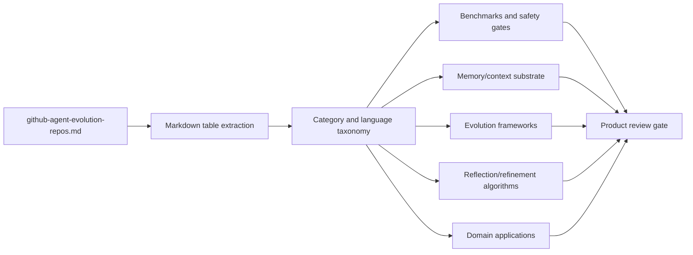

# GitNexus Agent Evolution Repository Review

Date: 2026-05-20  
Task: `Av0awMJt6E4j` — project-wide GitNexus technical/code/domain extraction and review output.  
Primary source: [`github-agent-evolution-repos.md`](../../github-agent-evolution-repos.md)  
GitNexus evidence: `gitnexus analyze --skip-git --index-only --name awesome-agent-evolution .` indexed this workspace as a non-git folder: **2 nodes, 1 edge, 0 clusters, 0 flows**.

## L1 Verdict

The current `awesome-agent-evolution` workspace is a curated repository corpus rather than a code-heavy project, so the actionable output is a domain/technology taxonomy review of 107 agent-evolution repositories plus a gap list for deeper PDF/LaTeX review.

## L2 Evidence Summary

- Workspace files inspected: only `github-agent-evolution-repos.md` is present outside `.aha`; `wiki/log.md` is absent.
- GitNexus is installed (`1.6.5`) and can index the folder, but there are no local source files, symbols, flows, PDF files, or LaTeX files to analyze in this workspace.
- The corpus contains **107 repositories**: 47 frameworks, 23 applications, 16 evaluation projects, 13 paper-code repositories, and 8 tools.

## Corpus Extraction

### Category distribution

| Category | Count | Total stars | Review meaning |
|---|---:|---:|---|
| 框架 | 47 | 68,791 | Dominant implementation surface: runtimes, memory layers, harnesses, orchestration frameworks. |
| 工具 | 8 | 27,684 | Fewer projects but high attention; context DBs and awesome lists shape ecosystem discovery. |
| 应用 | 23 | 18,705 | Domain-specific self-improvement loops: coding, trading, web, OS, prompt, voice, biomedical. |
| 评测 | 16 | 16,755 | Evaluation and benchmark harnesses are a major differentiator for safe evolution. |
| 论文代码 | 13 | 5,985 | Research implementations provide mechanisms but need production hardening. |

### Language distribution

| Language | Count | Review meaning |
|---|---:|---|
| Python | 81 | Mainstream research and agent-framework language; fastest path for algorithm comparison. |
| N/A | 8 | Mostly curated lists or metadata-only resources. |
| Rust | 6 | Systems/runtime direction for long-running agents and safer local orchestration. |
| TypeScript | 5 | Web/UI, memory OS, and agent platform integration surface. |
| JavaScript | 2 | Evolution engines and curated tool ecosystems. |
| Jupyter Notebook | 2 | Exploratory or tutorial-style implementations. |
| Java | 1 | Memory/context engine niche. |
| Shell | 1 | CLI orchestration/meta-agent tooling. |
| HTML | 1 | Lightweight memory/system artifact. |

## Leading Projects by Attention

| Rank | Repository | Stars | Category | Language | Technical/domain signal |
|---:|---|---:|---|---|---|
| 1 | `volcengine/OpenViking` | 24,247 | 工具 | Python | Agent context database; memory/context substrate for agents. |
| 2 | `letta-ai/letta` | 22,833 | 框架 | Python | Stateful agents and memory-enabled learning/self-improvement. |
| 3 | `lsdefine/GenericAgent` | 11,837 | 框架 | Python | Self-evolving agent with skill-tree growth and system-control claim. |
| 4 | `MemTensor/MemOS` | 9,211 | 评测 | TypeScript | Self-evolving memory OS, hybrid retrieval, cross-task skill reuse. |
| 5 | `EvoMap/evolver` | 7,507 | 框架 | JavaScript | Gene/capsule/event-based auditable evolution engine. |
| 6 | `HKUDS/OpenSpace` | 6,277 | 框架 | Python | Low-cost/self-evolving agent framework. |
| 7 | `aiwaves-cn/agents` | 5,927 | 框架 | Python | Data-centric autonomous language agents. |
| 8 | `EverMind-AI/EverOS` | 5,128 | 评测 | Python | Long-term memory build/evaluate/integration stack. |
| 9 | `NousResearch/hermes-agent-self-evolution` | 3,401 | 应用 | Python | Evolutionary skill/prompt/code optimization with DSPy + GEPA. |
| 10 | `noahshinn/reflexion` | 3,155 | 论文代码 | Python | Verbal reinforcement learning via reflection memory. |

## Technical Taxonomy

### 1. Memory and context substrate

Representative repositories: `volcengine/OpenViking`, `letta-ai/letta`, `MemTensor/MemOS`, `EverMind-AI/EverOS`, `openmemind/memind`, `memovai/memov`, `28naem-del/mnemosyne`.

Review: memory is the central primitive for persistent self-evolution. The strongest projects explicitly model long-term memory, episodic memory, hybrid retrieval, cross-task reuse, and traceability. For any product built from this corpus, memory cannot be treated as chat history; it needs lifecycle, evaluation, provenance, and regression gates.

### 2. Evolution engines and agent frameworks

Representative repositories: `lsdefine/GenericAgent`, `EvoMap/evolver`, `HKUDS/OpenSpace`, `aiwaves-cn/agents`, `EvoAgentX/EvoAgentX`, `sentrux/sentrux`, `greyhaven-ai/autocontext`, `neosigmaai/auto-harness`, `ReflexioAI/reflexio`, `AgentToolkit/altk-evolve`.

Review: the framework cluster owns the largest share of repositories and stars. Common mechanisms include skill trees, prompt/harness optimization, data-centric feedback loops, event-sourced evolution, self-referential improvement, and continuous code-quality sensing. Product review should prioritize frameworks that expose auditable evolution events and rollback/approval boundaries over black-box self-modification.

### 3. Reflection, refinement, and verbal RL

Representative repositories: `noahshinn/reflexion`, `madaan/self-refine`, `metauto-ai/GPTSwarm`, `ngoodman/metaprompt`, `mbchang/meta-prompt`, `faveos8758/reflexion-agent-ts`.

Review: reflection remains a foundational pattern but is not sufficient alone. These projects are useful as algorithmic baselines: generate, critique, revise, store lessons, and retry. The gap for production is usually evidence quality: reflections must be tied to task outcomes, tests, human review, or measurable regressions.

### 4. Benchmarks, evaluation, and safety gates

Representative repositories: `Human-Agent-Society/CORAL`, `modelscope/AgentJet`, `OpenTracy/OpenTracy`, `OpenDataBox/Workspace-Bench`, `ShaoShuai0605/Misevolution`, `YinBo0927/FATE`, `sethkarten/continual-harness`.

Review: evaluation projects form the safety perimeter for self-evolving systems. Important signals include failure mining, trajectory replay, regression gates, approval workflows, benchmark workspaces, and explicit mis-evolution risk analysis. Any roadmap should pair every self-improvement mechanism with an evaluation/harness counterpart.

### 5. Domain applications

Representative repositories: `jennyzzt/dgm`, `facebookresearch/HyperAgents`, `chrisworsey55/atlas-gic`, `OS-Copilot/OS-Copilot`, `yologdev/yoyo-evolve`, `modelscope/AgentEvolver`, `AMAP-ML/SkillClaw`, `LYL1015/JarvisEvo`, `THUDM/WebRL`, `facebookresearch/drzero`, `zaixizhang/STELLA`, `zhang677/AccelOpt`.

Review: application projects show self-evolution moving from generic agents into coding agents, OS agents, web agents, search agents, photo editing, trading, biomedical research, and AI accelerator optimization. The domain layer tends to introduce specialized evaluators; these evaluators are often the real product moat.

## GitNexus / Mermaid Architecture View



Self Mirror node map:

- `awesome-agent-evolution.corpus`: `github-agent-evolution-repos.md`; upstream search and GitHub metadata; downstream taxonomy review.
- `awesome-agent-evolution.gitnexus-index`: local GitNexus index of this workspace; evidence `2 nodes | 1 edges | 0 clusters | 0 flows`.
- `awesome-agent-evolution.review`: this report; downstream candidate PDF/LaTeX or manuscript production.

## PDF / LaTeX Review Status

No `.pdf`, `.tex`, `.bib`, or local manuscript files exist in the current workspace. Therefore, an actual PDF/LaTeX source review cannot be completed from local files in this task iteration. Recommended next artifact is either:

1. add a manuscript source tree (`paper/`, `latex/`, or `docs/`) and run a structured review over claims, citations, tables, figures, and reproducibility; or
2. create a LaTeX survey draft from this corpus after product/academic outline approval.

## Review Findings

### Strengths

- The corpus is broad enough to support an ecosystem survey: 107 repositories across frameworks, applications, evaluation, tools, and paper-code.
- The corpus is fresh as of 2026-05-20 in the source table, so it captures current attention patterns.
- Categories already distinguish implementation intent, which makes a product review more useful than a flat awesome list.

### Risks / Gaps

- Star counts and update dates were read from the existing local corpus; this task did not re-query GitHub or clone all repositories.
- Several descriptions are truncated in the source table, so detailed code-level claims require repository-specific GitNexus indexes.
- The workspace has no local code, PDFs, or LaTeX, so “整体review” is currently a corpus review rather than a manuscript review.
- Categories such as `评测` may include both benchmark systems and memory platforms; a second pass should normalize classification criteria.

## Recommended Next Steps

1. Clone/index the top 10 repositories with GitNexus and produce symbol/flow-level comparisons for memory, harness, evaluator, and evolution-loop implementations.
2. Define a normalized schema: `repo`, `mechanism`, `memory model`, `evolution trigger`, `evaluator`, `safety gate`, `runtime`, `evidence`, `license`.
3. Add PDF/LaTeX sources or approve creation of a new survey manuscript, then review claims and citations against the normalized schema.
4. Separate product review from academic review: product review should score deployability and safety; academic review should score novelty, evidence, and citation coverage.

## Verification Commands

```bash
find . -maxdepth 4 -type f -not -path './.git/*' -not -path './.aha/*' | sort
gitnexus doctor
gitnexus analyze --skip-git --index-only --name awesome-agent-evolution .
python3 /tmp/analyze_repos.py
```
