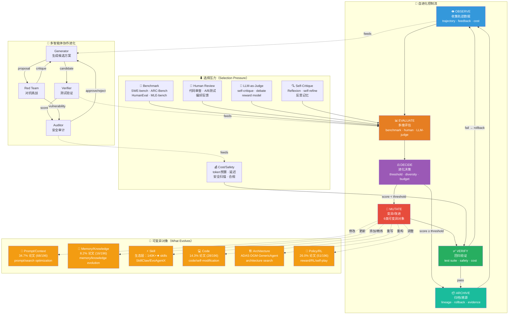

# Agent 自进化机制全景图（Mermaid DAG）

- generated_at: 2026-05-26
- source: 综合 `evolution-state-machine.md` + `method-taxonomy-mermaid.md` + `cross-source-validation-map.md` + `propagation-self-evolution-core.md`
- purpose: 展示Agent自进化的完整机制闭环——观察→评估→决策→变异→验证→归档，以及6类可变异对象的进化路径

## 核心洞察

全景图揭示三个层次：
1. **控制流层**（横向）：OBSERVE → EVALUATE → DECIDE → MUTATE → VERIFY → ARCHIVE → 循环
2. **对象层**（纵向）：Prompt / Memory / Skill / Code / Architecture / Policy 六类可变异对象
3. **选择压力层**（底部）：Benchmark / Human / LLM-Judge / Self-Critique / Cost / Safety

## 数据支撑

| 机制维度 | 论文数量 | 占比 | 代表性项目/方法 |
|---------|-------:|-----:|-------------|
| Prompt/Search Optimization | 68 | 34.7% | EvoPrompt, GEPA |
| Reward/RL/Self-play | 51 | 26.0% | Absolute Zero, RAGEN |
| Code/Self-modification | 28 | 14.3% | DGM, AlphaEvolve |
| Multi-agent Reflection/Debate | 16 | 8.2% | Reflexion, CORAL |
| Memory/Knowledge Evolution | 16 | 8.2% | Mem0, lifelong learning |
| Web/Tool/Environment | 13 | 6.6% | Voyager, Agent-R |
| Evaluation/Safety/Governance | 4 | 2.0% | Misevolution study |

数据来源：`paper-method-classification-snapshot.csv` (196 papers classified)

## 关键发现

1. **Prompt优化是最大方法族**（34.7%），但对应Repo中memory类最多（60个），说明论文与实践存在研究-应用gap
2. **选择压力多样化**：从单一benchmark到多维度评估（benchmark + human + LLM-judge + cost + safety）
3. **多智能体协作是进化加速器**：Generator-Verifier-RedTeam-Auditor 四角色互补降低共同盲点风险
4. **验证环节是瓶颈**：交叉验证显示"demo成功 ≠ production成功"（Reliability gap: 2 papers vs 132 repos vs 19 painpoints）
