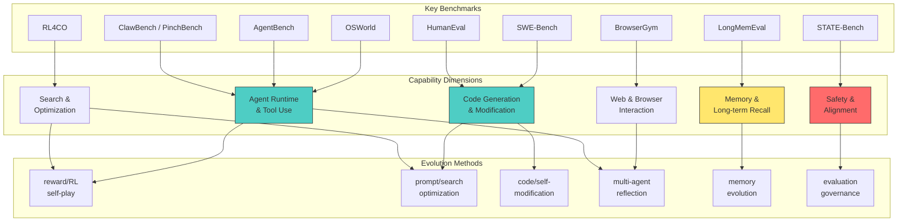

# Benchmark 覆盖关系图

- generated_at: 2026-05-25
- source: `README.md` benchmark section + `analysis/github-project-data-analysis.json`
- benchmark_repos: 163

## Benchmark Gap Analysis

| Dimension | Benchmarks | Coverage | Gap |
|-----------|-----------|----------|-----|
| Code | SWE-Bench, HumanEval | Strong | Well-covered |
| Web/Browser | BrowserGym | Moderate | Need more real-world |
| Agent Runtime | AgentBench, OSWorld | Strong | Growing |
| Memory | LongMemEval | Weak | Under-benchmarked |
| Optimization | RL4CO | Moderate | Niche |
| Safety | STATE-Bench | Weak | Critical gap |
