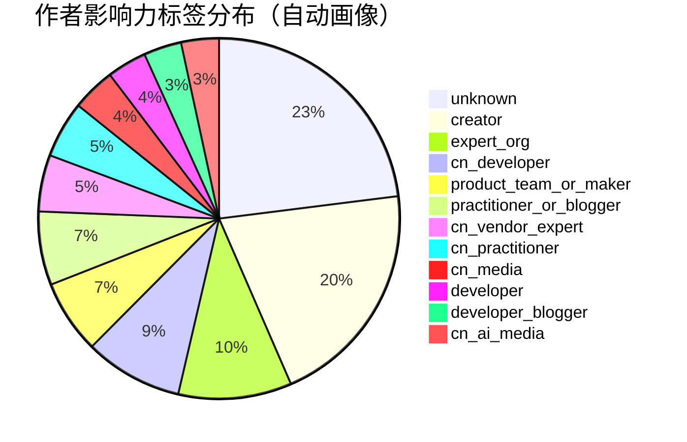
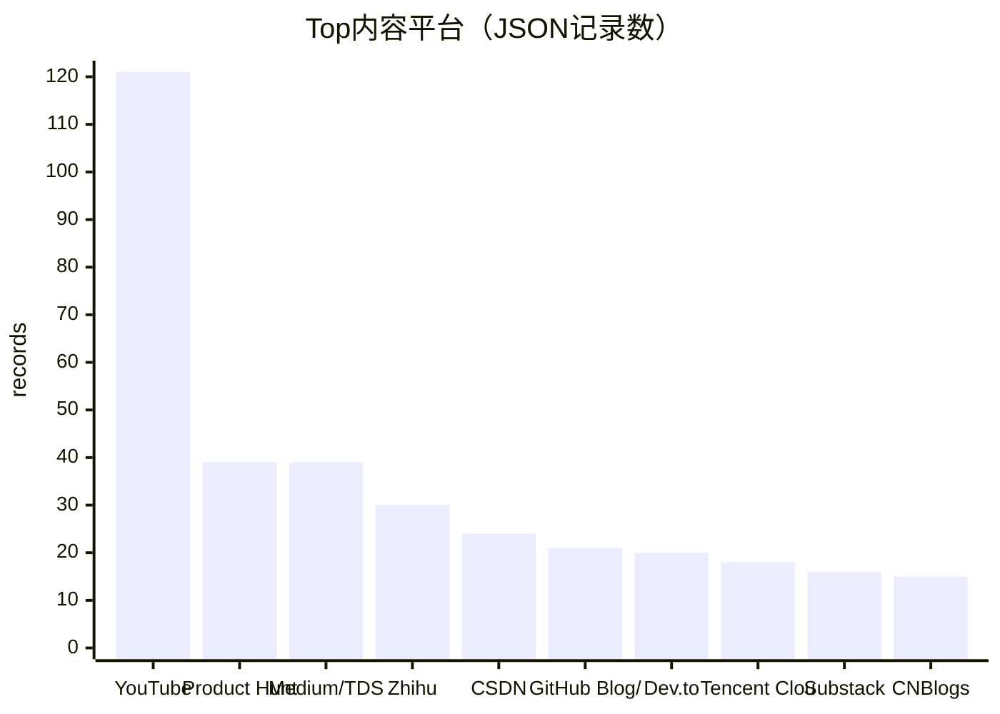

# 博客/视频作者画像统计（当前快照）

- generated_at: 2026-05-26T09:34:56+08:00
- raw_blog_files: 1308
- json_item_records: 652
- author_profiles_need_enrichment: 572 / 652
- warning: 作者画像多为自动补全字段，`needs_enrichment=True` 占比高；这是一张“缺口定位图”，不是最终KOL排名。

## 平台分布 Top 25

| Platform | Records | Share |
|---|---:|---:|
| YouTube | 121 | 18.6% |
| Product Hunt | 39 | 6.0% |
| Medium/TDS | 39 | 6.0% |
| Zhihu | 30 | 4.6% |
| CSDN | 24 | 3.7% |
| GitHub Blog/Docs | 21 | 3.2% |
| Dev.to | 20 | 3.1% |
| Tencent Cloud Dev | 18 | 2.8% |
| Substack | 16 | 2.5% |
| CNBlogs | 15 | 2.3% |
| 36Kr | 13 | 2.0% |
| Juejin | 13 | 2.0% |
| Alibaba Cloud Dev | 12 | 1.8% |
| arxiv.org | 12 | 1.8% |
| Anthropic Blog | 11 | 1.7% |
| OpenAI Blog | 11 | 1.7% |
| WeChat Official Accounts | 11 | 1.7% |
| InfoQ China | 10 | 1.5% |
| LangChain Blog | 10 | 1.5% |
| Leiphone | 10 | 1.5% |
| Machine Heart | 10 | 1.5% |
| QbitAI | 10 | 1.5% |
| SegmentFault | 10 | 1.5% |
| baijiahao.baidu.com | 10 | 1.5% |
| humanloop.com | 10 | 1.5% |

## 影响力标签分布

| Influence rating | Records | Share |
|---|---:|---:|
| unknown | 136 | 20.9% |
| creator | 121 | 18.6% |
| expert_org | 60 | 9.2% |
| cn_developer | 52 | 8.0% |
| product_team_or_maker | 39 | 6.0% |
| practitioner_or_blogger | 39 | 6.0% |
| cn_vendor_expert | 30 | 4.6% |
| cn_practitioner | 30 | 4.6% |
| cn_media | 23 | 3.5% |
| developer | 21 | 3.2% |
| developer_blogger | 20 | 3.1% |
| cn_ai_media | 20 | 3.1% |
| newsletter_author | 16 | 2.5% |
| academic | 14 | 2.1% |
| cn_media_or_kol | 11 | 1.7% |
| cn_media_or_expert | 10 | 1.5% |
| tech_media | 10 | 1.5% |

详表：`blog-author-profile-index.csv`。
