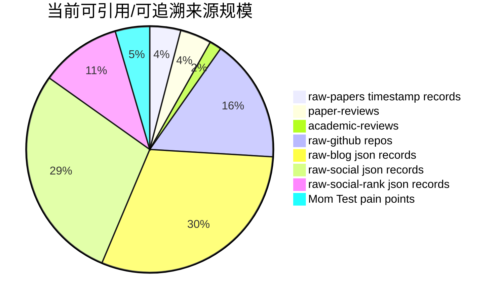

# 引用/来源统计图

- generated_at: 2026-05-21T22:21:49+08:00
- use: 作为参考文献与附录覆盖率的统计入口。

| Source bucket | Count |
|---|---:|
| raw-papers timestamp records | 87 |
| paper-reviews | 88 |
| academic-reviews | 34 |
| raw-github repos | 348 |
| raw-blog json records | 652 |
| raw-social json records | 612 |
| raw-social-rank json records | 228 |
| Mom Test pain points | 97 |

## 论文时间切片 Top

| Time slice | Paper records |
|---|---:|
| 2025-10 | 8 |
| 2025-05 | 8 |
| 2024-Q4 | 8 |
| 2024-Q3 | 7 |
| 2025-08 | 6 |
| 2024-Q1 | 6 |
| 2025-06 | 5 |
| 2025-01 | 5 |
| 2025-02 | 5 |
| 2025-09 | 5 |
| 2025-11 | 4 |
| 2023-Q2 | 3 |
| 2025-04 | 3 |
| 2023-Q4 | 2 |
| 2023-Q1 | 2 |
| 2025-12 | 2 |
| 2024-Q2 | 2 |
| early | 1 |
| 2025-03 | 1 |
| 2023-Q3 | 1 |
