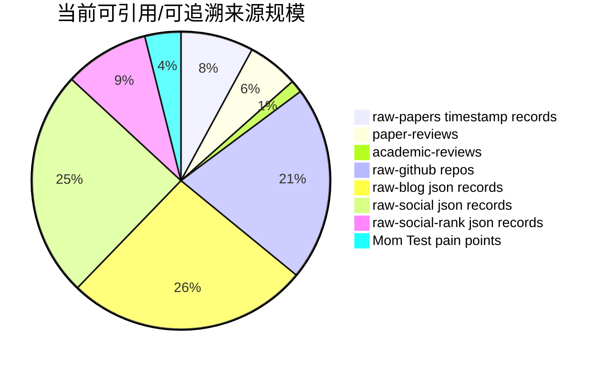

# 引用/来源统计图

- generated_at: 2026-05-26T09:34:56+08:00
- use: 作为参考文献与附录覆盖率的统计入口。

| Source bucket | Count |
|---|---:|
| raw-papers timestamp records | 196 |
| paper-reviews | 137 |
| academic-reviews | 34 |
| raw-github repos | 525 |
| raw-blog json records | 652 |
| raw-social json records | 613 |
| raw-social-rank json records | 228 |
| Mom Test pain points | 97 |

## 论文时间切片 Top

| Time slice | Paper records |
|---|---:|
| 2025-05 | 16 |
| 2025-10 | 16 |
| 2024-10 | 12 |
| 2025-08 | 11 |
| 2025-01 | 10 |
| 2025-02 | 10 |
| 2025-06 | 10 |
| 2026-04 | 10 |
| 2025-09 | 9 |
| 2025-04 | 8 |
| 2024-01 | 7 |
| 2025-11 | 7 |
| 2026-03 | 7 |
| 2024-09 | 6 |
| 2026-02 | 6 |
| 2026-05 | 6 |
| 2023-03 | 4 |
| 2023-05 | 4 |
| 2025-07 | 4 |
| 2024-02 | 3 |
