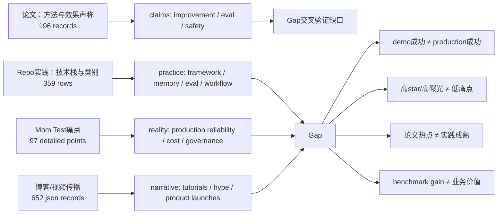

# 数据交叉验证图：论文声称 × Repo实践 × 社区痛点 × 博客传播

- generated_at: 2026-05-25T15:25:19+08:00
- purpose: 给后续综述提供“矛盾点/验证点”导航，不替代深度review。

| Topic | Paper signal | Repo signal | Painpoint signal | Blog signal | Interpretation |
|---|---:|---:|---:|---:|---|
| Reliability / production gap | 2 | 131 | 19 | 43 | strong mismatch risk |
| Evaluation / benchmark gap | 6 | 85 | 10 | 28 | strong mismatch risk |
| Memory / drift / forgetting | 16 | 59 | 10 | 34 | strong mismatch risk |
| Framework opacity / tooling | 87 | 66 | 14 | 85 | strong mismatch risk |
| Safety / governance / cost | 4 | 86 | 11 | 6 | strong mismatch risk |
| Self-improvement feasibility | 60 | 59 | 12 | 116 | strong mismatch risk |

详表：`cross-source-validation-matrix.csv`。
