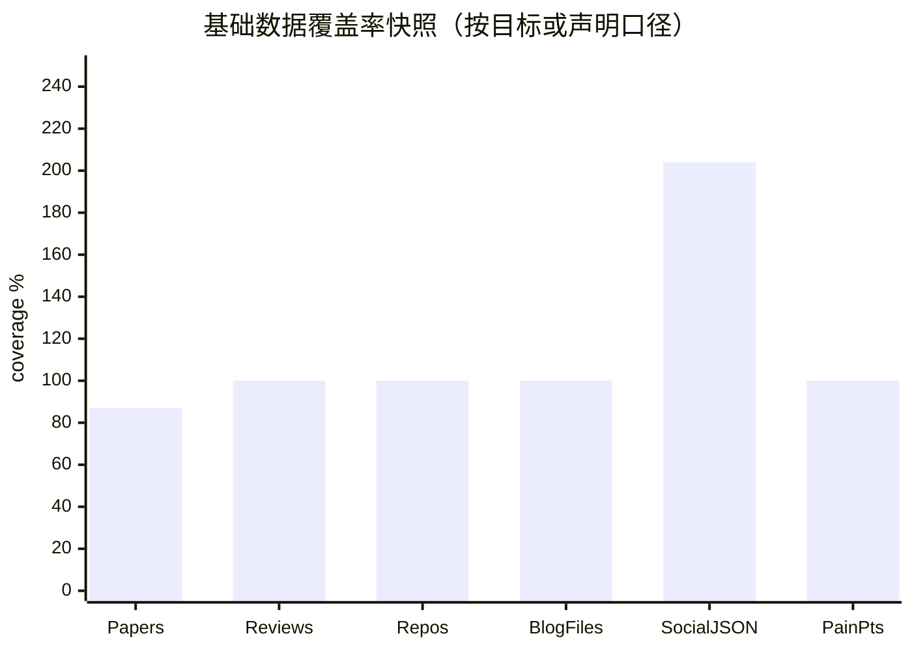
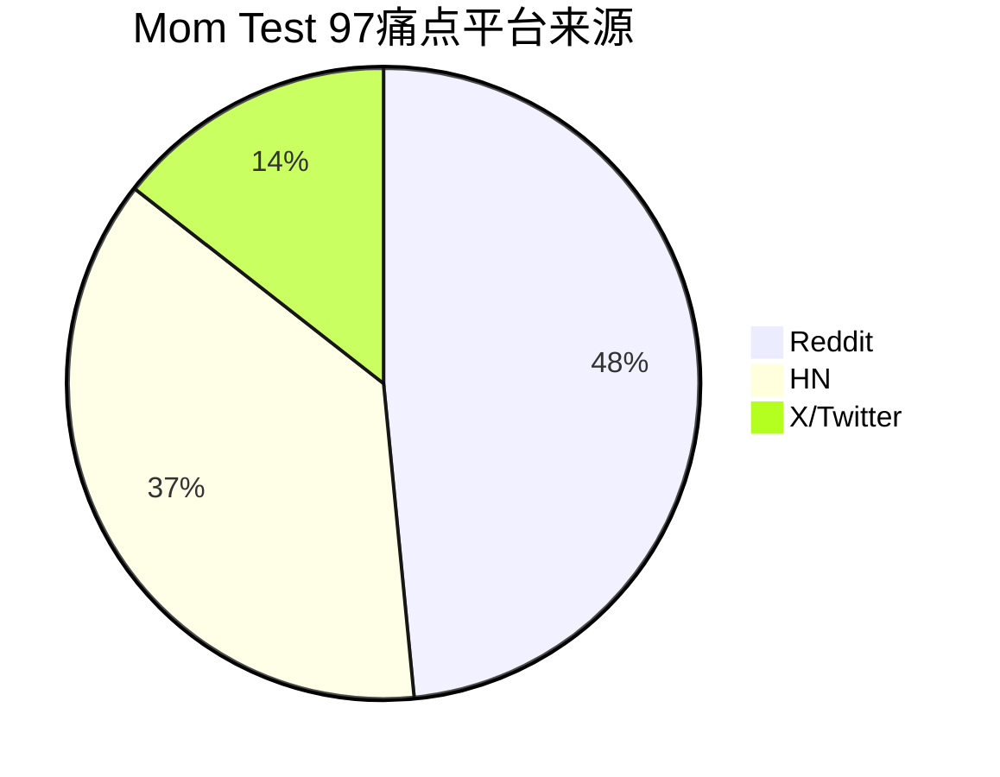

# 数据覆盖仪表盘（当前快照）

- generated_at: 2026-05-21T22:21:49+08:00
- scope: 仅基于当前仓库文件生成；基础数据仍在并行补齐，所有图表应在最终综述前重跑。
- important discrepancy: `output/raw-papers-timestamp-index.json` 当前为 87 条，而 Master 消息称 raw-papers 88/100；`raw-blogs/` 当前为 1306 个文件、652 条 JSON item 记录，需区分“文件数”和“内容条目数”。

| Dataset | Current | Target / Claim | Coverage | Status |
|---|---:|---|---:|---|
| raw-papers timestamp index | 87 | 100 target / Master said 88 currently | 87.0% | gap: count discrepancy vs Master message |
| paper-reviews deep reviews | 88 | 88 reviews | 100.0% | meets/exceeds 88 target |
| academic-reviews supplemental | 34 | supporting reviews | supplemental | partly duplicate ids possible |
| raw-github repo README/code snapshots | 348 | 348 repos | 100.0% | complete snapshot; cross-analysis exists |
| repo techstack cross-analysis rows | 348 | 348 repos | 100.0% | complete snapshot |
| raw-blogs files | 1306 | 1306 files mentioned by Master | 100.0% | files are json+md pairs; item records below |
| raw-blogs JSON item records | 652 | 1306 blog claim requires clarification | 652 json records if paired files | author_profile present but needs enrichment |
| raw-social files | 1291 | 300+ full posts / earlier 131 | file count includes md+json pairs | needs full-text status audit |
| raw-social JSON item records | 612 | 300+ posts | 204.0% | above 300 json records; quality varies |
| Mom Test pain points | 97 | 97 pain points | 100.0% | detailed platform files parse to 97 |

## 可追溯中间文件

- `data-coverage-snapshot.csv`
- `figure-data-summary.json`
- `painpoint-index.csv`
