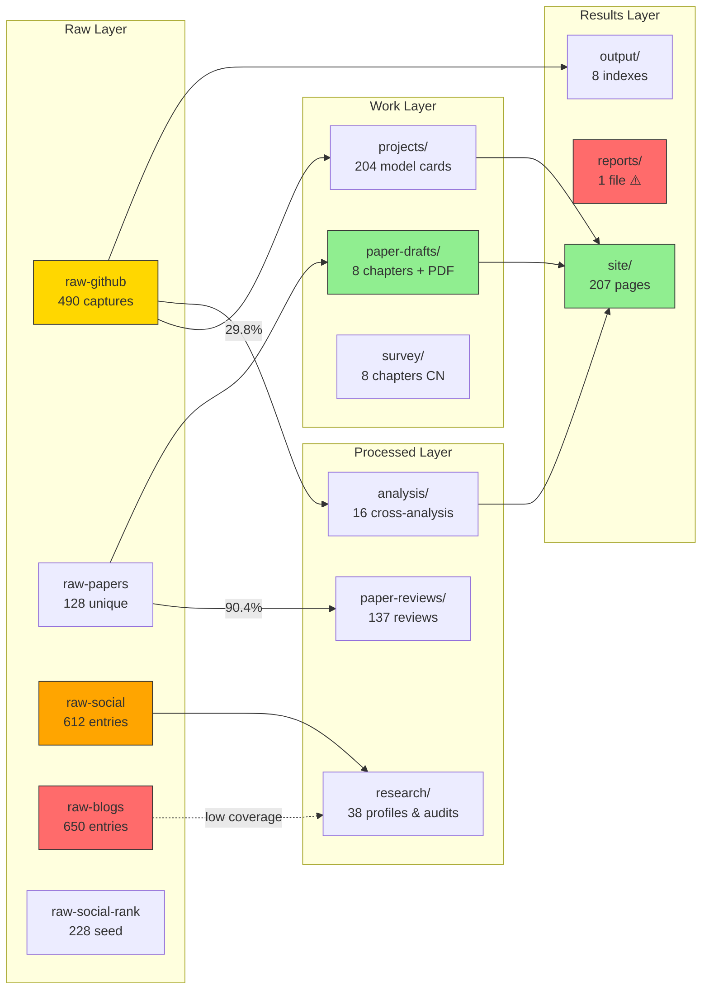

# 数据流管线图

- generated_at: 2026-05-25
- source: `analysis/pipeline-audit.md`
- layer_counts: raw-github 490 / raw-papers 128 / raw-social 612 / raw-blogs 650 / projects 204 / analysis 16 / paper-drafts 22 / site 207

## Coverage Summary

| Path | Coverage | Status |
|------|---------|--------|
| raw-github → projects | 29.8% (146/490) | HIGH GAP |
| raw-papers → paper-reviews | 90.4% (113/128) | OK |
| raw-social → research | <5% | LOW |
| raw-blogs → research | 0% | NONE |
| projects → site | 207 pages | OK |
| paper-drafts → PDF | Built today | OK |
