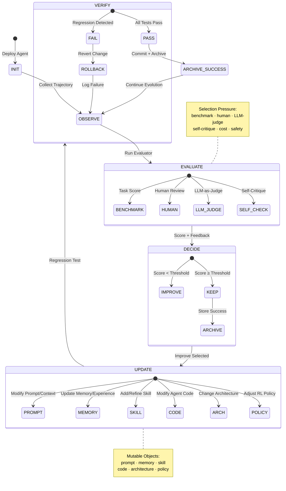

# 自进化循环状态机

- generated_at: 2026-05-25
- source: `README.md` + `survey/ch3-methods-cn.md`
- model: State × Policy × Evaluator × Update

## State Machine Components

| Component | Role | Examples |
|-----------|------|----------|
| State | Current agent configuration | prompt, memory, code, architecture |
| Policy | Decision to update or keep | threshold, diversity, cost budget |
| Evaluator | Selection pressure | SWE-Bench, HumanEval, LLM-Judge |
| Update | What changes | prompt, memory, skill, code, arch, policy |
| Verify | Regression check | test suite, safety scan, cost check |
| Archive | Provenance | lineage, rollback point, evidence |
