# 领域发展时间线（论文 + Repo 活跃快照）

- generated_at: 2026-05-25T15:25:19+08:00
- paper time source: raw-papers temporal metadata
- repo time source: repo techstack cross-analysis `time_slice`

```mermaid
timeline
    title Agent Self-Evolution / Evolution 论文时间切片
    2022-03 : 2 paper records
    2023-03 : 4 paper records
    2023-04 : 2 paper records
    2023-05 : 4 paper records
    2023-08 : 2 paper records
    2023-11 : 2 paper records
    2023-12 : 2 paper records
    2024-01 : 7 paper records
    2024-02 : 3 paper records
    2024-03 : 2 paper records
    2024-04 : 1 paper records
    2024-05 : 2 paper records
    2024-06 : 1 paper records
    2024-07 : 3 paper records
    2024-08 : 2 paper records
    2024-09 : 6 paper records
    2024-10 : 12 paper records
    2024-11 : 1 paper records
    2024-12 : 2 paper records
    2025-01 : 10 paper records
    2025-02 : 10 paper records
    2025-03 : 1 paper records
    2025-04 : 8 paper records
    2025-05 : 16 paper records
    2025-06 : 10 paper records
    2025-07 : 4 paper records
    2025-08 : 11 paper records
    2025-09 : 9 paper records
    2025-10 : 16 paper records
    2025-11 : 7 paper records
    2025-12 : 3 paper records
    2026-01 : 1 paper records
    2026-02 : 6 paper records
    2026-03 : 7 paper records
    2026-04 : 10 paper records
    2026-05 : 6 paper records
    20pl-ac : 1 paper records
```

## Repo 时间切片 Top 20

| Time slice | Repo count |
|---|---:|
| 2026-05 | 195 |
| unknown | 109 |
| 2026-04 | 9 |
| 2024-Q2 | 7 |
| 2026-03 | 7 |
| 2024-Q3 | 4 |
| 2025-11 | 4 |
| 2026-01 | 3 |
| early | 3 |
| 2025-05 | 3 |
| 2025-12 | 2 |
| 2025-02 | 2 |
| 2026-02 | 2 |
| 2024-Q4 | 2 |
| 2024-Q1 | 2 |
| 2025-09 | 2 |
| 2025-07 | 1 |
| 2025-10 | 1 |
| 2025-04 | 1 |

解释：repo 时间切片中 `unknown` 很高，表示 README/raw capture 缺失可靠时间戳，不应解读为真实活跃度分布。
