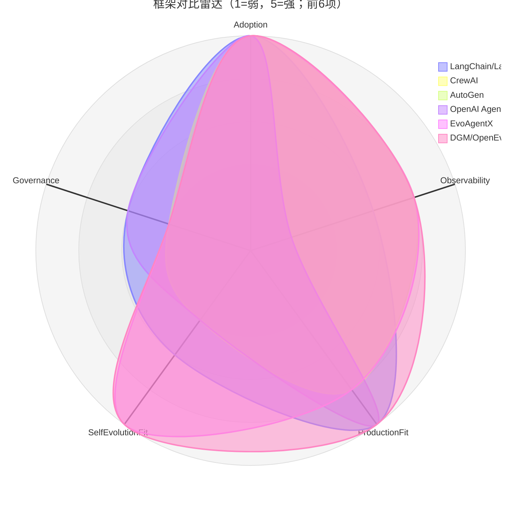

# 框架对比雷达图（启发式快照）

- generated_at: 2026-05-25T15:25:19+08:00
- source: repo名称/类别/README结构信号 + Mom Test痛点标题信号。
- warning: 这是全局导航用启发式评分（1-5），不是用户满意度或真实性能排名；后续需接入 repo交叉分析与社区痛点深度验证。

| Framework | Adoption | Observability | Production fit | Self-evolution fit | Safety/Governance | Repo mentions | Pain mentions |
|---|---:|---:|---:|---:|---:|---:|---:|
| LangChain/LangGraph | 5 | 3 | 5 | 3 | 3 | 13 | 1 |
| CrewAI | 5 | 4 | 4 | 2 | 2 | 4 | 0 |
| AutoGen | 5 | 4 | 4 | 2 | 2 | 5 | 0 |
| OpenAI Agents SDK | 5 | 1 | 5 | 2 | 3 | 82 | 28 |
| EvoAgentX | 5 | 4 | 4 | 5 | 2 | 5 | 0 |
| DGM/OpenEvolve | 5 | 4 | 5 | 5 | 2 | 14 | 0 |
| Letta/Graphiti | 5 | 4 | 4 | 3 | 3 | 4 | 0 |
| Browser-use | 4 | 4 | 3 | 2 | 2 | 3 | 0 |
| n8n | 5 | 4 | 4 | 2 | 2 | 4 | 0 |

详表：`framework-radar-scores.csv`。
