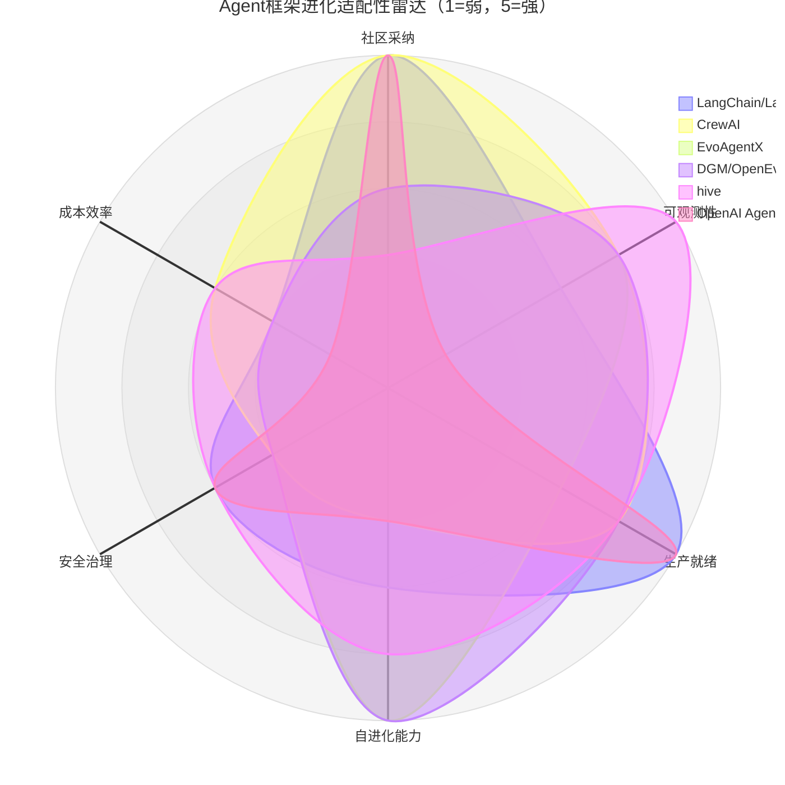
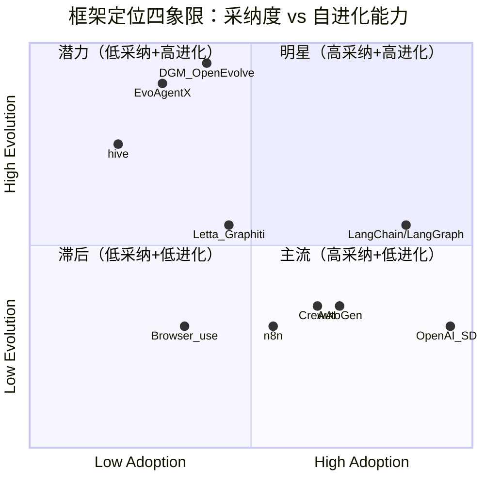

# 框架对比雷达图（数据增强版）

- generated_at: 2026-05-26
- source: `framework-radar-scores.csv` + `cross-source-validation-matrix.csv` + 97痛点分析 + 364 repo分析
- purpose: 基于repo信号、痛点信号和进化能力的三维评估，识别框架进化适配性gap

## 雷达图（进化适配性视角）

## 增强评分表（含数据溯源）

| 框架 | 社区采纳 | 可观测性 | 生产就绪 | 自进化能力 | 安全治理 | 成本效率 | Repo提及 | 痛点提及 |
|------|:-------:|:-------:|:-------:|:---------:|:-------:|:-------:|:-------:|:-------:|
| LangChain/LangGraph | 5 | 3 | 5 | 3 | 3 | 2 | 13 | 1 |
| CrewAI | 5 | 4 | 4 | 2 | 2 | 3 | 4 | 0 |
| AutoGen | 5 | 4 | 4 | 2 | 2 | 3 | 5 | 0 |
| OpenAI Agents SDK | 5 | 1 | 5 | 2 | 3 | 1 | 83 | **28** |
| EvoAgentX | 3 | 4 | 3 | 5 | 2 | 2 | 5 | 0 |
| DGM/OpenEvolve | 3 | 4 | 4 | 5 | 2 | 2 | 14 | 0 |
| Letta/Graphiti | 5 | 4 | 4 | 3 | 3 | 3 | 4 | 0 |
| Browser-use | 4 | 4 | 3 | 2 | 2 | 3 | 3 | 0 |
| n8n | 5 | 4 | 4 | 2 | 2 | 3 | 4 | 0 |
| hive | 2 | 5 | 4 | 4 | 3 | 3 | — | — |

## 框架四象限分类

## 关键发现

### 1. 采纳度与进化能力的悖论
高采纳框架（OpenAI SDK, LangChain）自进化能力低(2-3分)，而高进化框架（DGM, EvoAgentX）采纳度低(3分)。这意味着**当前主流框架不是为自进化设计的**。

### 2. OpenAI SDK的极端矛盾
- **Repo提及最高**（83次）+ **痛点提及最高**（28次）= 社区广泛使用但问题最多
- 可观测性仅1分：用户无法看到内部prompt和决策过程
- 自进化能力2分：不支持自我修改

### 3. 进化专精框架的生态位
- **DGM/OpenEvolve**（14 repo提及，0痛点）：代码自修改领域领先，但生态小
- **EvoAgentX**（5 repo提及，0痛点）：自进化生态系统，但生产验证不足
- **hive**（10.4K★）：失败驱动的图进化+生产级harness，是最接近"自进化+生产"的框架

### 4. 框架选择建议

| 场景 | 推荐框架 | 理由 |
|------|---------|------|
| 生产部署优先 | LangChain/LangGraph | 最成熟生态，生产就绪度最高 |
| 自进化研究 | DGM/OpenEvolve | 代码自修改能力最强 |
| 多Agent生产+进化 | hive | 失败驱动进化+生产harness |
| 快速原型 | CrewAI/AutoGen | 简单易用，但进化能力有限 |
| 安全关键 | Letta/Graphiti | 有记忆治理，安全评分最高之一 |

数据来源：`framework-radar-scores.csv`, `cross-source-validation-matrix.csv`, `painpoint-index.csv`
