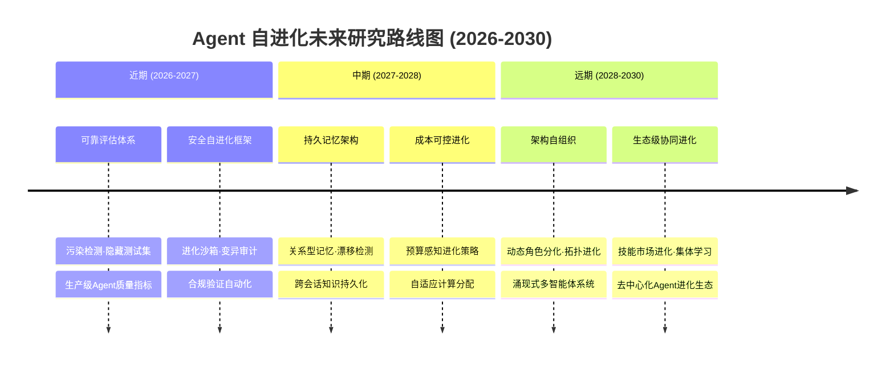
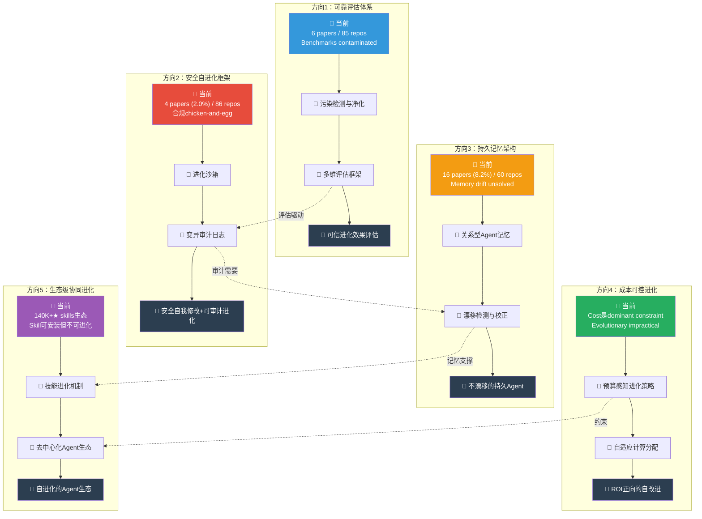

# 未来方向技术路线图（Agent自进化研究路线）

- generated_at: 2026-05-26
- source: 综合97痛点因果链 + 196论文分类 + 364 repo分析 + 生态数据（140K+★ skills, 374K★ runtime）
- purpose: 基于数据缺口和因果链分析，规划5个关键研究方向的路线图

## 路线图全景



## 五大研究方向详细路线



## 优先级排序（基于Gap指数）

| 排名 | 方向 | Gap指数 | 痛点驱动 | 可行性 | 优先级 |
|-----:|------|-------:|---------|-------|-------:|
| 1 | 安全自进化框架 | **21.5x** | 11 pain points | 中（沙箱已有基础） | **P0** |
| 2 | 成本可控进化 | **21.5x** | 11 pain points | 高（增量改进） | **P0** |
| 3 | 可靠评估体系 | **14.2x** | 10 pain points | 高（hidden test sets可快速建立） | **P1** |
| 4 | 持久记忆架构 | **3.8x** | 10 pain points | 中（架构选择未收敛） | **P1** |
| 5 | 生态级协同进化 | 1.4x | 跨领域 | 低（需基础设施先行） | **P2** |

*Gap指数 = Repo覆盖/痛点数量。越高=研究实践gap越大=越需要优先投入。*

## 技术依赖关系

```
方向1(评估) ──→ 方向2(安全) ──→ 方向5(生态)
     │               │
     ↓               ↓
方向4(成本) ──→ 方向3(记忆) ──→ 方向5(生态)
```

- 方向1(评估)是基础：没有可靠评估，进化方向无法确定
- 方向2(安全)和方向4(成本)是约束：进化必须在安全和成本边界内
- 方向3(记忆)是载体：持久化是长期进化的前提
- 方向5(生态)是远景：需要前四个方向的基础设施

## 里程碑

| 时间 | 里程碑 | 验收标准 |
|------|-------|---------|
| 2026 Q4 | 污染检测基准 | SWE-bench contamination rate < 5% |
| 2027 Q2 | 进化沙箱v1 | 自修改代码100%隔离测试 |
| 2027 Q4 | 关系型记忆原型 | 跨10+会话零漂移 |
| 2028 Q2 | 成本感知进化 | 改进/token < 基准线50% |
| 2029+ | 生态级涌现 | Agent集体进化无需人工干预 |
