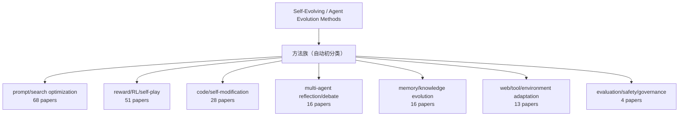

# 方法分类 Mermaid 图（论文全量快照）

- generated_at: 2026-05-26T09:34:56+08:00
- paper_source: `output/raw-papers-timestamp-index.json` + `raw-papers/*.md`
- current_papers_classified: 196
- note: 这是自动关键词初分类，后续需由论文review #26-#88 的深度结论校正。

| Method family | Papers | Share |
|---|---:|---:|
| prompt/search optimization | 68 | 34.7% |
| reward/RL/self-play | 51 | 26.0% |
| code/self-modification | 28 | 14.3% |
| multi-agent reflection/debate | 16 | 8.2% |
| memory/knowledge evolution | 16 | 8.2% |
| web/tool/environment adaptation | 13 | 6.6% |
| evaluation/safety/governance | 4 | 2.0% |

详表：`paper-method-classification-snapshot.csv`。
