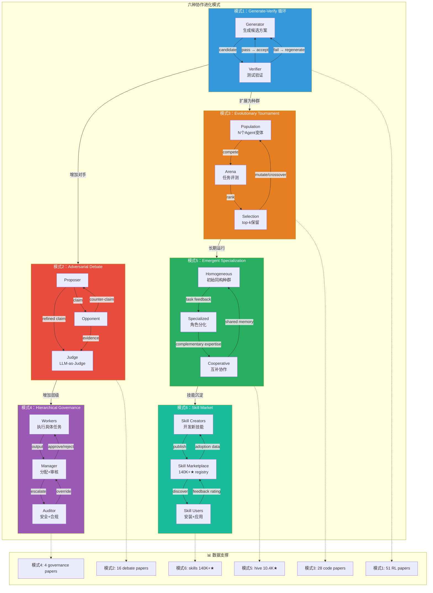
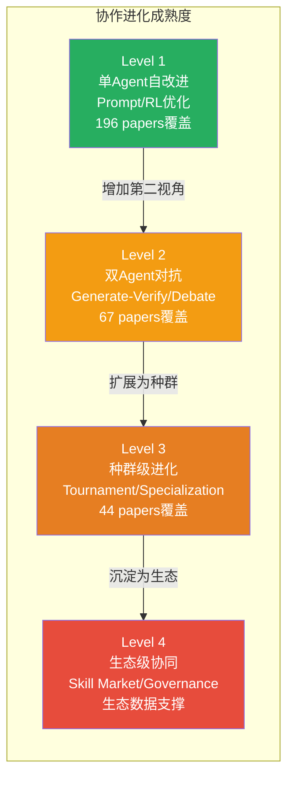

# 多智能体协作进化模式图

- generated_at: 2026-05-26
- source: 综合 `multi-agent-collaboration.md` + `propagation-self-evolution-core.md` + 16 multi-agent papers + `cross-source-validation-matrix.csv`
- purpose: 展示6种协作进化模式，每种模式的通信拓扑、进化机制、适用场景和失败模式

## 核心洞察

多智能体协作进化不仅是"分工"，而是通过**独立错误分布**实现进化加速。当Agent间的blind spots独立时，协作才能产生真正的改进信号。

## 六种模式对比

| 模式 | 通信拓扑 | 进化对象 | 论文支撑 | 代表项目 | 失败模式 |
|------|---------|---------|---------|---------|---------|
| 1. Generate-Verify | 双向循环 | Prompt/Code | 51 papers | SWE-bench agents | Goodhart's law: 验证器被game |
| 2. Adversarial Debate | 三方对抗 | Argument quality | 16 papers | Reflexion, CORAL | 共同盲点→共识幻觉 |
| 3. Evolutionary Tournament | 种群竞争 | Architecture/Code | 28 papers | DGM, AlphaEvolve | 多样性丢失→早熟收敛 |
| 4. Hierarchical Governance | 分层控制 | Safety/Policy | 4 papers | hive (10.4K★) | 官僚化→过度阻塞 |
| 5. Emergent Specialization | 网状自组织 | Role/Capability | 跨领域 | AutoResearchClaw (12.6K★) | 角色坍缩→单一Agent |
| 6. Skill Market | 发布-订阅 | Skill | 生态数据 | SkillClaw, awesome-claude-skills | 技能碎片化→兼容性差 |

## 进化路径分析

## 关键发现

1. **模式1-3有论文支撑但缺乏生产验证**：Generate-Verify/Debate/Tournament在论文中分别有51/16/28篇，但痛点显示"demo成功≠production成功"
2. **模式4-6缺乏研究但生态数据丰富**：Governance和Skill Market论文极少(4篇)，但实际生态(140K+★ skills)证明需求强烈
3. **多样性是关键前提**：所有6种模式都要求参与者有独立错误分布，否则协作退化为echo chamber
4. **hive的failure-driven进化是模式5的独特实例**：失败捕获→图结构变异→状态持久化→崩溃恢复
