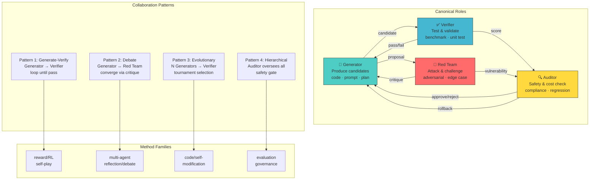

# 多 Agent 协同模式图

- generated_at: 2026-05-25
- source: `README.md` + `survey/ch3-methods-cn.md` + `survey/ch8-future-cn.md`
- models: 4 canonical roles

## Role Definitions

| Role | Function | Error Mode | Guard |
|------|----------|------------|-------|
| Generator | Produce solution candidates | Overfit to known patterns | Diversity injection |
| Verifier | Test against benchmarks | Goodhart's law | Hidden test sets |
| Red Team | Find failures & adversarial cases | Excessive blocking | Calibrated thresholds |
| Auditor | Safety, cost, compliance gates | False positives | Override with evidence |

## Key Insight

Multi-agent collaboration works when each role has **independent error distributions** — if all roles share the same blind spots, collaboration degenerates to consensus hallucination.
