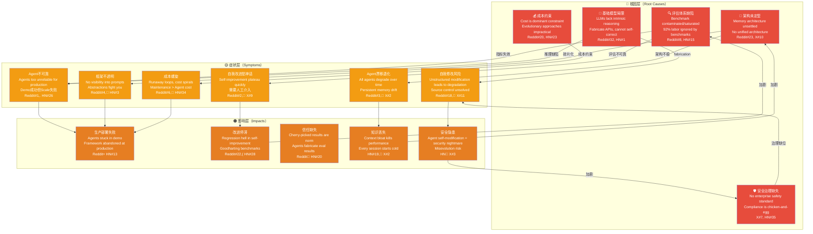

# 痛点因果链图（Agent自进化障碍根因分析）

- generated_at: 2026-05-26
- source: `painpoint-index.csv` (97 pain points: 47 Reddit + 36 HN + 14 X/Twitter) + `cross-source-validation-matrix.csv`
- purpose: 从97个痛点中提取因果链——根因→症状→影响→连锁反应，揭示自进化的系统性障碍

## 因果链分析



## 四条关键因果链

### 因果链1：评估陷阱（The Evaluation Trap）
```
评估体系缺陷 → Benchmark被game → Goodharting → 虚假进步 → 信任缺失 → 需要更多人工评估 → 回到起点
```
- **论文信号**：6 papers on evaluation, 85 evaluation repos
- **痛点信号**：10 pain points (Reddit#7,#8,#22,#31; HN#7,#12,#15,#28; X#5,#9)
- **闭环**：评估越不可靠→人越不信任→越依赖benchmark→benchmark越容易被game

### 因果链2：漂移螺旋（The Drift Spiral）
```
架构未定型 → Memory drift → Agent退化 → 人工修复 → 成本上升 → 降低监控频率 → 漂移加剧
```
- **论文信号**：16 memory papers, 60 memory repos
- **痛点信号**：10 pain points (Reddit#3,#17,#23,#24,#28; HN#19,#21; X#2,#4,#13)
- **闭环**：漂移→人工修复→成本高→减少监控→漂移更严重

### 因果链3：安全悖论（The Safety Paradox）
```
自我修改能力 → 攻击面扩大 → 安全治理缺失 → 合规无法验证 → 生产被阻 → 安全投入更少 → 风险更高
```
- **论文信号**：4 safety papers, 86 safety repos
- **痛点信号**：11 pain points (Reddit#25; HN#25,#35; X#3,#7,#11)
- **悖论**：进化能力越强→安全风险越大→治理成本越高→进化越受限

### 因果链4：能力幻觉（The Capability Illusion）
```
基础模型局限 → API fabrication → Agent不可靠 → 需要babysitting → 维护成本>价值 → 不再使用
```
- **论文信号**：68 prompt papers（试图通过prompt解决）
- **痛点信号**：12 pain points (Reddit#1,#30,#42,#47; HN#1,#2,#11,#29; X#8,#12)
- **幻觉**：demo能力 ≠ 生产能力，单次成功 ≠ 持续可靠

## 根因频率统计

| 根因类别 | 痛点数量 | 论文覆盖 | Repo覆盖 | Gap指数 |
|---------|-------:|-------:|-------:|-------:|
| 评估体系缺陷 | 10 | 6 | 85 | **14.2x** |
| 基础模型局限 | 12 | 68 | 17 | 1.4x |
| 架构未定型 | 10 | 16 | 60 | **3.8x** |
| 成本约束 | 11 | 4 | 86 | **21.5x** |
| 安全治理缺失 | 11 | 4 | 86 | **21.5x** |

*Gap指数 = Repo覆盖/痛点数量。越高表示研究与实践gap越大。*

## 交叉验证矛盾

| 矛盾 | 论文声称 | 社区现实 | 来源 |
|------|---------|---------|------|
| Self-improvement works | 60 papers claim improvement | Self-Improvement Is a Myth | Reddit#2, X#9 |
| Benchmarks show progress | 85 evaluation repos | Benchmarks Contaminated, Saturated | HN#15, Reddit#22 |
| Memory solves persistence | 16 memory papers | Memory Without Drift Unsolved | Reddit#28, X#2 |
| Framework maturity | 67 framework repos | Framework Abstractions Fight You | Reddit#12, HN#13 |
