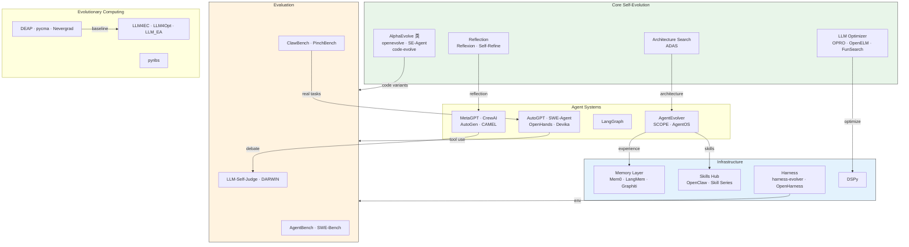

# 项目依赖/生态图

- generated_at: 2026-05-25
- source: `README.md` model-card groups + `projects/` cross-references
- total_groups: 26

## Ecosystem Clusters

| Cluster | Projects | Key Interaction |
|---------|---------|-----------------|
| Core Evolution | 10 | Code/architecture search → evaluation |
| Agent Systems | 12 | Runtime → memory/skills |
| Infrastructure | 98 | Memory + skills + harness support |
| Evaluation | 163 | Benchmarks + judges + real tasks |
| Evolutionary Computing | 10 | Classic → LLM-hybrid methods |
