# Star Project Propagation Ecosystem

> Source: `analysis/star-project-propagation.md` | 37 projects with 10K+ stars

## Complete Ecosystem Map

```mermaid
graph TD
    subgraph "G1: 2023 Pioneers"
        DSP["DSPy<br/>34.6K★ 2023-01"]
        AG["AutoGPT<br/>184.5K★ 2023-03"]
        CAMEL["CAMEL<br/>17K★ 2023-03"]
        MGT["MetaGPT<br/>68.2K★ 2023-06"]
        LG["LangGraph<br/>32.8K★ 2023-08"]
        AGT["AutoGen<br/>58.3K★ 2023-08"]
        CREW["CrewAI<br/>52K★ 2023-10"]
    end

    subgraph "G2: 2024 Specialists"
        OH["OpenHands<br/>74.7K★ 2024-03"]
        OD["OpenDevin<br/>50K★ 2024-03"]
        SWE["SWE-Agent<br/>19.3K★ 2024-04"]
    end

    subgraph "G3 Runtimes"
        OC["openclaw<br/>374K★"]
        SP["superpowers<br/>202K★"]
        ECC["ECC<br/>191K★"]
        HER["hermes-agent<br/>162K★"]
        OHS["OpenHarness<br/>13K★"]
    end

    subgraph "G3 Skills"
        ASK["anthropics/skills<br/>140K★"]
        CSK["awesome-claude-skills<br/>61.5K★"]
        OSK["openai/skills<br/>20.1K★"]
        VAK["awesome-agent-skills<br/>22.9K★"]
        AK["agentskills<br/>19.3K★"]
        SAK["scientific-agent-skills<br/>25.5K★"]
        HFK["huggingface/skills<br/>10.6K★"]
        CXK["awesome-codex-skills<br/>11.5K★"]
        VLK["vercel-labs/skills<br/>19.9K★"]
        PW["planning-with-files<br/>22K★"]
    end

    subgraph "G3 Memory"
        M0["mem0<br/>56.5K★"]
        MP["mempalace<br/>52.8K★"]
        GP["graphiti<br/>26.5K★"]
        AM["agentmemory<br/>16K★"]
        MM["Memori<br/>14.9K★"]
        HS["hindsight<br/>14.4K★"]
        MU["memU<br/>13.7K★"]
    end

    subgraph "G3 Self-Evolution"
        ARC["AutoResearchClaw<br/>12.6K★"]
        GA["GenericAgent<br/>11.9K★"]
        HIVE["hive<br/>10.4K★"]
    end

    %% G1→G2 propagation
    AG -.->|concept| OH
    AG -.->|concept| MGT
    AG -.->|concept| AGT
    DSP -.->|optimization| M0
    MGT -.->|multi-agent| CREW
    OH -->|fork| OD
    OH -.->|concept| SWE

    %% G1→G3 propagation
    AG -.->|runtime concept| OC
    AG -.->|self-improve| ARC
    LG -.->|graph model| OHS
    DSP -.->|teleprompter| HS

    %% G3 internal
    OC -->|runtime| ECC
    OC -->|runtime| SP
    OC -->|runtime| HER
    M0 -->|SDK| OC
    MP -->|MCP| OC
    GP -->|MCP| OC
    SWE -.->|benchmark| ARC

    %% Evolution connections
    ARC -->|skill evolution| AK
    HIVE -->|graph evolution| OHS

    %% Styling
    style AG fill:#e74c3c,color:#fff
    style DSP fill:#9b59b6,color:#fff
    style OC fill:#2ecc71,color:#fff
    style ARC fill:#f39c12,color:#fff
    style GA fill:#f39c12,color:#fff
    style HIVE fill:#f39c12,color:#fff
    style M0 fill:#1abc9c,color:#fff
    style MP fill:#1abc9c,color:#fff
    style ASK fill:#e67e22,color:#fff
```

## Legend

- **Red (#e74c3c)**: Pioneer seeds (AutoGPT)
- **Purple (#9b59b6)**: Optimization pioneer (DSPy)
- **Green (#2ecc71)**: Ecosystem hub (openclaw)
- **Teal (#1abc9c)**: Memory infrastructure
- **Orange (#e67e22)**: Skills ecosystem
- **Amber (#f39c12)**: Self-evolution core
- **Blue (#3498db)**: Specialists
- **Solid arrows**: Direct influence/dependency
- **Dashed arrows**: Concept diffusion
