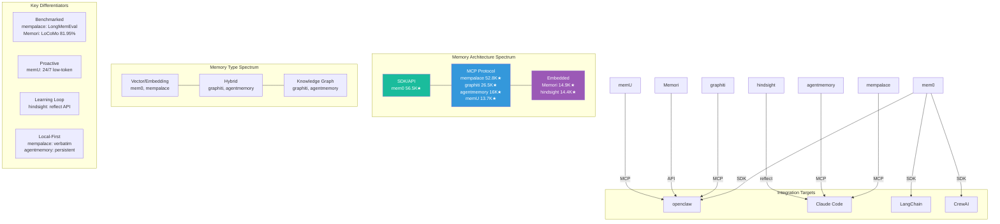

# Star Project Memory Infrastructure Competition

> Source: `analysis/star-project-propagation.md` | 7 memory projects with 10K+ stars

## Memory Wars Landscape (2026)

## Memory Evolution Relevance

Memory is the **substrate** for self-evolution. Without persistent state, agents cannot learn across sessions. The 7 competing systems differ in:

| Dimension | Key Trade-off |
|-----------|---------------|
| Integration model | SDK (mem0) vs MCP (most) vs Embedded (Memori/hindsight) |
| Storage type | Vector-only vs Hybrid (vector+graph) vs Knowledge Graph |
| Retrieval | Semantic similarity vs Temporal query vs Hybrid |
| Benchmarking | mempalace (LongMemEval), Memori (LoCoMo 81.95%), or none |
| Proactiveness | Reactive recall (most) vs Proactive injection (memU) |
| Learning loop | None (most) vs Built-in reflect API (hindsight) |
