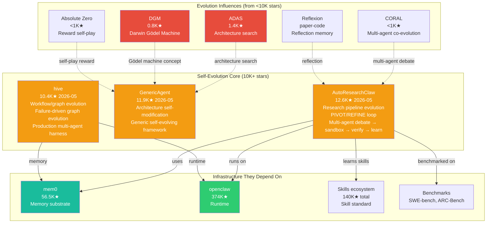

# Star Project Self-Evolution Core

> Source: `analysis/star-project-propagation.md` | 3 self-evolution projects with 10K+ stars

## Self-Evolution Star Projects

## The 3 Self-Evolution Star Projects

| Project | Evolution Dimension | Method | Evidence |
|---------|-------------------|--------|----------|
| **AutoResearchClaw** | Skill + Memory + Workflow | 23-stage research pipeline; PIVOT/REFINE loop; multi-agent debate; sandbox experiment; claim verification; lesson learning across runs | 12.6K★, v0.5.0, ARC-Bench |
| **GenericAgent** | Architecture | Generic self-evolving agent framework; architecture self-modification | 11.9K★ |
| **hive** | Workflow/Graph | Production multi-agent harness; failure capture → graph evolution; state persistence; crash recovery; cost control | 10.4K★, Apache-2.0 |

## Research-to-Star Gap

Self-evolution research leaders are <5K stars while infrastructure projects dominate:

| Research Method | Paper Impact | GitHub Stars | Star Gap Factor |
|----------------|-------------|-------------|-----------------|
| Architecture Search (ADAS) | ICML 2024 | 1,400 | 80x vs average skill repo |
| Gödel Machine (DGM) | arXiv 2025 | 800 | 175x vs average skill repo |
| Self-Play Reward (Absolute Zero) | arXiv 2025 | <1,000 | 140x vs average skill repo |
| Multi-Agent Debate (CORAL) | arXiv 2025 | <1,000 | 140x vs average skill repo |
| Reflection (Reflexion) | NeurIPS 2023 | paper-code | Academic code only |

**Conclusion**: The self-evolution research frontier is not yet reflected in community star counts. The 10K+ star projects represent applied evolution (research pipelines, generic agents) rather than the core evolutionary mechanisms being researched.
