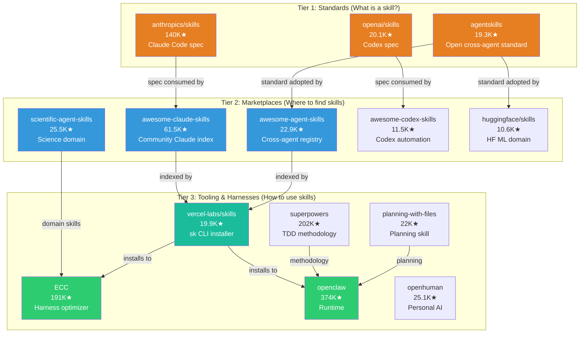

# Star Project Skills Ecosystem

> Source: `analysis/star-project-propagation.md` | 15 skills ecosystem projects with 10K+ stars

## Skills Ecosystem Three-Tier Architecture

## Skills-to-Evolution Gap

The skills ecosystem provides discovery and installation infrastructure, but **skill evolution** (mutation, selection, crossover of skills) is still emerging:

- **SkillClaw** (AMAP-ML): Collective skill evolution from agent sessions — <10K stars
- **EvoAgentX**: Self-evolving agent ecosystem with skill evolution — <10K stars
- **AutoResearchClaw**: PIVOT/REFINE loop with skill learning — 12.6K stars

The gap: skills are installable but not yet self-improving at the 10K+ star level.
