# Rank/Judgment 框架流程图

- generated_at: 2026-05-25
- source: `README.md` 高价值方向排序 + task WMwn85ROXmWb spec
- dimensions: 7 evaluation axes

```mermaid
flowchart TD
    INPUT["Input: Project or Method"] --> EXTRACT

    subgraph EXTRACT["Step 1: Evidence Extraction"]
        E1["GitHub metrics<br/>stars · forks · activity"]
        E2["Evolution mechanism<br/>mutable object · feedback · update"]
        E3["Benchmark coverage<br/>eval dimensions · test types"]
        E4["Code quality<br/>tests · docs · CI/CD"]
        E5["Community signal<br/>issues · PRs · discussions"]
        E6["Paper backing<br/>citations · peer review"]
        E7["Reproducibility<br/>setup time · dep clarity"]
    end

    EXTRACT --> SCORE

    subgraph SCORE["Step 2: Multi-Dimensional Scoring"]
        S1["Evidence Strength<br/>0-10"]
        S2["Evolution Depth<br/>0-10"]
        S3["Practical Usability<br/>0-10"]
        S4["Community Vitality<br/>0-10"]
        S5["Academic Rigor<br/>0-10"]
        S6["Safety & Governance<br/>0-10"]
        S7["Future Potential<br/>0-10"]
    end

    SCORE --> AGGREGATE

    subgraph AGGREGATE["Step 3: Weighted Aggregation"]
        W["Weights:<br/>Evidence 20% · Depth 20%<br/>Usability 15% · Community 15%<br/>Academic 15% · Safety 10% · Future 5%"]
        FORMULA["Score = Σ(wᵢ × sᵢ)"]
    end

    AGGREGATE --> CLASSIFY

    subgraph CLASSIFY["Step 4: Tier Classification"]
        T1["🥇 Tier 1: Core<br/>Score ≥ 75<br/>Strict self-evolution"]
        T2["🥈 Tier 2: Strong<br/>Score 50-74<br/>Broad evolution-related"]
        T3["🥉 Tier 3: Support<br/>Score 25-49<br/>Infrastructure/tool"]
        T4["Tier 4: Emerging<br/>Score < 25<br/>Early stage or tangential"]
    end

    CLASSIFY --> OUTPUT["Output:<br/>Ranked list + tier + scorecard"]

    style INPUT fill:#e8f5e9,stroke:#333
    style OUTPUT fill:#e8f5e9,stroke:#333
    style T1 fill:#ffd700,stroke:#333
    style T2 fill:#c0c0c0,stroke:#333
    style T3 fill:#cd7f32,stroke:#333
```

## Scoring Dimensions

| Dimension | Weight | What It Measures |
|-----------|--------|-----------------|
| Evidence Strength | 20% | Are claims backed by reproducible tests? |
| Evolution Depth | 20% | How deeply can the system modify itself? |
| Practical Usability | 15% | Can a practitioner install and use it? |
| Community Vitality | 15% | Is the project actively maintained? |
| Academic Rigor | 15% | Is there peer-reviewed backing? |
| Safety & Governance | 10% | Are there guardrails against harmful mutations? |
| Future Potential | 5% | Does the approach scale to new domains? |
