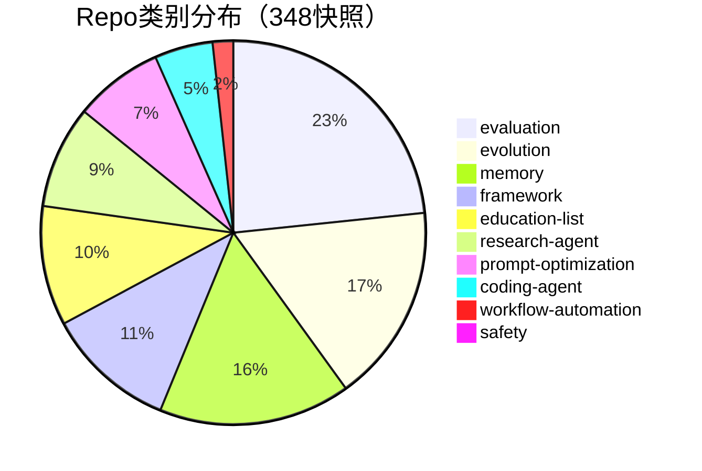
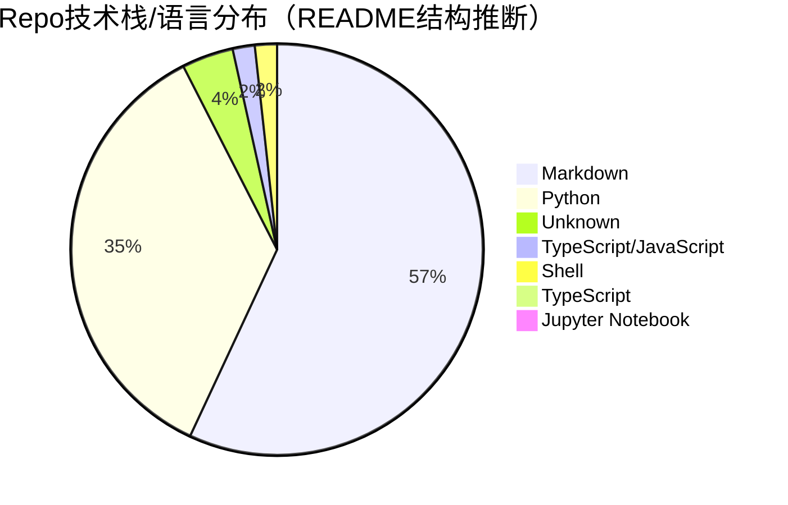

# 348 Repo 技术栈与趋势图

- generated_at: 2026-05-21T22:21:49+08:00
- source: `analysis/repo-techstack-cross-analysis.csv`
- rows: 348

## 类别分布

| Category | Count | Share |
|---|---:|---:|
| evaluation | 81 | 23.3% |
| evolution | 58 | 16.7% |
| memory | 56 | 16.1% |
| framework | 38 | 10.9% |
| education-list | 35 | 10.1% |
| research-agent | 30 | 8.6% |
| prompt-optimization | 26 | 7.5% |
| coding-agent | 17 | 4.9% |
| workflow-automation | 6 | 1.7% |
| safety | 1 | 0.3% |

## 技术栈分布

| Stack | Count | Share |
|---|---:|---:|
| Markdown | 197 | 56.6% |
| Python | 123 | 35.3% |
| Unknown | 14 | 4.0% |
| TypeScript/JavaScript | 6 | 1.7% |
| Shell | 6 | 1.7% |
| TypeScript | 1 | 0.3% |
| Jupyter Notebook | 1 | 0.3% |

交叉表：`repo-category-stack-cross-tab.csv`。
