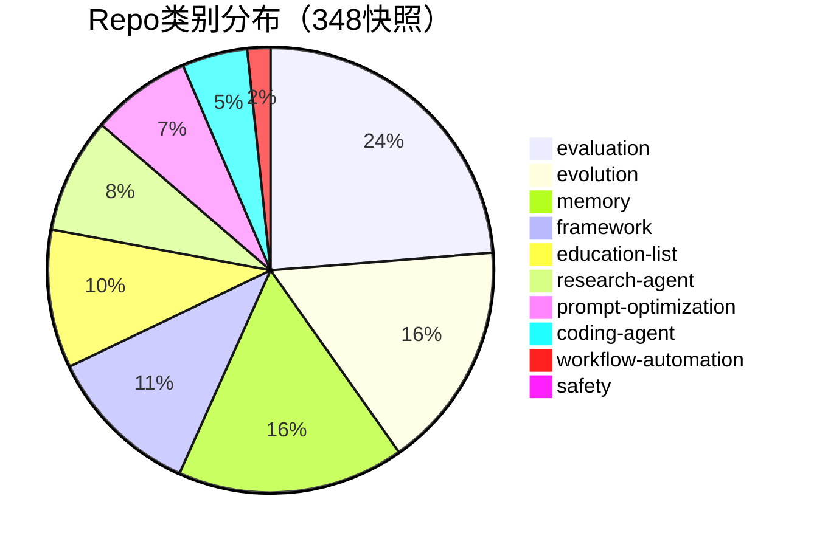
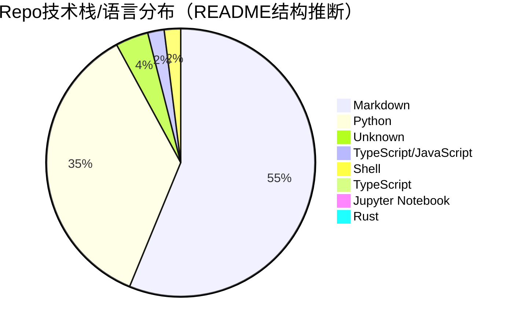

# 348 Repo 技术栈与趋势图

- generated_at: 2026-05-25T15:25:19+08:00
- source: `analysis/repo-techstack-cross-analysis.csv`
- rows: 359

## 类别分布

| Category | Count | Share |
|---|---:|---:|
| evaluation | 85 | 23.7% |
| evolution | 59 | 16.4% |
| memory | 59 | 16.4% |
| framework | 40 | 11.1% |
| education-list | 36 | 10.0% |
| research-agent | 30 | 8.4% |
| prompt-optimization | 26 | 7.2% |
| coding-agent | 17 | 4.7% |
| workflow-automation | 6 | 1.7% |
| safety | 1 | 0.3% |

## 技术栈分布

| Stack | Count | Share |
|---|---:|---:|
| Markdown | 199 | 55.4% |
| Python | 127 | 35.4% |
| Unknown | 14 | 3.9% |
| TypeScript/JavaScript | 7 | 1.9% |
| Shell | 7 | 1.9% |
| TypeScript | 3 | 0.8% |
| Jupyter Notebook | 1 | 0.3% |
| Rust | 1 | 0.3% |

交叉表：`repo-category-stack-cross-tab.csv`。
