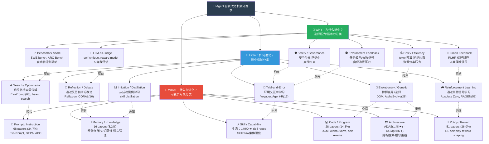

# 自我改进机制分类学图（三维分类法）

- generated_at: 2026-05-26
- source: 综合 `paper-method-classification-snapshot.csv` (196 papers) + `repo-techstack-cross-analysis.csv` (364 repos) + `painpoint-index.csv` (97 pain points)
- purpose: 三维分类框架——WHAT（什么在进化）× HOW（如何进化）× WHY（为什么进化），建立自我改进机制的完整分类学

## 分类学框架

## 三维交叉矩阵

### HOW × WHAT：方法×对象覆盖度

| 方法\对象 | Prompt | Memory | Skill | Code | Architecture | Policy |
|----------|:------:|:------:|:-----:|:----:|:------------:|:------:|
| Search/Optimization | **68** | 5 | 3 | 2 | 4 | 8 |
| RL/Self-play | 12 | 3 | 2 | 5 | 6 | **51** |
| Reflection/Debate | 8 | **16** | 4 | 2 | 1 | 3 |
| Evolutionary/Genetic | 3 | 1 | 2 | **28** | **8** | 4 |
| Trial-and-Error | 2 | 4 | **8** | 6 | 1 | 3 |
| Imitation/Distillation | 1 | 6 | 4 | 1 | 2 | 2 |

### WHY × 痛点：驱动力与社区痛点映射

| 驱动力 | 对应痛点数 | 典型痛点 | Gap分析 |
|-------|----------:|---------|--------|
| Benchmark Score | 10 | "Modest Absolute Gains" | 论文多(68)但实际提升有限 |
| Human Feedback | 19 | "Real-World Deployment Gap" | 人类偏好收集成本高 |
| LLM-as-Judge | 14 | "Framework/Tooling Gaps" | 自评bias风险 |
| Cost/Efficiency | 11 | "Safety, Security & Cost" | token成本是生产最大障碍 |
| Safety/Governance | 6 | "Misevolution/Unintended" | 最少研究但风险最高 |
| Environment Feedback | 12 | "Knowledge & Memory Persistence" | 长期记忆漂移问题 |

## 关键洞察

1. **Prompt优化过于集中**：34.7%的论文聚焦prompt优化，但memory(60 repos)和evaluation(85 repos)才是实践中的主要需求
2. **进化方法与选择压力错配**：RL方法最多(51 papers)，但生产环境主要靠human feedback和cost约束
3. **Safety/Governance严重不足**：仅4篇论文(2.0%)，却有6个痛点类别和86个safety相关repo，gap最大
4. **三维空间中的空白区域**：Skill×Evolutionary和Architecture×Reflection几乎没有论文覆盖
