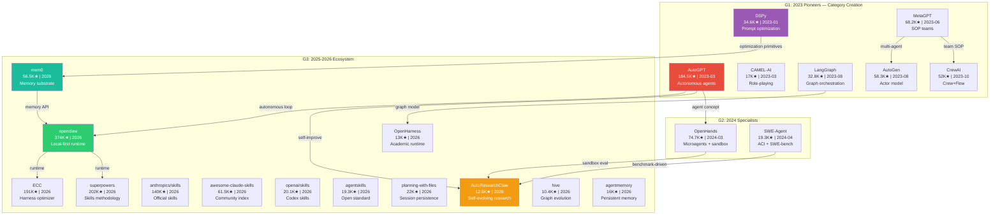
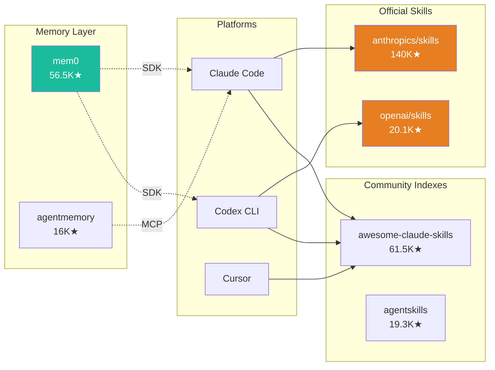
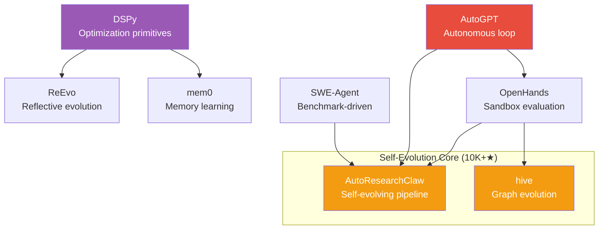

# Star Project Propagation Diagrams

Source: analysis/star-project-propagation.md (2026-05-25)

## Figure 1: Three-Generation Timeline

## Figure 2: Skills Ecosystem Vendor Map

## Figure 3: Self-Evolution Core Propagation

## Figure 4: Influence Heat Map

| Project | Influenced | Pattern | Self-Evo Relevance |
|---------|:----------:|---------|:------------------:|
| AutoGPT | 12 | Concept-diffusion | Medium |
| DSPy | 5 | API-integration | High |
| MetaGPT | 4 | Competitor-branching | Medium |
| OpenHands | 3 | Specialization | Medium |
| mem0 | 3 | API-integration | High |
| openclaw | 3 | Ecosystem-nesting | Medium |

Top 3 self-evolution relevant 10K+ projects: DSPy (prompt optimization loop), mem0 (memory substrate for learning), AutoResearchClaw (explicit PIVOT/REFINE evolution).

## Figure 5: Propagation Pattern Distribution

| Pattern | Count | Key Projects |
|---------|------:|-------------|
| Concept-diffusion | 8 | AutoGPT → openclaw, ECC, hive |
| API-integration | 6 | mem0 → Claude Code, Codex; DSPy → ReEvo |
| Competitor-branching | 5 | MetaGPT vs AutoGen vs LangGraph vs CrewAI |
| Ecosystem-nesting | 3 | anthropics/skills under Claude Code |
| Fork-divergence | 1 | AutoGPT → Devika |
