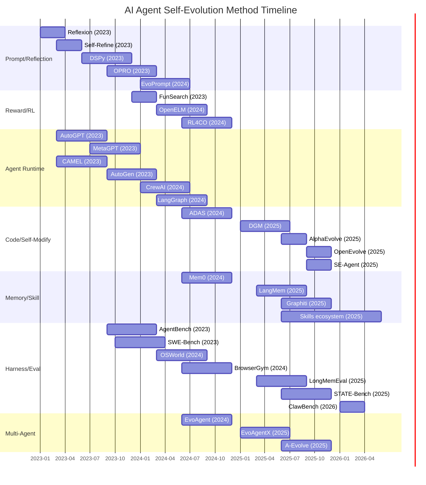

# 时间线演进图 (2022-2026)

- generated_at: 2026-05-25
- source: `README.md` 历史主线 + `analysis/github-project-data-analysis.md`
- key_milestones: extracted from release timeline

## Phase Analysis

| Phase | Period | Key Shift |
|-------|--------|-----------|
| Lightweight self-improvement | 2022-2023 | Feedback → reflection → prompt retry |
| Agent runtime & multi-agent | 2023-2024 | Tools, roles, workflow, state machines |
| Architecture/code self-modification | 2024-2025 | Architecture, code, programs enter search space |
| Memory/skill/harness infrastructure | 2025-2026 | Installable skills, auditable memory, runnable harness |
