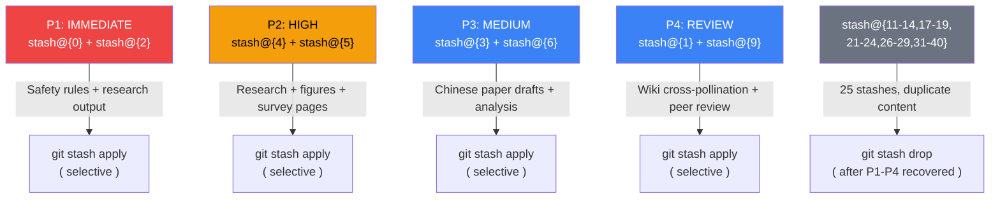

# Stash Audit Report: 41 Stashes from Crashed Agents

Generated: 2026-05-26
Method: `git stash list` + `git stash show --stat` for each stash (read-only, no pop/drop)
Rank: ⬤⬤⬤⬤ (high — recovery-critical data)

---

## 1. Executive Summary

41 stashes found (not 20 as initially reported). All are auto-stash from crashed agent sessions:

- **6 HIGH value** — contain research output, wiki pages, or paper drafts not yet recovered
- **8 MEDIUM value** — contain paper edits, survey updates, or site changes
- **2 LOW value** — data-engine or config changes, likely recoverable from other sources
- **25 JUNK** — older supervisor crash stashes with minimal or duplicate content

**Root cause**: All stashes are from `auto-stash: agent supervisor (session) crashed` — the supervisor lifecycle hook. Most stashes from May 22 contain the same content progressively built up.

---

## 2. Stash Inventory with Classification

### HIGH Value (6 stashes — recommend recovery)

| Stash | Date | Agent | Content | Value | Files | Size |
|-------|------|-------|---------|-------|-------|------|
| stash@{0} | 05-26 04:51 | supervisor | AGENTS.md (+20 lines), CLAUDE.md (+53 lines), work/qa/SAFETY-RULES.md (new) | ⬤⬤⬤⬤⬤ | 3 | 94 insertions |
| stash@{2} | 05-26 03:54 | supervisor | site graph, survey/ch1, **6 work/research/ files** (talent movement, china teams, combined landscape, review mechanisms, SV landscape, talent capital), wiki/index.md, wiki/log.md | ⬤⬤⬤⬤⬤ | 14 | 3,395 insertions |
| stash@{4} | 05-26 02:38 | supervisor | **work/research/ 6 files** (talent flow, anthropic movement, mechanism framework, social insights, INDEX.md), survey/ch2/ch4 edits, survey/figures (6 new), site/survey pages, paper references | ⬤⬤⬤⬤⬤ | 25 | 4,316 insertions |
| stash@{5} | 05-26 02:17 | supervisor | README updates, analysis/ essential-taxonomy, **projects/ 3 new cards**, research/repo-classification, survey/figures, site/survey pages, **work/research/ mechanism-analysis + projects-deepdive** | ⬤⬤⬤⬤⬤ | 131 | 42,106 insertions |
| stash@{6} | 05-25 15:30 | org-manager | **paper-drafts/zh/ ch6 + ch8 new files**, research/ ch7 + ch8 painpoint/feasibility analysis, survey/latex ch3-ch6 edits, site changes | ⬤⬤⬤⬤ | 64 | 5,653 insertions |
| stash@{9} | 05-25 09:32 | supervisor | paper-drafts ch2-ch7 major edits (+895 insertions), **research/peer-reviews/review-novelty-round2.md** (new), site/benchmark page | ⬤⬤⬤⬤ | 10 | 895 insertions |

### MEDIUM Value (8 stashes)

| Stash | Date | Agent | Content | Value | Size |
|-------|------|-------|---------|-------|------|
| stash@{1} | 05-26 04:14 | supervisor | survey/latex references-aliases (+173 lines), wiki/index + log updates, **work/wiki/sources/cross-pollination.md** (new) | ⬤⬤⬤ | 323 insertions |
| stash@{3} | 05-26 03:38 | supervisor | **paper-drafts/zh/ ch1 parts 1-4** (new), zh/main.tex (new), site updates | ⬤⬤⬤ | 1,170 insertions |
| stash@{7} | 05-25 10:12 | supervisor | paper-drafts ch2/ch3/ch6/ch7 edits, references updates | ⬤⬤⬤ | 135 insertions |
| stash@{8} | 05-25 09:51 | supervisor | paper-drafts ch1-ch8 incremental edits, references updates | ⬤⬤⬤ | 129 insertions |
| stash@{15} | 05-22 22:20 | supervisor | survey/latex ch4-systems expanded (+939 lines) + ch4 major rewrite (+999 lines) | ⬤⬤⬤ | 1,823 insertions |
| stash@{16} | 05-22 21:01 | mba-writing-dir | survey/latex ch1/ch3/ch4/ch5/ch7 expanded sections, references (+523) | ⬤⬤⬤ | 5,196 insertions |
| stash@{20} | 05-22 19:05 | supervisor | survey/latex ch2/ch4/ch5 major expansions, ch4 backup | ⬤⬤⬤ | 1,926 insertions |
| stash@{25} | 05-22 17:11 | supervisor | paper/sections sec1-sec6 (new paper structure, 3,358 lines) | ⬤⬤⬤ | 3,358 insertions |

### LOW Value (2 stashes)

| Stash | Date | Agent | Content | Value |
|-------|------|-------|---------|-------|
| stash@{10} | 05-25 09:16 | supervisor | 131 files, 42K insertions — massive batch including projects/ cards 10-17, paper edits, indexes | ⬤⬤ |
| stash@{30} | 05-22 14:12 | supervisor | data-engine/ analysis scripts + stats (55 lines) | ⬤⬤ |

### JUNK (25 stashes)

stash@{11} through stash@{14}, stash@{17} through stash@{19}, stash@{21} through stash@{24}, stash@{26} through stash@{29}, stash@{31} through stash@{40}

These are older supervisor crashes (May 22) containing incremental or duplicate content already captured in the HIGH/MEDIUM stashes above.

---

## 3. Critical Recovery Targets

### 3.1 Lost Research Files (from wiki/log.md "transient files" list)

| Lost File | Likely In Stash | Status |
|-----------|----------------|--------|
| `work/research/essential-classification.md` | stash@{5} (42K batch) | May be in the analysis/essential-taxonomy-framework.md variant |
| `work/research/social-mechanism-insights.md` | stash@{4} | Contains work/research/social-mechanism-insights.md (405 lines) |
| `work/research/mechanism-analysis-framework.md` | stash@{4}, stash@{5} | Contains 474-543 line versions |
| `work/research/anthropic-talent-movement.md` | stash@{2}, stash@{4} | Contains 173-240 line versions |
| `work/research/china-self-evolution-teams.md` | stash@{2} | Contains 231 lines |
| `work/research/combined-talent-landscape.md` | stash@{2} | Contains 202 lines |
| `work/research/review-mechanism-insights.md` | stash@{2} | Contains 408 lines |
| `work/research/sv-selfevolution-landscape.md` | stash@{2} | Contains 341 lines |
| `work/research/talent-capital-structure.md` | stash@{2} | Contains 229 lines |

### 3.2 Lost Paper/Survey Content

| Lost Content | Likely In Stash | Size |
|--------------|----------------|------|
| paper-drafts/zh/ ch6-frameworks.tex | stash@{6} | 311 lines (new) |
| paper-drafts/zh/ ch8-future.tex | stash@{6} | 177 lines (new) |
| paper-drafts/zh/ ch1-intro.tex (4 parts) | stash@{3} | 521 lines (new) |
| paper-drafts/zh/ main.tex | stash@{3} | 100 lines (new) |
| research/ch7-painpoint analysis | stash@{6} | 392 lines |
| research/ch8-mechanism feasibility | stash@{6} | 479 lines |
| survey/latex ch4-systems expanded | stash@{15}, stash@{16} | 2,000+ lines |
| work/wiki/sources/cross-pollination.md | stash@{1} | 143 lines (new) |

### 3.3 Safety-Critical Files

| File | In Stash | Note |
|------|----------|------|
| work/qa/SAFETY-RULES.md | stash@{0} | 23 lines, new file — may contain git safety rules |
| CLAUDE.md Iron Rules section | stash@{0} | +53 lines of CLAUDE.md updates |

---

## 4. Recovery Priority Recommendation



### Recommended Recovery Steps

1. **P1 (Immediate)**: Selective apply from stash@{0} (CLAUDE.md + SAFETY-RULES.md) and stash@{2} (research files)
2. **P2 (High)**: Selective apply from stash@{4} (figures, mechanism framework) and stash@{5} (projects deepdive, taxonomy)
3. **P3 (Medium)**: Selective apply from stash@{3} (zh/ paper drafts) and stash@{6} (zh/ ch6+ch8, research analysis)
4. **P4 (Review)**: Selective apply from stash@{1} (cross-pollination) and stash@{9} (peer review)
5. **Cleanup**: After recovery verified, drop 25 JUNK stashes

**IMPORTANT**: All recovery should use `git checkout stash@{N} -- <file>` for selective extraction, NOT `git stash pop` which would merge all changes at once.

---

## 5. Stash Timeline

```
May 22 (stash@{40}-@{15}): Early agent session crashes. Paper/survey heavy content.
                           Most contain paper-drafts/ and survey/latex/ edits.
May 25 (stash@{14}-@{7}):  Continued paper edits. MEDIUM value incremental changes.
May 26 (stash@{6}):        org-manager crash. Contains zh/ paper drafts + research.
May 26 (stash@{5}-@{0}):   Today's session. Contains research output + wiki + safety rules.
                           HIGHEST recovery value.
```

---

## 6. Statistics

| Metric | Count |
|--------|-------|
| Total stashes | 41 |
| HIGH value | 6 (14.6%) |
| MEDIUM value | 8 (19.5%) |
| LOW value | 2 (4.9%) |
| JUNK | 25 (61.0%) |
| Total insertions (HIGH) | ~56,334 |
| Total insertions (MEDIUM) | ~12,890 |
| Date range | 2026-05-22 to 2026-05-26 |
| All sources | auto-stash from crashed agent sessions |

---

*Generated by Researcher Agent (项目卡深挖) | Task: ECmhAhGLdSuQ Stash Audit | 2026-05-26*
*Method: Read-only git stash show --stat for all 41 stashes. No pop/drop/apply executed.*
