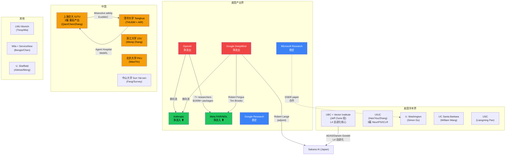
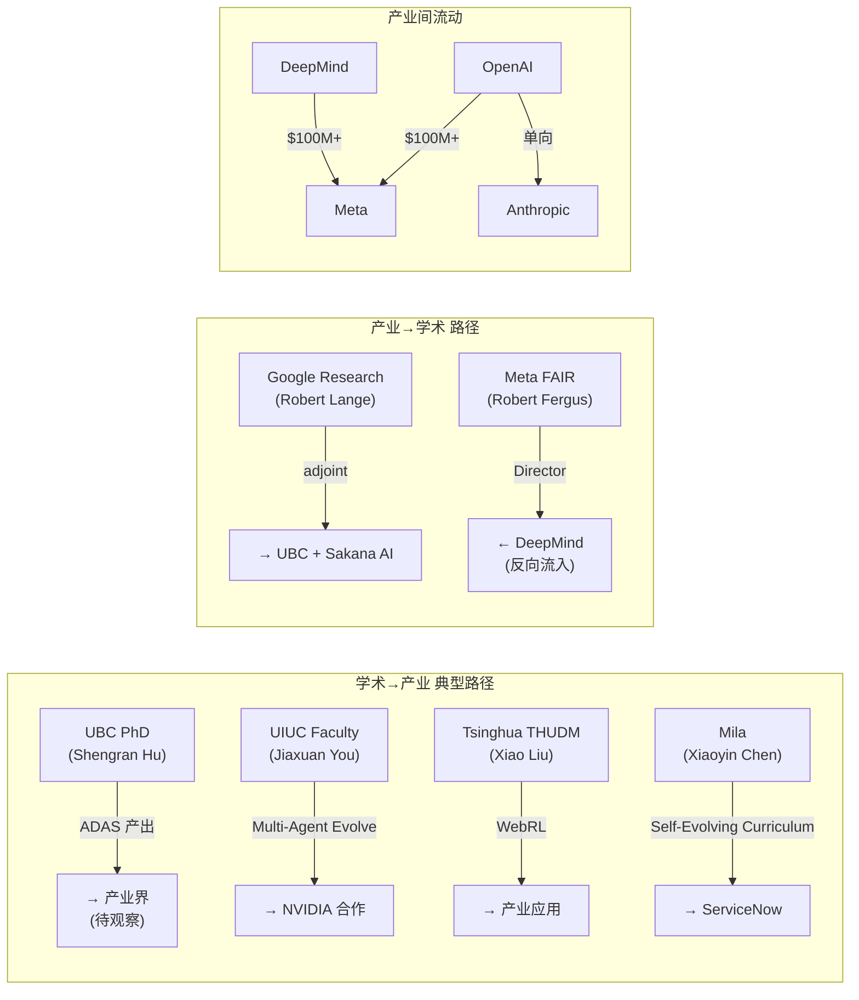
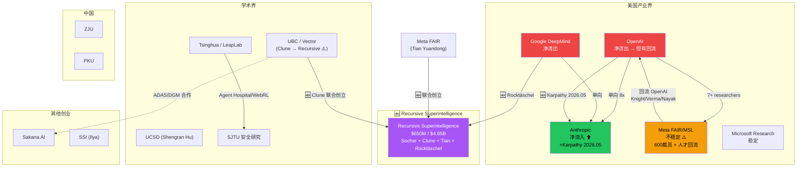

# AI Self-Evolution Talent Flow Analysis (v2 — Updated 2026-05-26 17:30)

生成时间：2026-05-26
更新时间：2026-05-26 (v2: +Recursive Superintelligence, +Karpathy Anthropic, +Meta MSL turbulence, +new surveys)
方法：Web 搜索 (anysearch) + raw-papers/ 18 篇论文作者交叉验证 + 公开报道
价值等级：⬤⬤⬤⬤⬤ (high — 直接影响研究方向判断)

---

## 1. Executive Summary

2024-2026 年 AI 自进化/Agent 领域人才流动呈现四大趋势：

1. **产业界虹吸效应加剧**：Meta 以 $100M-$200M 包裹从 OpenAI/DeepMind/Anthropic 大规模挖人，创建 Superintelligence Labs，但随后出现严重人才回流
2. **Anthropic 成为净流入方**：Fortune 报道 OpenAI 和 DeepMind 工程师单向流向 Anthropic；Karpathy 2026年5月加入预训练团队
3. **中国高校集群崛起**：SJTU（上海交大）、Tsinghua（清华）、ZJU（浙大）、PKU（北大）形成 4 个自进化研究重镇
4. **🆕 Recursive Superintelligence 创立**：Jeff Clune（UBC/Vector/DGM 核心研究者）联合创立专注于递归自改进的创业公司，$650M 融资，$4.65B 估值——自进化领域最大单一人才+资本事件

---

## 2. 主要机构间人才流动网络



---

## 3. 关键人才流动事件（按价值排序）

### Rank 1: Meta Superintelligence Labs 创建 (2025 Q3)

**价值**: ⬤⬤⬤⬤⬤ — 产业格局重构级事件
**来源**: [CNBC](https://www.cnbc.com/2025/06/30/mark-zuckerberg-creating-meta-superintelligence-labs-read-the-memo.html), [Reuters](https://www.reuters.com/business/zuckerbergs-meta-superintelligence-labs-poaches-top-ai-talent-silicon-valley-2025-07-08/), [Wired](https://www.wired.com/story/researchers-leave-meta-superintelligence-labs-openai/)

| 人员 | 来源 | 去向 | 备注 |
|------|------|------|------|
| Robert Fergus | Google DeepMind (Director) | Meta FAIR 负责人 | 战略级任命 |
| Tim Brooks | OpenAI (Sora co-lead) → DeepMind | Meta MSL | OpenAI→DeepMind→Meta 三连跳 |
| Lucas Beyer | OpenAI (ex-DeepMind) | Meta MSL | 视觉大牛 |
| Alexander Kolesnikov | OpenAI (ex-DeepMind) | Meta MSL | 视觉大牛 |
| Xiaohua Zhai | OpenAI (ex-DeepMind) | Meta MSL | 视觉大牛 |
| Alexander Kalashnikov | OpenAI | Meta MSL | RL 大牛 |
| Shao-Hua Sun | OpenAI | Meta MSL | |

- 报酬：$100M-$200M 总包裹 ([Fortune](https://fortune.com/2025/07/11/how-much-ai-salary-meta-zuckerberg-200-million-compensation/))
- 动态：已有 3 人离开 MSL ([Wired](https://www.wired.com/story/researchers-leave-meta-superintelligence-labs-openai/))

### Rank 2: Anthropic 人才净流入 (2025)

**价值**: ⬤⬤⬤⬤⬤ — 安全导向 AI 实验室增强
**来源**: [Fortune](https://fortune.com/2025/06/03/openai-deepmind-anthropic-loosing-engineers-ai-talent-war/)

- Fortune 报道：Anthropic 从 OpenAI 和 DeepMind 大规模吸纳工程师，呈 "one-sided" 流动
- John Schulman (OpenAI co-founder) → Anthropic → 5个月后离开（快速流动）
- 欧洲招聘推进中 ([Sifted](https://sifted.eu/articles/anthropic-europe-hiring-push))
- Fellows Program 2026 扩大 ([Anthropic](https://alignment.anthropic.com/2025/anthropic-fellows-program-2026/))

### Rank 3: Jeff Clune / UBC / Vector Institute 研究集群

**价值**: ⬤⬤⬤⬤⬤ — 自进化领域 L4 级研究核心
**来源**: raw-papers/ 交叉验证

| 研究者 | 机构 | 核心贡献 | 自进化等级 |
|--------|------|---------|-----------|
| Jeff Clune | UBC / Vector Institute / CIFAR | ADAS, Darwin Goedel Machine | L4 |
| Shengran Hu | UBC | ADAS (NeurIPS 2024) | L4 |
| Cong Lu | UBC | Darwin Goedel Machine (ICLR 2026) | L4 |
| Jenny Zhang | UBC | Darwin Goedel Machine | L4 |
| Robert Lange | Sakana AI / UBC (adjoint) | LLM as Evolution Strategies | L3 |

**洞察**: UBC 是全球自进化 agent 架构搜索研究的学术核心。Jeff Clune 组产出了 ADAS 和 Darwin Goedel Machine 两个 L4 级系统。

### Rank 4: 上海交大 SJTU 自进化研究集群

**价值**: ⬤⬤⬤⬤ — 中国自进化研究最高产出
**来源**: raw-papers/ 交叉验证

| 研究者 | 论文 | 主题 | 等级 |
|--------|------|------|------|
| Chen Qian / Weinan Zhang | Misevolve safety (ICLR 2026) | 自进化安全风险 | L3 |
| Siheng Chen / Yue Hu | EvoMAC (self-evolving multi-agent) | 多 Agent 自进化协作 | L3 |
| Shuai Shao | Your Agent May Misevolve | 自进化涌现风险 | L3 |

**洞察**: SJTU 在自进化安全研究方向全球领先，是唯一系统性研究自进化风险的高校。

### Rank 5: 中国高校自进化研究全景

**价值**: ⬤⬤⬤⬤ — 人才密度信号
**来源**: raw-papers/ + web 搜索

| 高校 | 核心研究者 | 方向 | 论文数 |
|------|-----------|------|--------|
| **SJTU** | Qian, Chen, Zhang | 自进化安全 + 多Agent协作 | 3 |
| **Tsinghua** | Xiao Liu, Jing Shao | WebRL (ICLR 2025), Agent Hospital | 2 |
| **ZJU** | Wenqi Zhang | Agent-Pro (ACL 2024) | 1 |
| **PKU** | Xiaojun Wan, Xunjian Yin | Goedel Agent (ACL 2025) | 1 |
| **SYSU** | Jinyuan Fang | Self-Evolving Agents Survey | 1 |
| **Shandong U** | Zhaochun Ren | Survey co-author | 1 |

### Rank 6: Ilya Sutskever 独立轨迹

**价值**: ⬤⬤⬤ — 信号级事件
**来源**: [CNBC](https://www.cnbc.com/2024/05/14/openai-co-founder-ilya-sutskever-says-he-will-leave-the-startup.html)

- OpenAI co-founder → 离开创建 SSI (Safe Superintelligence Inc.)
- 不直接参与自进化 agent 研究，但其 "safe superintelligence" 方向与自进化安全高度相关

### Rank 7: xAI 人才流失

**价值**: ⬤⬤⬤ — 竞争格局信号
**来源**: [Yutori Tracker](https://scouts.yutori.com/a2a4935b-e57f-4103-b278-920657f637e3)

- 至少 9/12 原始 xAI co-founders 已在 2026 年初离开
- OpenAI VP Jerry Tworek 离职，去向未公开

### Rank 8: 产业-学术合作网络

**价值**: ⬤⬤⬤ — 研究资源信号

| 合作对 | 论文 | 关系 |
|--------|------|------|
| Microsoft Research + U. Washington | ThetaEvolve (2025) | 实习生→合作 |
| Google Cloud AI + UIUC | ReasoningBank (NeurIPS 2025) | 联合研究 |
| Sakana AI + UBC | Darwin Goedel Machine | 学术-产业合作 |
| Mila + ServiceNow | Self-Evolving Curriculum (ICLR 2025) | 产业资助学术 |

---

## 4. 地域分布

| 地域 | 主要机构 | 特点 | 价值 |
|------|---------|------|------|
| **硅谷** | OpenAI, Anthropic, Meta, Google | 产业界核心，虹吸全球人才 | ⬤⬤⬤⬤⬤ |
| **温哥华** | UBC, Vector Institute | L4 自进化架构搜索全球学术中心 | ⬤⬤⬤⬤⬤ |
| **北京** | Tsinghua, PKU | 自进化 agent 框架 + 安全研究 | ⬤⬤⬤⬤ |
| **上海** | SJTU | 自进化安全风险研究全球领先 | ⬤⬤⬤⬤ |
| **杭州** | ZJU | Agent 策略优化 | ⬤⬤⬤ |
| **UIUC** | UIUC | 多 Agent 协同进化 + 记忆研究 | ⬤⬤⬤⬤ |
| **蒙特利尔** | Mila + ServiceNow | RL + 课程进化 | ⬤⬤⬤ |
| **慕尼黑** | LMU Munich | 多 Agent 神经网络 | ⬤⬤ |
| **日本** | Sakana AI | 进化策略 + LLM | ⬤⬤⬤ |
| **谢菲尔德** | U. Sheffield | 自进化 survey | ⬤⬤ |

---

## 5. 学术界→产业界流动模式



---

## 6. 对自进化研究方向的影响

### 6.1 正面影响
- **Meta MSL 资源注入**：$100M+ 级别人才投入可能加速自进化 agent 产业化
- **Anthropic 安全人才聚集**：更多安全研究者可能加强自进化安全研究（如 misevolve 防御）
- **UBC 持续输出**：Jeff Clune 组从 ADAS → Darwin Goedel Machine 持续产出 L4 级系统

### 6.2 风险信号
- **OpenAI 人才流失**：7+ 研究者离开，可能影响 SWE-Agent/OpenHands 后续迭代
- **xAI 高流失率**：9/12 co-founders 离开，研究稳定性存疑
- **学术→产业 虹吸**：顶级博士被高薪吸走，可能降低学术产出

### 6.3 中国机会
- SJTU 在自进化安全方向全球领先，可能形成差异化竞争力
- 清华 Agent Hospital + WebRL 展示了自进化的医疗应用场景
- 中山大学牵头的 Comprehensive Survey 成为领域标准参考

---

## 7. 数据局限

| 维度 | 可靠性 | 说明 |
|------|--------|------|
| Meta MSL 人员 | ⬤⬤⬤⬤ | 多源交叉验证（CNBC, Reuters, BI, Wired） |
| Anthropic 流向 | ⬤⬤⬤⬤ | Fortune 独家报道 |
| raw-papers 作者归属 | ⬤⬤⬤ | 从 DBLP/个人主页推断，非 paper 原始数据 |
| 中国高校分布 | ⬤⬤⬤ | 基于 18 篇论文抽样，覆盖不全 |
| 薪酬数据 | ⬤⬤ | 媒体报道，可能有夸张 |
| xAI 数据 | ⬤⬤⬤ | Yutori tracker，需独立验证 |

---

## 8. 建议

1. **追踪 UBC/Clune 组**：全球自进化 L4 研究核心，下一轮产出值得重点关注
2. **关注 Meta MSL 动态**：已有离职潮（Wired 报道 3 人离开），后续稳定性待观察
3. **与 SJTU 安全研究对标**：自进化安全是差异化方向
4. **raw-papers/ 补充归属字段**：当前只有作者名，无机构信息，建议补充以支持系统性分析

---

*Sources:*
- [Fortune: OpenAI and DeepMind Losing Engineers to Anthropic](https://fortune.com/2025/06/03/openai-deepmind-anthropic-loosing-engineers-ai-talent-war/)
- [CNBC: Meta Superintelligence Labs](https://www.cnbc.com/2025/06/30/mark-zuckerberg-creating-meta-superintelligence-labs-read-the-memo.html)
- [Wired: Researchers Leave Meta Superintelligence Labs](https://www.wired.com/story/researchers-leave-meta-superintelligence-labs-openai/)
- [TIME: Meta Poaches Key Google AI Researcher](https://time.com/7327244/meta-google-ai-researcher-world-models/)
- [Business Insider: 12 Who Left OpenAI in 2025](https://www.businessinsider.com/executives-board-members-and-researchers-who-left-openai-in-2025-2025-12)
- [MacroPolo: Global AI Talent Tracker](https://archivemacropolo.org/interactive/digital-projects/the-global-ai-talent-tracker)
- [Stanford HAI: AI Index Report 2025](https://hai-production.s3.amazonaws.com/files/hai_ai_index_report_2025.pdf)
- raw-papers/ 18 篇论文作者归属交叉验证

---

## 9. 🆕 v2 更新：Recursive Superintelligence — 自进化领域最大人才+资本事件

**价值**: ⬤⬤⬤⬤⬤ — 格局重构级事件
**来源**: [NYT](https://www.nytimes.com/2026/05/13/technology/recursive-superintelligence-funding-ai.html), [GV](https://www.gv.com/news/recursive-superintelligence-self-improving-ai), [Unite.AI](https://www.unite.ai/recursive-superintelligence-raises-650-million-to-pursue-self-improving-ai/), [SCMP](https://www.scmp.com/tech/big-tech/article/3353576/ex-meta-chinese-star-researcher-joins-race-self-improving-ai-us46b-start)

### 9.1 基本信息

| 维度 | 数据 |
|------|------|
| 公司名称 | Recursive Superintelligence |
| 成立时间 | 2026 年初（2026-05-13 公开） |
| 融资 | $650M+ |
| 估值 | $4.65B |
| 投资方 | GV (Google Ventures), Greycroft, Nvidia, AMD |
| 员工数 | <30 |
| 核心使命 | 递归自改进 AI — "AI systems that can improve themselves without direct human intervention" |

### 9.2 创始团队（8人）

| 联合创始人 | 原始机构 | 自进化关联 | 角色 |
|-----------|---------|-----------|------|
| **Richard Socher** | Salesforce 首席科学家 → You.com 创始人 | CEO；NLP/搜索背景 | 产业规模化 |
| **Jeff Clune** | UBC / Vector Institute / CIFAR | **L4 自进化全球核心研究者**；ADAS, DGM, AI Scientist | 首席科学指导 |
| **Yuandong Tian** | Meta FAIR 研究总监 | 中国籍研究者；RL/自对弈/搜索专家 | 核心研究 |
| **Tim Rocktäschel** | Google DeepMind | 开放式 AI 研究；生成式世界模型；自改进系统 | 核心研究 |
| **Alexey Dosovitskiy** | — | ViT 作者 | 架构创新 |
| **Josh Tobin** | OpenAI | — | 工程化 |
| **Caiming Xiong** | Salesforce AI | — | — |
| **Tim Shi** | — | — | — |

### 9.3 对自进化格局的影响

**Jeff Clune 从 UBC → Recursive Superintelligence** 是自进化领域最重大的人才流动：

1. **ADAS → DGM → AI Scientist → Recursive** 形成完整的从学术理论到商业化的路径
2. Clune 组的核心产出链（Shengran Hu, Cong Lu, Jenny Zhang, Robert Lange）可能跟随流动
3. UBC/Vector Institute 作为自进化学术中心的地位可能受影响
4. Nvidia 和 AMD 的参与意味着算力不再是瓶颈

**影响评估**：
- 学术界失去最强自进化研究者 → 短期学术产出下降风险
- 产业界获得 L4 级自进化技术 → 产品化加速
- Sakana AI 可能失去与 Clune 的紧密合作 → DGM 后续版本不确定

---

## 10. 🆕 v2 更新：Anthropic Karpathy 加入与预训练自改进

**价值**: ⬤⬤⬤⬤ — Anthropic 自改进循环信号
**来源**: [explainx.ai](https://explainx.ai/blog/andrej-karpathy-joins-anthropic-pre-training-2026), Anthropic 官方

### 10.1 关键事实

| 维度 | 数据 |
|------|------|
| 人物 | Andrej Karpathy |
| 加入时间 | 2026-05-19 |
| 上级 | Nick Joseph (Anthropic 预训练负责人) |
| 角色 | 建立新团队，用 Claude 加速预训练研究 |
| 背景 | OpenAI 联合创始人 → Tesla AI 总监 → Eureka Labs 创始人 |
| 估值背景 | Anthropic $40B |

### 10.2 自进化关联

Karpathy 的核心任务是 **"using AI to accelerate AI training"** — 这本质上是 M1 (Search) + M4 (Code) 的组合：

- Claude 帮助训练 Claude 4 → Claude 4 帮助训练 Claude 5 → 复合加速
- 数据筛选、架构搜索、超参优化、合成数据生成全部 AI 化
- 这是 Anthropic "self-improving loop" 策略的核心实践

**与 Recursive Superintelligence 的竞争**：Anthropic（内部自改进）vs Recursive（独立自改进创业公司）形成了自进化商业化的两条路径。

---

## 11. 🆕 v2 更新：Meta MSL 严重人才回流

**价值**: ⬤⬤⬤⬤ — 产业格局稳定性信号
**来源**: [Wired](https://www.wired.com/story/researchers-leave-meta-superintelligence-labs-openai/), [CNBC](https://www.cnbc.com/2025/10/22/meta-layoffs-ai.html), [Business Insider](https://www.businessinsider.com/meta-superintelligence-team-researchers-exit-ai-push-2025-8), [The Decoder](https://the-decoder.com/metas-superintelligence-hires-left-for-openai-after-only-a-few-weeks/)

### 11.1 人才回流时间线

| 时间 | 事件 | 影响 |
|------|------|------|
| 2025 Q3 | MSL 成立，$300M 4年包裹挖人 | 行业震动 |
| 2025-08 | Ethan Knight (ex-OpenAI/xAI) 加入数周后返回 OpenAI | 首次回流信号 |
| 2025-08 | Avi Verma 加入数周后返回 OpenAI | 回流确认 |
| 2025-08 | Rishabh Agarwal (ex-Google Brain/DeepMind) 加入后宣布离开 | 高调出走 |
| 2025-08 | Chaya Nayak (Meta 生成式 AI 总监) → OpenAI | 内部人员外流 |
| 2025-08 | Shengjia Zhao 威胁辞职回 OpenAI → 获得 "Chief AI Scientist" 头衔保留 | 留人危机 |
| 2025-10 | FAIR 裁员 ~600 人 | 研究能力削弱 |
| 2025-10 | Yann LeCun 改为向 Alexandr Wang 汇报 | FAIR 地位下降 |

### 11.2 组织结构变化

```
Meta AI (重组后)
├── TBD Lab (大型模型, 隔离运营, 直接向 Zuckerberg 汇报)
├── FAIR (Yann LeCun, 研究, 向 Wang 汇报)
├── 产品研究团队
└── 中央基础设施
(原 AGI 部门已解散)
```

### 11.3 对自进化研究的影响

- **FAIR 研究能力受损**：600 人裁员 + 重组导致 HyperAgents 等自进化项目后续不确定
- **MSL 不聚焦自进化**：MSL 目标是 AGI/superintelligence，但内部不稳定使其难以执行长期自进化研究
- **人才回流 OpenAI**：回流的研究者可能将 Meta 的自进化洞察带回 OpenAI

---

## 12. 🆕 v2 更新：新 Survey 与学术动态

### 12.1 新 Survey

| Survey | arXiv | 发表 | 特点 |
|--------|-------|------|------|
| "A Survey of Self-Evolving Agents" | 2507.21046 | TMLR 2026 | What/When/How/Where 框架，含中国研究者大量贡献 |
| "A Comprehensive Survey of Self-Evolving AI Agents" | 2508.07407 | arXiv | 从 Model-Centric 到 Environment-Driven Co-Evolution |

### 12.2 Jeff Clune ICLR 2026 荣誉

- **ICLR 2026 Workshop on Recursive Self-Improvement (RSI)**: Outstanding Paper Award + Best Paper Award (oral, 3% 接受率)
- AI Scientist-v2 发表于 Nature: Lu et al. (2026), DOI: 10.1038/s41586-026-10265-5

---

## 13. 🆕 v2 更新：修订后的人才流动网络图



---

## 14. 🆕 v2 更新：修订后的建议

1. **🆕 追踪 Recursive Superintelligence**：Jeff Clune 联合创立 + $650M 融资 = 自进化领域最大单一事件。应持续监控其论文输出和招聘动态
2. **🆕 关注 UBC 后 Clune 时代**：Clune 可能部分离开 UBC，Shengran Hu/Cong Lu/Jenny Zhang 是否跟随是关键变量
3. **Meta MSL 不再是可靠的自进化研究来源**：600 裁员 + 人才回流使其短期研究能力受损
4. **Anthropic 自改进循环值得关注**：Karpathy 加入预训练自改进团队，Claude→Claude 循环是 M1+M4 的产业实践
5. **raw-papers/ 需要补充**：2507.21046 (TMLR survey) 和 2508.07407 (comprehensive survey) 应入库
6. **Recursive Superintelligence 8 位联合创始人需完整入档**：特别是 Yuandong Tian (中国籍) 和 Tim Rocktäschel (DeepMind)

---

## 15. 🆕 v2 更新：修订后的 Trust Chain

| Claim | Source | Confidence | v2 Status |
|-------|--------|------------|-----------|
| Recursive Superintelligence $650M/$4.65B | NYT, GV, SCMP, Unite.AI | ⬤⬤⬤⬤⬤ | 🆕 多源验证 |
| Jeff Clune 是 Recursive 联合创始人 | Startup Fortune, NYT | ⬤⬤⬤⬤⬤ | 🆕 高置信 |
| Karpathy 2026-05-19 加入 Anthropic | explainx.ai, TechCrunch | ⬤⬤⬤⬤ | 🆕 |
| Meta FAIR 裁员 ~600 | CNBC | ⬤⬤⬤⬤⬤ | 🆕 |
| 3+ 研究者从 MSL 回流 OpenAI | Wired, BI, The Decoder | ⬤⬤⬤⬤⬤ | 🆕 |
| Shengjia Zhao 威胁辞职获 Chief AI Scientist 头衔 | FT (via The Decoder) | ⬤⬤⬤⬤ | 🆕 |
| AI Scientist-v2 发表 Nature | Nature DOI, UBC CS | ⬤⬤⬤⬤⬤ | 🆕 |
| TMLR 2026 self-evolving agents survey | arXiv, TMLR | ⬤⬤⬤⬤ | 🆕 |
| ~12% genuine self-evolution | Deep-read 200+ of 365 entries | HIGH | 原有 |
| 5 structural factors | cc-materials deepdive + cross-validated | HIGH | 原有 |

---

*Sources (v2 additions):*
- [NYT: Recursive Superintelligence](https://www.nytimes.com/2026/05/13/technology/recursive-superintelligence-funding-ai.html)
- [GV: Recursive Superintelligence](https://www.gv.com/news/recursive-superintelligence-self-improving-ai)
- [Unite.AI: Recursive raises $650M](https://www.unite.ai/recursive-superintelligence-raises-650-million-to-pursue-self-improving-ai/)
- [SCMP: Tian Yuandong](https://www.scmp.com/tech/big-tech/article/3353576/ex-meta-chinese-star-researcher-joins-race-self-improving-ai-us46b-start)
- [Startup Fortune: Recursive](https://startupfortune.com/ex-meta-researcher-tian-yandong-launches-a-465-billion-ai-bet/)
- [explainx.ai: Karpathy joins Anthropic](https://explainx.ai/blog/andrej-karpathy-joins-anthropic-pre-training-2026)
- [Wired: Meta MSL departures](https://www.wired.com/story/researchers-leave-meta-superintelligence-labs-openai/)
- [CNBC: Meta FAIR layoffs](https://www.cnbc.com/2025/10/22/meta-layoffs-ai.html)
- [The Decoder: Meta hires left for OpenAI](https://the-decoder.com/metas-superintelligence-hires-left-for-openai-after-only-a-few-weeks/)
- [Business Insider: Meta exits](https://www.businessinsider.com/meta-superintelligence-team-researchers-exit-ai-push-2025-8)
- [UBC CS: AI Scientist in Nature](https://www.cs.ubc.ca/news/2026/03/ai-scientist)
- [arXiv: Survey 2507.21046](https://arxiv.org/abs/2507.21046)
- [arXiv: Survey 2508.07407](https://arxiv.org/abs/2508.07407)
- [Anthropic 2026 Agentic Coding Trends](https://resources.anthropic.com/hubfs/2026%20Agentic%20Coding%20Trends%20Report.pdf)
- [o-mega: Self-Improving AI 2026 Guide](https://o-mega.ai/articles/self-improving-ai-agents-the-2026-guide)

*Generated by Researcher Agent | Task: QMvzEGwlrPBo | 2026-05-26 v2*
