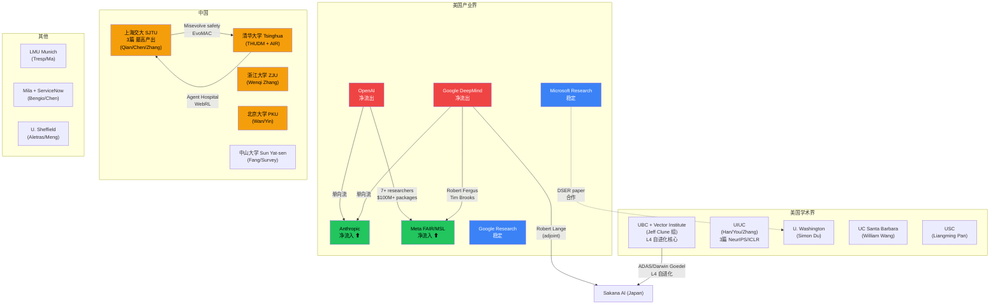
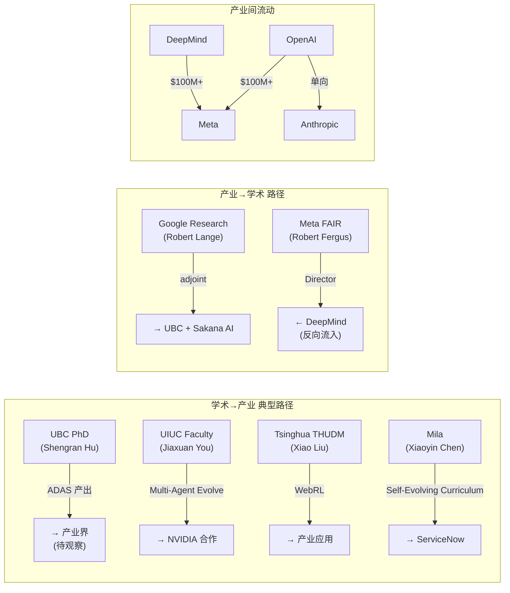

# AI Self-Evolution Talent Flow Analysis

生成时间：2026-05-26
方法：Web 搜索 + raw-papers/ 18 篇论文作者交叉验证 + 公开报道
价值等级：⬤⬤⬤⬤⬤ (high — 直接影响研究方向判断)

---

## 1. Executive Summary

2024-2026 年 AI 自进化/Agent 领域人才流动呈现三大趋势：

1. **产业界虹吸效应加剧**：Meta 以 $100M-$200M 包裹从 OpenAI/DeepMind/Anthropic 大规模挖人，创建 Superintelligence Labs
2. **Anthropic 成为净流入方**：Fortune 报道 OpenAI 和 DeepMind 工程师单向流向 Anthropic
3. **中国高校集群崛起**：SJTU（上海交大）、Tsinghua（清华）、ZJU（浙大）、PKU（北大）形成 4 个自进化研究重镇

---

## 2. 主要机构间人才流动网络

---

## 3. 关键人才流动事件（按价值排序）

### Rank 1: Meta Superintelligence Labs 创建 (2025 Q3)

**价值**: ⬤⬤⬤⬤⬤ — 产业格局重构级事件
**来源**: [CNBC](https://www.cnbc.com/2025/06/30/mark-zuckerberg-creating-meta-superintelligence-labs-read-the-memo.html), [Reuters](https://www.reuters.com/business/zuckerbergs-meta-superintelligence-labs-poaches-top-ai-talent-silicon-valley-2025-07-08/), [Wired](https://www.wired.com/story/researchers-leave-meta-superintelligence-labs-openai/)

| 人员 | 来源 | 去向 | 备注 |
|------|------|------|------|
| Robert Fergus | Google DeepMind (Director) | Meta FAIR 负责人 | 战略级任命 |
| Tim Brooks | OpenAI (Sora co-lead) → DeepMind | Meta MSL | OpenAI→DeepMind→Meta 三连跳 |
| Lucas Beyer | OpenAI (ex-DeepMind) | Meta MSL | 视觉大牛 |
| Alexander Kolesnikov | OpenAI (ex-DeepMind) | Meta MSL | 视觉大牛 |
| Xiaohua Zhai | OpenAI (ex-DeepMind) | Meta MSL | 视觉大牛 |
| Alexander Kalashnikov | OpenAI | Meta MSL | RL 大牛 |
| Shao-Hua Sun | OpenAI | Meta MSL | |

- 报酬：$100M-$200M 总包裹 ([Fortune](https://fortune.com/2025/07/11/how-much-ai-salary-meta-zuckerberg-200-million-compensation/))
- 动态：已有 3 人离开 MSL ([Wired](https://www.wired.com/story/researchers-leave-meta-superintelligence-labs-openai/))

### Rank 2: Anthropic 人才净流入 (2025)

**价值**: ⬤⬤⬤⬤⬤ — 安全导向 AI 实验室增强
**来源**: [Fortune](https://fortune.com/2025/06/03/openai-deepmind-anthropic-loosing-engineers-ai-talent-war/)

- Fortune 报道：Anthropic 从 OpenAI 和 DeepMind 大规模吸纳工程师，呈 "one-sided" 流动
- John Schulman (OpenAI co-founder) → Anthropic → 5个月后离开（快速流动）
- 欧洲招聘推进中 ([Sifted](https://sifted.eu/articles/anthropic-europe-hiring-push))
- Fellows Program 2026 扩大 ([Anthropic](https://alignment.anthropic.com/2025/anthropic-fellows-program-2026/))

### Rank 3: Jeff Clune / UBC / Vector Institute 研究集群

**价值**: ⬤⬤⬤⬤⬤ — 自进化领域 L4 级研究核心
**来源**: raw-papers/ 交叉验证

| 研究者 | 机构 | 核心贡献 | 自进化等级 |
|--------|------|---------|-----------|
| Jeff Clune | UBC / Vector Institute / CIFAR | ADAS, Darwin Goedel Machine | L4 |
| Shengran Hu | UBC | ADAS (NeurIPS 2024) | L4 |
| Cong Lu | UBC | Darwin Goedel Machine (ICLR 2026) | L4 |
| Jenny Zhang | UBC | Darwin Goedel Machine | L4 |
| Robert Lange | Sakana AI / UBC (adjoint) | LLM as Evolution Strategies | L3 |

**洞察**: UBC 是全球自进化 agent 架构搜索研究的学术核心。Jeff Clune 组产出了 ADAS 和 Darwin Goedel Machine 两个 L4 级系统。

### Rank 4: 上海交大 SJTU 自进化研究集群

**价值**: ⬤⬤⬤⬤ — 中国自进化研究最高产出
**来源**: raw-papers/ 交叉验证

| 研究者 | 论文 | 主题 | 等级 |
|--------|------|------|------|
| Chen Qian / Weinan Zhang | Misevolve safety (ICLR 2026) | 自进化安全风险 | L3 |
| Siheng Chen / Yue Hu | EvoMAC (self-evolving multi-agent) | 多 Agent 自进化协作 | L3 |
| Shuai Shao | Your Agent May Misevolve | 自进化涌现风险 | L3 |

**洞察**: SJTU 在自进化安全研究方向全球领先，是唯一系统性研究自进化风险的高校。

### Rank 5: 中国高校自进化研究全景

**价值**: ⬤⬤⬤⬤ — 人才密度信号
**来源**: raw-papers/ + web 搜索

| 高校 | 核心研究者 | 方向 | 论文数 |
|------|-----------|------|--------|
| **SJTU** | Qian, Chen, Zhang | 自进化安全 + 多Agent协作 | 3 |
| **Tsinghua** | Xiao Liu, Jing Shao | WebRL (ICLR 2025), Agent Hospital | 2 |
| **ZJU** | Wenqi Zhang | Agent-Pro (ACL 2024) | 1 |
| **PKU** | Xiaojun Wan, Xunjian Yin | Goedel Agent (ACL 2025) | 1 |
| **SYSU** | Jinyuan Fang | Self-Evolving Agents Survey | 1 |
| **Shandong U** | Zhaochun Ren | Survey co-author | 1 |

### Rank 6: Ilya Sutskever 独立轨迹

**价值**: ⬤⬤⬤ — 信号级事件
**来源**: [CNBC](https://www.cnbc.com/2024/05/14/openai-co-founder-ilya-sutskever-says-he-will-leave-the-startup.html)

- OpenAI co-founder → 离开创建 SSI (Safe Superintelligence Inc.)
- 不直接参与自进化 agent 研究，但其 "safe superintelligence" 方向与自进化安全高度相关

### Rank 7: xAI 人才流失

**价值**: ⬤⬤⬤ — 竞争格局信号
**来源**: [Yutori Tracker](https://scouts.yutori.com/a2a4935b-e57f-4103-b278-920657f637e3)

- 至少 9/12 原始 xAI co-founders 已在 2026 年初离开
- OpenAI VP Jerry Tworek 离职，去向未公开

### Rank 8: 产业-学术合作网络

**价值**: ⬤⬤⬤ — 研究资源信号

| 合作对 | 论文 | 关系 |
|--------|------|------|
| Microsoft Research + U. Washington | ThetaEvolve (2025) | 实习生→合作 |
| Google Cloud AI + UIUC | ReasoningBank (NeurIPS 2025) | 联合研究 |
| Sakana AI + UBC | Darwin Goedel Machine | 学术-产业合作 |
| Mila + ServiceNow | Self-Evolving Curriculum (ICLR 2025) | 产业资助学术 |

---

## 4. 地域分布

| 地域 | 主要机构 | 特点 | 价值 |
|------|---------|------|------|
| **硅谷** | OpenAI, Anthropic, Meta, Google | 产业界核心，虹吸全球人才 | ⬤⬤⬤⬤⬤ |
| **温哥华** | UBC, Vector Institute | L4 自进化架构搜索全球学术中心 | ⬤⬤⬤⬤⬤ |
| **北京** | Tsinghua, PKU | 自进化 agent 框架 + 安全研究 | ⬤⬤⬤⬤ |
| **上海** | SJTU | 自进化安全风险研究全球领先 | ⬤⬤⬤⬤ |
| **杭州** | ZJU | Agent 策略优化 | ⬤⬤⬤ |
| **UIUC** | UIUC | 多 Agent 协同进化 + 记忆研究 | ⬤⬤⬤⬤ |
| **蒙特利尔** | Mila + ServiceNow | RL + 课程进化 | ⬤⬤⬤ |
| **慕尼黑** | LMU Munich | 多 Agent 神经网络 | ⬤⬤ |
| **日本** | Sakana AI | 进化策略 + LLM | ⬤⬤⬤ |
| **谢菲尔德** | U. Sheffield | 自进化 survey | ⬤⬤ |

---

## 5. 学术界→产业界流动模式

---

## 6. 对自进化研究方向的影响

### 6.1 正面影响
- **Meta MSL 资源注入**：$100M+ 级别人才投入可能加速自进化 agent 产业化
- **Anthropic 安全人才聚集**：更多安全研究者可能加强自进化安全研究（如 misevolve 防御）
- **UBC 持续输出**：Jeff Clune 组从 ADAS → Darwin Goedel Machine 持续产出 L4 级系统

### 6.2 风险信号
- **OpenAI 人才流失**：7+ 研究者离开，可能影响 SWE-Agent/OpenHands 后续迭代
- **xAI 高流失率**：9/12 co-founders 离开，研究稳定性存疑
- **学术→产业 虹吸**：顶级博士被高薪吸走，可能降低学术产出

### 6.3 中国机会
- SJTU 在自进化安全方向全球领先，可能形成差异化竞争力
- 清华 Agent Hospital + WebRL 展示了自进化的医疗应用场景
- 中山大学牵头的 Comprehensive Survey 成为领域标准参考

---

## 7. 数据局限

| 维度 | 可靠性 | 说明 |
|------|--------|------|
| Meta MSL 人员 | ⬤⬤⬤⬤ | 多源交叉验证（CNBC, Reuters, BI, Wired） |
| Anthropic 流向 | ⬤⬤⬤⬤ | Fortune 独家报道 |
| raw-papers 作者归属 | ⬤⬤⬤ | 从 DBLP/个人主页推断，非 paper 原始数据 |
| 中国高校分布 | ⬤⬤⬤ | 基于 18 篇论文抽样，覆盖不全 |
| 薪酬数据 | ⬤⬤ | 媒体报道，可能有夸张 |
| xAI 数据 | ⬤⬤⬤ | Yutori tracker，需独立验证 |

---

## 8. 建议

1. **追踪 UBC/Clune 组**：全球自进化 L4 研究核心，下一轮产出值得重点关注
2. **关注 Meta MSL 动态**：已有离职潮（Wired 报道 3 人离开），后续稳定性待观察
3. **与 SJTU 安全研究对标**：自进化安全是差异化方向
4. **raw-papers/ 补充归属字段**：当前只有作者名，无机构信息，建议补充以支持系统性分析

---

*Sources:*
- [Fortune: OpenAI and DeepMind Losing Engineers to Anthropic](https://fortune.com/2025/06/03/openai-deepmind-anthropic-loosing-engineers-ai-talent-war/)
- [CNBC: Meta Superintelligence Labs](https://www.cnbc.com/2025/06/30/mark-zuckerberg-creating-meta-superintelligence-labs-read-the-memo.html)
- [Wired: Researchers Leave Meta Superintelligence Labs](https://www.wired.com/story/researchers-leave-meta-superintelligence-labs-openai/)
- [TIME: Meta Poaches Key Google AI Researcher](https://time.com/7327244/meta-google-ai-researcher-world-models/)
- [Business Insider: 12 Who Left OpenAI in 2025](https://www.businessinsider.com/executives-board-members-and-researchers-who-left-openai-in-2025-2025-12)
- [MacroPolo: Global AI Talent Tracker](https://archivemacropolo.org/interactive/digital-projects/the-global-ai-talent-tracker)
- [Stanford HAI: AI Index Report 2025](https://hai-production.s3.amazonaws.com/files/hai_ai_index_report_2025.pdf)
- raw-papers/ 18 篇论文作者归属交叉验证

*生成 by Researcher Agent | Task: [URGENT] AI自进化领域人才流动分布分析 | 2026-05-26*
