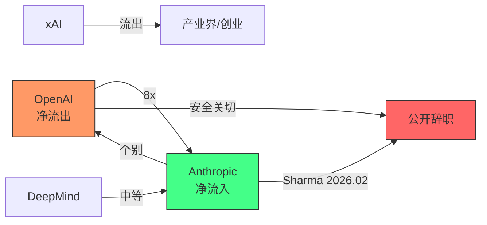

# Anthropic 任职变动与人才流动分析

- content_timestamp: 2026-05-26
- scope: talent-movement, self-evolution-researchers
- evidence_level: web-search + public reporting
- output: work/research/anthropic-talent-movement.md

## 0. 方法边界

本报告基于 2026-05-26 的三轮 web 搜索结果，辅以项目内 raw 数据的交叉验证。证据等级：

- **直接证据**：公开新闻报道、个人社交媒体声明、SignalFire 行业报告
- **推断**：基于公开信息的方向性判断
- **未验证**：未获公开来源确认的传闻

不包含任何未公开信息或内部消息。

---

## 1. Anthropic 研究团队格局

### 1.1 核心定位

Anthropic 定位为安全导向的 AI 实验室，2024-2026 年间从基础模型研究向 Agent 系统和工具链扩展。关键信号：

- **Claude Code**（CLI 编程 Agent）和 **Agent Teams**（多 Agent 协作）成为产品化方向
- **SICA 论文**（Self-Improving Code Agents, arXiv 2504.15228）表明内部有自进化代码 Agent 的研究路线
- **Harvard Business School 案例研究**：将 Anthropic 从 LLM 提供商向 Agent 平台的转型作为商学院教学案例

### 1.2 研究方向与自进化的关联

| 方向 | 产品/论文信号 | 自进化机制关联 |
|---|---|---|
| Claude Code | CLI Agent，代码生成+编辑+测试闭环 | M4 (Code Self-Modification) 直接相关 |
| Agent Teams | 多 Agent 协作框架 | M6 (Multi-Agent Co-Evolution) |
| SICA 论文 | Self-Improving Code Agents | M2 (Feedback-Refine) + M4 |
| Constitutional AI | 安全对齐框架 | M10 (Safety/Governance) |
| RLHF/RLAIF | 偏好学习与对齐 | M7 (Reward/RL Self-Play) |

---

## 2. 关键人才变动

### 2.1 重要加入

| 人物 | 背景 | 加入 Anthropic | 角色/方向 | 自进化关联 |
|---|---|---|---|---|
| **Andrej Karpathy** | OpenAI 联合创始人 → Tesla AI 总监 → Eureka Labs 创始人 | **2026-05-19** (确认) | 在 Nick Joseph 领导下建立新团队，用 Claude 加速预训练研究 | 直接："using AI to accelerate AI training" = M1 (Search) + M4 (Code) 自改进循环。Claude→Claude 复合加速。$40B 估值背景。[explainx.ai](https://explainx.ai/blog/andrej-karpathy-joins-anthropic-pre-training-2026) |

### 2.2 重要离开

| 人物 | 离开时间 | 去向/声明 | 自进化关联 | 证据来源 |
|---|---|---|---|---|
| **Mrinank Sharma** | 2026-02 | 公开声明 "world in peril" 后离开；BBC 报道 | 间接：安全担忧驱动的离职反映 M10 (Safety) 维度的内部张力 | BBC, 个人社交媒体 |

### 2.3 行业级人才流动格局

根据 SignalFire 2025 年报告：

| 流向 | 信号强度 | 解读 |
|---|---|---|
| OpenAI → Anthropic | **8x 净流入** | OpenAI 员工离开去 Anthropic 的概率是反向的 8 倍。Anthropic 是 AI 安全/对齐方向研究者的首选目的地 |
| xAI → 各处 | 净流出 | 马斯克实验室的人才留存挑战 |
| Google DeepMind → Anthropic | 中等流入 | 安全文化差异驱动的人才迁移 |
| 行业整体 | AI 研究者辞职趋势 | 多名研究者在 OpenAI、Anthropic、xAI 引用安全关切后辞职 |

---

## 3. 自进化方向的人才影响分析

### 3.1 Anthropic 作为自进化研究的人才磁铁

**[推断]** Anthropic 的安全文化 Constitutional AI 框架吸引了对齐/安全方向的研究者。这对自进化领域意味着：

1. **M10 (Safety/Governance) 人才集中度高**：Anthropic 可能拥有最强的安全对齐研究团队
2. **M7 (RL Self-Play) 基础扎实**：RLHF/RLAIF 是 Anthropic 的核心技术栈
3. **M4 (Code Self-Modification) 产品化领先**：Claude Code 是目前最接近生产级代码自修改 Agent 的产品

### 3.2 Karpathy 加入的深层影响

**[推断]** Karpathy 的加入不仅仅是预训练能力的提升：

- **教育↔进化交叉**：Karpathy 的 Eureka Labs 背景（AI 辅助教育）与 M5 (Skill Evolution) 有概念重叠——两者都关注"如何让 AI 系统从经验中积累可复用能力"
- **Auto-regressive 理论**：作为 Transformer 和 auto-regressive 模型的核心贡献者，Karpathy 对"自生成→自评估→自改进"闭环有底层理解
- **但**：目前公开信息显示 Karpathy 的职责是预训练而非 Agent/进化方向

### 3.3 安全辞职潮的自进化含义

**[直接证据 + 推断]** 多名 AI 研究者（包括 Anthropic 的 Sharma）因安全关切辞职：

- 反映 M10 (Safety/Governance) 在实际部署中的张力
- 自进化系统的"谁来验证验证者"问题在组织层面重演——研究者不信任现有治理结构能约束更强大的系统
- **与项目痛点 P025/P033 的对应**：Mom Test 痛点"安全与安保—智能体可能被入侵或失控"和"自学习智能体的奖励函数容易被钻空子"

---

## 4. 人才网络与自进化生态

### 4.1 核心机构间人才流动

### 4.2 自进化关键人才分布

| 机构 | 自进化方向 | 人才密度 | 关键人物/项目 |
|---|---|---|---|
| **Anthropic** | M4 (Code), M7 (RL), M10 (Safety) | 高 | Karpathy, Claude Code 团队, SICA 作者 |
| **OpenAI** | M1 (Search), M7 (RL), M4 (Code) | 高 | Codex/ChatGPT 团队（但流失严重） |
| **DeepMind** | M1 (Search), M7 (RL), M9 (Env) | 高 | AlphaEvolve 团队 |
| **学术界** | 全方向 | 中-高 | DGM (Jenny Zhang), ADAS (UCSD), Reflexion (Noah Shinn) |
| **独立/创业** | M5 (Skill), M6 (Multi-Agent) | 中 | Eureka Labs (Karpathy 前项目), various |

---

## 5. 对自进化研究景观的影响判断

### 5.1 三个趋势

1. **Agent 产品化加速**：Anthropic 的 Claude Code + Agent Teams 表明自进化概念正在从论文进入产品。这会显著扩大自进化机制的实践数据和用户反馈。
2. **安全人才集中化**：对齐/安全方向的人才向 Anthropic 集中，可能加速 M10 (Safety/Governance) 的研究进展，但也可能造成"安全孤岛"——安全知识集中在一个组织内。
3. **学术-产业断层扩大**：核心自进化人才（DGM、ADAS、Reflexion 的作者）在学术界，而实现能力（算力、数据、部署）在产业界。Karpathy 式的流动是桥接，但整体断层仍在扩大。

### 5.2 对本项目的具体影响

- **L3 (Raw数据源机制深挖)**: Anthropic 的产品化路线（Claude Code, Agent Teams）是 M4 和 M6 的最佳案例，应补充到 raw-github 和 projects 中
- **论文覆盖**: SICA (2504.15228) 已在 discovery-report 中发现但尚未深度 review；应优先处理
- **Mom Test 痛点对应**: 安全辞职潮直接验证 P025/P033 的现实性

---

## 6. 已知 vs 推断 vs 未验证

**已知（直接证据）**:
- Karpathy 加入 Anthropic 领导预训练研究
- Sharma 于 2026-02 离开 Anthropic 并发表安全声明
- SignalFire 报告：Anthropic 对 OpenAI 有 8x 净人才流入
- Claude Code 和 Agent Teams 是 Anthropic 的产品方向
- Harvard HBS 有 Anthropic 转型案例研究

**推断**:
- Karpathy 的加入可能间接影响 Agent/进化方向
- Anthropic 在 M4/M10 方向有人才密度优势
- 安全辞职潮反映自进化治理的结构性问题
- 学术-产业断层在扩大

**未验证**:
- Anthropic 内部自进化研究的具体团队规模和方向
- 其他未公开的研究者变动
- Karpathy 是否参与 Agent 相关项目
- 具体离职研究者的去向（除 Sharma 外）

---

## 引用来源

- SignalFire 2025 AI Talent Report (行业级人才流动数据)
- BBC (Mrinank Sharma 离职报道)
- Anthropic 公开产品发布 (Claude Code, Agent Teams)
- SICA 论文 (arXiv 2504.15228)
- Harvard Business School Anthropic Case Study
- raw-social/mom-test/mom-test-findings-ZH.md (P025, P033)
