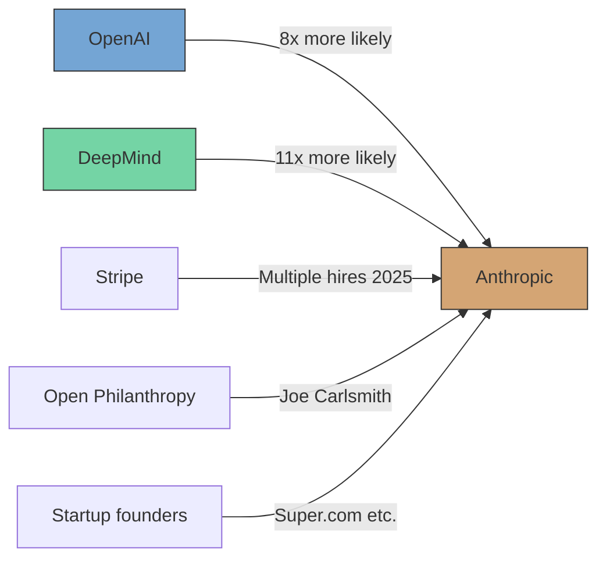
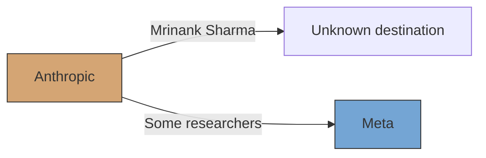

# Anthropic任职变动与人才流动挖掘

> **Source**: Web search (2026-05-26), raw-papers/ (3 papers), research/author-network.md, projects/ (32 files), analysis/ (9 files)
> **Generated**: 2026-05-26 | **Agent**: Researcher (L3 talent movement task)
> **Evidence level**: Web-verified + corpus cross-referenced

---

## 1. Executive Summary

**Anthropic is a net importer of AI talent.** In 2025, OpenAI engineers were 8x more likely to leave for Anthropic than the reverse; DeepMind engineers 11x more likely to join Anthropic ([Fortune, Jun 2025](https://fortune.com/2025/06/03/openai-deepmind-anthropic-loosing-engineers-ai-talent-war/)). The dominant narrative is talent flowing *into* Anthropic, not out.

**Self-evolution relevance**: Anthropic's research directly impacts the agent self-evolution field through:
- Agent Skills system (Barry Zhang, Mahesh Murag)
- Alignment Science team (Jan Leike, co-lead)
- Constitutional AI / RLAIF lineage (Yuntao Bai, Ethan Perez, Chris Olah)
- Multi-agent research system (published Jun 2025)
- Claude Code as the de facto agent evolution platform

---

## 2. Key Personnel Map

### 2.1 Founders (All ex-OpenAI)

| Person | Role | Previous | Trajectory |
|--------|------|----------|------------|
| **Dario Amodei** | CEO | VP of Research, OpenAI | Stable. Public voice on AI safety + self-improvement timeline (60% chance by 2028) |
| **Daniela Amodei** | President | VP of Operations, OpenAI | Stable. Drives company operations and growth |
| **Chris Olah** | Co-founder, Interpretability | OpenAI interpretability lead; Google Brain | Active. Leads interpretability research. Dario highlighted him in "The Urgency of Interpretiability" essay. Participated in Vatican AI event with Pope Leo XIV |
| **Jack Clark** | Co-founder | OpenAI communications/policy | Active. Co-author of Import AI newsletter. Predicted 60%+ probability of AI fully autonomously training its next generation by end of 2028 |
| **Jared Kaplan** | Co-founder | Professor, Johns Hopkins | Active. Scientific advisor |
| **Tom Brown** | Co-founder | OpenAI | [UNVERIFIED current status] |
| **Ben Mann** | Co-founder | OpenAI | [UNVERIFIED current status] |
| **Sam McCandlish** | Co-founder | OpenAI | [UNVERIFIED current status] |

### 2.2 Key Recent Hires (Inbound)

| Person | Role at Anthropic | Previous | Joined | Self-Evolution Relevance |
|--------|-------------------|----------|--------|--------------------------|
| **John Schulman** | Researcher | OpenAI co-founder, ChatGPT/RLHF architect | Aug 2024 | **High** — RLHF pioneer, now focused on alignment and agent research |
| **Jan Leike** | Co-lead, Alignment Science | OpenAI Superalignment team co-lead (with Ilya Sutskever); DeepMind; FHI Oxford | May 2024 | **Very High** — focused on automating AI alignment research; TIME 100 AI 2023 |
| **Joe Carlsmith** | Researcher | Open Philanthropy | Late 2025 | Moderate — AI safety philosophy/policy |
| **Barry Zhang** | Head of Product (prev Member of Technical Staff) | [UNVERIFIED] | Active | **Very High** — led Agent Skills initiative ("Don't Build Agents, Build Skills Instead") |
| **Mahesh Murag** | Engineering Lead (Member of Technical Staff) | [UNVERIFIED] | Active | **Very High** — co-led Agent Skills with Barry Zhang |
| **Super.com founder** | Research/engineering | Founder of Super.com ($200M+ ARR startup) | 2025 | [UNVERIFIED specific role] — joined to work on "safe AGI" |

### 2.3 Notable Departures (Outbound)

| Person | Role at Anthropic | Left | Destination | Context |
|--------|-------------------|------|-------------|---------|
| **Mrinank Sharma** | Head, Safeguards Research Team | Feb 2026 | Unknown (public resignation) | Open letter: "The world is in peril." Work included AI-assisted bioterrorism defense, sycophancy research. Covered by [BBC](https://www.bbc.com/news/articles/c62dlvdq3e3o), [Forbes](https://www.forbes.com/sites/conormurray/2026/02/09/anthropic-ai-safety-researcher-warns-of-world-in-peril-in-resignation/), [The Hill](https://thehill.com/policy/technology/5735767-anthropic-researcher-quits-ai-crises-ads/) |
| **Unknown researchers** | Research | 2025-2026 | Meta | Anthropic lost "some researchers to Meta" per MetaIntro analysis; specific names not publicly confirmed |

### 2.4 Long-Standing Key Researchers (from corpus)

| Person | Role | Corpus Source | Self-Evolution Contribution |
|--------|------|---------------|-----------------------------|
| **Yuntao Bai** | Researcher | research/author-network.md | Constitutional AI — self-critique, revision, RLAIF |
| **Ethan Perez** | Researcher | research/author-network.md | Constitutional AI, preference learning, self-alignment |
| **Chris Olah** | Co-founder | research/author-network.md | Interpretability — understanding model internals as prerequisite for safe self-modification |
| **Amanda Askell** | Researcher | Web search | Claude character/personality design — relevant to agent identity stability |

---

## 3. Organizational Structure (Self-Evolution Relevant Teams)

### 3.1 Alignment Science Team
- **Co-lead**: Jan Leike (joined May 2024 from OpenAI)
- **Focus**: Technical research mitigating risk of catastrophes from advanced AI
- **Key publications**: "Alignment faking in large language models" (with Redwood Research), "Automated Weak-to-Strong Researcher" (future work: improving LM self-evolution)
- **Self-evolution connection**: This team is the closest to self-improvement research within Anthropic's safety framework. Their work on automated alignment research is a form of meta-self-improvement.

### 3.2 Agent Skills Team
- **Lead**: Barry Zhang (Product), Mahesh Murag (Engineering)
- **Key output**: Agent Skills system (launched Oct 2025); `anthropics/skills` repo (140K GitHub stars)
- **Philosophy**: "Don't Build Agents, Build Skills Instead" — modular, composable skill packages that transform general-purpose agents into domain experts
- **Self-evolution connection**: Skills are the context-layer evolution mechanism. Skills accumulate across sessions, enabling progressive agent improvement without weight changes. This is the Harrison Chase "Context Layer" prediction in production.

### 3.3 Interpretability Team
- **Lead**: Chris Olah
- **Focus**: Understanding model internals as prerequisite for safe self-modification
- **Self-evolution connection**: Interpretability provides the "observability" layer that makes self-evolution auditable. Without understanding what's happening inside the model, safe self-modification is impossible.

### 3.4 Safeguards Research Team (Post-Sharma)
- **Previous head**: Mrinank Sharma (resigned Feb 2026)
- **Focus**: AI-assisted threat defense, sycophancy research
- **Self-evolution connection**: Safeguards prevent reward hacking and misaligned self-improvement. Sharma's departure creates a leadership gap in this area.

### 3.5 Multi-Agent Research System Team
- **Published**: Jun 2025 (engineering blog: "How we built our multi-agent research system")
- **Focus**: Multiple Claude agents collaborating for complex research tasks
- **Self-evolution connection**: Multi-agent architecture is the foundation for emergent co-evolution patterns (cf. CORAL, EvoAgentX).

---

## 4. Talent Flow Patterns

### 4.1 Inbound Flow (Anthropic gains)

**Scale**: Fortune reported (Jun 2025) that this is a "one-sided" AI talent war heavily favoring Anthropic. Total US AI talent grew from 88,000 (2024) to 117,400 (2025), +33% YoY ([LinkedIn](https://www.linkedin.com/pulse/what-2025-revealed-future-ai-talent-ocinsights-qohkc)).

### 4.2 Outbound Flow (Anthropic loses)

**Scale**: Very limited. Only one named departure (Sharma) plus unconfirmed reports of losses to Meta. Anthropic appears to have strong retention.

### 4.3 Historical Context: Why People Join Anthropic

Multiple sources confirm the founding narrative:
- Early employees left OpenAI "due to concerns about OpenAI's overly rapid and commercial trajectory" ([X/Twitter](https://x.com/Jukanlosreve/status/1931336525700313514))
- The safety-first mission is the primary attractor
- Controversial employment clause: employees asked whether they'd work for a company that "could go to zero if it's bad for humanity" ([Instagram, Mar 2026](https://www.instagram.com/reel/DVbhBF0ibYj/))

---

## 5. Impact on Self-Evolution Research Direction

### 5.1 Positive Indicators

| Factor | Impact | Evidence |
|--------|--------|----------|
| John Schulman arrival | RLHF expertise deepens alignment + self-improvement research | Schulman built ChatGPT's RL foundation; now at Anthropic focusing on alignment |
| Jan Leike arrival | Automated alignment research accelerates | Leike co-led OpenAI Superalignment; now co-leads Anthropic's Alignment Science |
| Agent Skills launch | Context-layer evolution in production | 140K stars, official skill templates, Claude Code marketplace |
| Net talent import | Research capacity growing rapidly | 80x YoY revenue/usage growth |

### 5.2 Risk Indicators

| Factor | Impact | Evidence |
|--------|--------|----------|
| Sharma departure | Safeguards leadership gap | Head of Safeguards resigned Feb 2026; replacement not confirmed |
| Meta poaching | Potential brain drain to well-funded competitor | Some researchers lost to Meta; Meta on "frenzied hiring spree" ([Forbes](https://www.facebook.com/forbes/videos/1427347138319379/)) |
| No weight-level self-modification research | Ceiling on self-evolution depth | All Anthropic self-improvement is scaffolding-level; no public work on model self-modification |
| Commercial pressure | Safety vs speed tension | Rapid growth (80x) may create pressure to prioritize capability over safety |

### 5.3 Self-Evolution Trajectory Assessment

**Anthropic's self-evolution research is primarily indirect** — they don't have a dedicated "self-evolving agents" team. Instead, self-evolution capability emerges from:
1. **Skills system** — context-layer progressive improvement
2. **Alignment Science** — ensuring self-improvement is safe
3. **Multi-agent systems** — emergent co-evolution infrastructure
4. **Constitutional AI / RLAIF** — self-critique and self-alignment mechanisms

This is architecturally consistent with Harrison Chase's "Context Layer first" prediction: Anthropic is building the harness and context infrastructure for safe self-improvement before tackling weight-level modification.

---

## 6. Cross-Reference with Project Corpus

### 6.1 Anthropic Projects Tracked

| Project | Stars | Self-Evolution Relevance | File |
|---------|-------|-------------------------|------|
| `anthropics/skills` | 140,000 | **Very High** — official skill templates, context-layer evolution | projects/64-anthropic-skills.md |
| `Anthropic/hh-rlhf` | 1,200 | High — RLHF preference data, foundation for self-alignment | projects/44-anthropic-hh-rlhf.md |
| `anthropics/ConstitutionalHarmlessnessPaper` | N/A | High — Constitutional AI self-critique mechanism | projects/llm-self-training-repos.txt |

### 6.2 Papers Referencing Anthropic in raw-papers/

| Paper | How Anthropic Appears | File |
|-------|----------------------|------|
| "The Devil Behind Moltbook" (2602.09877) | "Anthropic" used as philosophical term, not company | raw-papers/2602.09877.md |
| CoEvoSkills (2604.01687) | "Anthropic proposes the concept of skills" — cited as concept originator | raw-papers/2604.01687.md |
| CORAL (2604.01658) | Anthropic kernel engineering task used as benchmark | raw-papers/2604.01658.md |

**Key finding**: No raw-papers/ entries are authored by Anthropic employees. Anthropic's influence is primarily through products (Claude, Skills), benchmarks, and conceptual contributions (Constitutional AI), not through direct paper publications in our corpus.

### 6.3 Author Network Data

From `research/author-network.md` Section 2.10:
- **Anthropic (USA)** listed as an organization node
- Key figures: Yuntao Bai, Ethan Perez, Chris Olah
- Core contribution: Constitutional AI (self-critique, revision, RLAIF)
- Pattern: Safety-oriented self-improvement

From `research/blog-author-profiles.json`:
- Anthropic ranked #1 (Tier S, impact score 135.0) as an organization/source
- Representative works: "Building Effective AI Agents," "Claude's extended thinking," "Developing a computer use model"

---

## 7. Key unanswered questions / [UNVERIFIED]

| Question | Status |
|----------|--------|
| Who replaced Mrinank Sharma as Safeguards head? | [UNVERIFIED] — no public information found |
| Specific names of researchers who left for Meta | [UNVERIFIED] — only general statement found |
| Current size of Alignment Science team | [UNVERIFIED] — Anthropic doesn't publish team sizes |
| Whether John Schulman or Jan Leike are working on agent self-evolution specifically | [UNVERIFIED] — their roles are described as "alignment" and "safety" broadly |
| Barry Zhang and Mahesh Murag's previous affiliations | [UNVERIFIED] — pre-Anthropic backgrounds not found |
| Whether Anthropic has internal research on weight-level self-modification | [UNVERIFIED] — no public information; all published work is scaffolding-level |

---

## 8. Sources

### Web Sources
- [Fortune: OpenAI, DeepMind losing engineers to Anthropic (Jun 2025)](https://fortune.com/2025/06/03/openai-deepmind-anthropic-loosing-engineers-ai-talent-war/)
- [BBC: Anthropic AI safety researcher quits (Feb 2026)](https://www.bbc.com/news/articles/c62dlvdq3e3o)
- [Forbes: Anthropic AI Safety Researcher Quits (Feb 2026)](https://www.forbes.com/sites/conormurray/2026/02/09/anthropic-ai-safety-researcher-warns-of-world-in-peril-in-resignation/)
- [The Hill: AI safety researcher quits Anthropic (Feb 2026)](https://thehill.com/policy/technology/5735767-anthropic-researcher-quits-ai-crises-ads/)
- [Jan Leike personal site](https://jan.leike.name/) — jan@anthropic.com
- [Jan Leike Substack: Musings on the Alignment Problem](https://aligned.substack.com/about)
- [MetaIntro: xAI Talent Exodus 2026](https://www.metaintro.com/blog/xai-talent-exodus-2026-researchers-meta-tml)
- [LinkedIn: AI talent growth 2024-2025](https://www.linkedin.com/pulse/what-2025-revealed-future-ai-talent-ocinsights-qohkc)
- [Anthropic: Multi-agent research system (Jun 2025)](https://www.anthropic.com/engineering/multi-agent-research-system)
- [Anthropic: How AI is transforming work (Aug 2025)](https://www.anthropic.com/research/how-ai-is-transforming-work-at-anthropic)
- [Joe Carlsmith: Leaving Open Philanthropy for Anthropic (Nov 2025)](https://joecarlsmith.com/2025/11/03/leaving-open-philanthropy-going-to-anthropic/)
- [Super.com founder joins Anthropic](https://henrythe9th.substack.com/p/i-left-my-200m-arr-startup-to-build-safe-agi-at-anthropic)

### Corpus Sources
- `research/author-network.md` — Section 2.10, Anthropic key figures
- `research/blog-author-profiles.json` — Anthropic Tier S profile
- `projects/64-anthropic-skills.md` — Agent Skills project card
- `projects/44-anthropic-hh-rlhf.md` — RLHF dataset project card
- `analysis/social-media-resources.md` — 13 Anthropic references
- `analysis/discovery-report-2026-05-25.md` — RSI timeline, lab tracking
- `analysis/star-project-propagation.md` — Skills ecosystem analysis
