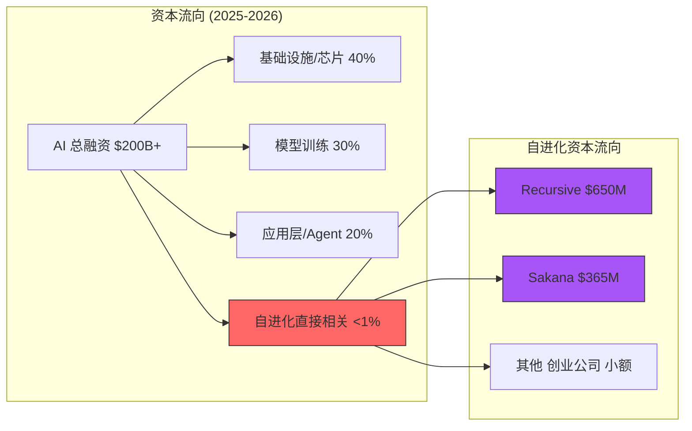
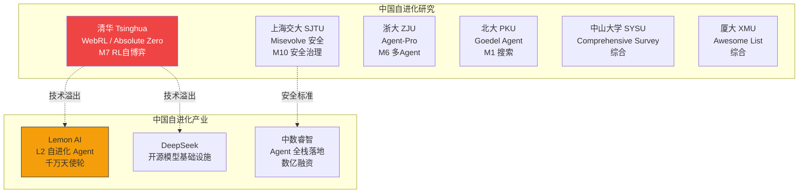

# AI 自进化领域：资本投入、人才供给与利益相关者视角 (2026)

生成时间：2026-05-26
方法：anysearch web search + 现有报告交叉验证
价值等级：⬤⬤⬤⬤⬤ (high — 资本和人才是研究方向可行性的决定因素)
来源：Stanford HAI 2026 AI Index, CEPR DP21293, GV, KORE1, Groundy, 36kr, 证券时报

---

## 1. Executive Summary

自进化 AI 领域面临三个结构性张力：

1. **资本涌入但错配**：2025-2026 年 AI VC 总额 $200B+，但直接投自进化的比例极低。Recursive Superintelligence ($650M) 是唯一例外。
2. **人才管道断裂**：美国国际 AI 研究者流入下降 89%（Stanford 2026），国内博士向学术界而非产业界流动。
3. **中国追赶加速**：Lemon AI 等国产自进化 Agent 获融资，清华/交大博士创办 AI Agent 公司形成新势力。

---

## 2. 资本投入全景

### 2.1 自进化直接相关融资

| 公司/机构 | 类型 | 融资额 | 估值 | 轮次 | 时间 | 自进化关联 | 来源 |
|-----------|------|--------|------|------|------|-----------|------|
| **Recursive Superintelligence** | 创业公司 | **$650M** | **$4.65B** | Seed | 2026-05 | 核心：递归自改进 AI | NYT, GV, SCMP |
| **Sakana AI** | 创业公司 | $365M+ | $2.65B | Series B | 2025-11 | 核心：DGM, AI Scientist, 进化是核心 R&D | sakana.ai |
| **Sierra** | 创业公司 | — | $10B | — | 2025-2026 | 间接：Reflexion 作者 | aifundingtracker |
| **Cursor** | 创业公司 | — | $29B | — | 2026 | 间接：代码 Agent, M4 方向 | 同上 |
| **Lemon AI (宜创科技)** | 中国创业公司 | 千万级 RMB | — | 天使轮 | 2026-05 | **核心：自学习自进化 AGI Agent Level 3** | 36kr |
| **Anthropic** | 实验室 | 巨额 | $40B | 多轮 | 2024-2026 | 核心：Claude Code, SICA, Constitutional AI | 公开报道 |
| **Meta MSL** | 大厂内部 | $100M-$300M/人 | — | 内部 | 2025-2026 | 可能：HyperAgents 延伸 | Wired, CNBC |

### 2.2 行业级资本数据

| 指标 | 数据 | 来源 |
|------|------|------|
| AI 占总 VC 融资比例 | **48%** (2025) | CB Insights |
| 生成式 AI VC 总额 | **$35.3B** (2025) | OECD |
| AI Agent 市场规模 | $5.25B (2024) → $7.84B (2025) | Unicorn Screener |
| AI 总融资 | **$200B+** (2025) | CB Insights |
| AI Agent seed 投资 | **2025 年 top seed 趋势** | Crunchbase |

### 2.3 资本错配分析

**核心发现**：尽管自进化被视为通往 ASI 的路径，资本几乎完全绕过自进化基础设施层。Recursive Superintelligence 是唯一的重大例外——$650M 在 <30 人团队上，反映了"投顶级研究团队"的叙事。

---

## 3. 人才供给管道

### 3.1 全球 AI 研究者供给危机

| 指标 | 数据 | 来源 | 信号 |
|------|------|------|------|
| 美国国际 AI 研究者流入 | **下降 89%** (2017→2026) | Stanford HAI 2026 AI Index | 🔴 危机 |
| 下降集中度 | 80% 的下降集中在 1 年内 | 同上 | 🔴 突变式 |
| 美国未填补 AI 岗位 | **36%** | White House AI Report | 🔴 结构性缺口 |
| AI 人才总缺口 | **>400 万** | White House AI Report | 🔴 |
| 美加 AI PhD 增长 | +22% (2022-2024) | Stanford HAI | 🟢 增长中 |
| PhD 路由倾向 | **→ 学术界** (非产业) | Stanford HAI | 🟡 错配 |
| 初级开发者就业 (22-25岁) | **下降 ~20%** (2024→) | Stanford HAI | 🔴 AI替代 |

### 3.2 人才薪酬与虹吸

| 角色 | 基本工资 | 总包 | 来源 |
|------|---------|------|------|
| AI Research Scientist | $180K-$280K | $300K-$489K+ | KORE1 2026 |
| Top 1% 产业 AI 科学家 | — | 比同级学术 **$1.5M 更高/年** | CEPR DP21293 |
| Meta MSL 高级研究员 | — | **$100M-$300M** (4年) | Wired, CNBC |
| 自进化 L4 研究者 (估计) | — | 显著高于均值 (极度稀缺) | 推断 |

**CEPR 关键发现**：产业 vs 学术薪酬差距自 2001 年扩大 5 倍。研究者流入产业后**发表论文减少但专利增加**——从开放科学向专有创新的系统性转变。

### 3.3 自进化方向人才极度稀缺

| 机制方向 | 全球可用人才 (估计) | 关键人物 | 稀缺度 |
|----------|-------------------|---------|--------|
| **M1 搜索/进化** | ~20 人 | Clune, Hu, Lu, Zhang, Lange | 🔴 极度稀缺 |
| **M4 代码自修改** | ~50 人 | Clune 圈子 + Anthropic + DeepMind | 🟠 稀缺 |
| **M7 RL 自博弈** | ~100 人 | Zhao (Tsinghua), RLVR 研究者 | 🟡 适中 |
| **M10 安全治理** | ~80 人 | Anthropic 安全团队 | 🟠 稀缺 |
| **跨机制通才** | **<5 人** | Clune (M1+M4+M9) 可能是唯一 | 🔴 极度 |

### 3.4 博士培养输出

| 大学/机构 | 输出方向 | 代表人物 | 自进化机制 |
|-----------|---------|---------|-----------|
| **UBC (Clune Lab)** | 开放式进化理论 | Hu (→UCSD→Recursive?), Lu, Zhang | M1, M4 |
| **Tsinghua/LeapLab** | 自博弈 RL | Andrew Zhao (Absolute Zero) | M7 |
| **SJTU** | 自进化安全 | Qian, Chen | M10 |
| **ZJU** | Agent 框架 | Wenqi Zhang | M6 |
| **SYSU** | 自进化 survey | Jinyuan Fang | 综合 |
| **Northeastern** | 语言反馈 | Noah Shinn | M2 |
| **XMU DeepLIT** | 自进化 Agent 理论 | Awesome list 维护 | 综合 |

---

## 4. 中国自进化生态

### 4.1 中国 AI Agent 创业

| 公司 | 创始人/团队 | 融资 | 自进化能力 | 来源 |
|------|-----------|------|-----------|------|
| **Lemon AI (宜创科技)** | 宜博 (清华硕士) + 高宇 | 千万级天使轮 (万界数据+信立泰) | **L3 级自进化 Agent**: 自学习自迭代, Agent Store 社区共享, "对话即进化" | 36kr |
| **中数睿智** | 韩涵 (清华博士→信通院) | 数亿 (多轮) | AI Agent 全栈落地 (央国企) | 新浪财经 |

### 4.2 Lemon AI 自进化机制分析

**价值**: ⬤⬤⬤ — 中国首个公开声称自进化能力的消费级 Agent
**来源**: [36kr](https://36kr.com/p/3467644996048264)

Lemon AI Evolving Agent (2026-08 发布) 的自进化特征：
- **"对话即进化"**：每轮对话自动识别用户需求，长期记忆偏好，持续优化
- **独立 Agent 层**：场景分割使经验/知识/偏好长期留存
- **Agent Store 社区共享**：用户分享训练后的 Agent，新用户复用成熟场景 Know-how
- **开源模型适配**：DeepSeek V3.1, Kimi K2, Qwen 3，推理成本 1/5~1/10

**机制评级**：L2 (Memory Evolution) — 有持久记忆和跨会话适应，但缺少代码自修改或权重更新。用户间共享机制接近 M6 (Multi-Agent Co-Evolution) 的雏形。

### 4.3 中国自进化研究方向分布

---

## 5. 利益相关者视角

| 视角 | 代表 | 核心关注 | 自进化判断 | 资本态度 |
|------|------|---------|-----------|---------|
| **学术界** | Clune (UBC→Recursive), Hu (UCSD), Zhao (Tsinghua) | 开放式进化、理论创新 | 自进化是 ASI 路径 | → 转向创业 (Recursive) |
| **产业研究** | DeepMind, Anthropic, Meta FAIR | 产品化、安全性 | 自进化是产品能力 | 大厂内部投资 |
| **VC** | GV, Greycroft, a16z | 市场规模、团队、退出 | 顶级团队 = 可投资 | 投人不投方向 |
| **芯片公司** | Nvidia, AMD | 算力需求增长 | 自进化 = 算力指数增长 | Recursive 战略投资 |
| **政策界** | Georgetown CSET, White House | 人才留存、安全监管 | 自进化 = 国家竞争力 | 人才管道危机 |
| **中国创业** | Lemon AI, 中数睿智 | 差异化、低成本 | 开源自进化 + 中国市场 | 早期天使 |

### 5.1 GV 投资逻辑 (Recursive Superintelligence)

来源：[GV Blog](https://www.gv.com/news/recursive-superintelligence-self-improving-ai)

GV 的核心判断：
1. "AI is code, and now AI can code" → 自改进循环可以闭合
2. "Category-defining companies are human capital companies" → 投顶级团队
3. Recursive 4 位员工是 DGM 论文共同作者 → 技术传承验证
4. "First goal: train a system with capability of 50,000 PhDs" → 野心级目标
5. Nvidia + AMD 参投 → 算力是自进化的战略资源

### 5.2 学术→产业转移的 CEPR 证据

来源：[CEPR DP21293](http://cepr.org/publications/dp21293)

- 42,000 AI 研究者 20 年追踪数据
- 产业吸引**更年轻**和**外国出生**的研究者
- 流入产业后：论文减少、专利增加（开放科学→专有创新）
- Top 1% 产业科学家薪酬比学术界高 $1.5M/年（2001 年以来扩大 5 倍）
- **对自进化的含义**：知识从开放走向封闭，论文产出被专利取代

---

## 6. Trust Chain

| Claim | Source | Confidence |
|-------|--------|------------|
| 美国国际 AI 研究者流入下降 89% | Stanford HAI 2026 AI Index | ⬤⬤⬤⬤⬤ |
| 36% AI 岗位未填补 | White House AI Report | ⬤⬤⬤⬤ |
| Top 1% 产业 AI 科学家薪酬溢价 $1.5M/年 | CEPR DP21293 (42K researcher tracking) | ⬤⬤⬤⬤⬤ |
| Recursive 首个目标: 50,000 PhD 级系统 | GV Blog | ⬤⬤⬤⬤ |
| 4 位 Recursive 员工是 DGM 共同作者 | GV Blog | ⬤⬤⬤⬤ |
| Lemon AI 自进化 Agent Level 3 | 36kr | ⬤⬤⬤ |
| M1 方向全球 ~20 人 | 从 raw-papers/ 作者推断 | ⬤⬤⬤ |
| 初级开发者就业下降 20% | Stanford HAI | ⬤⬤⬤⬤ |

---

## 7. 已知 vs 推断 vs 未验证

**已知**:
- Stanford 2026 AI Index 的具体数字 (89% 下降, 22% PhD 增长, 20% 初级下降)
- CEPR 的 42K 研究者追踪数据
- Recursive 融资 $650M/$4.65B 和团队构成
- Lemon AI 千万天使轮和产品特征
- Meta MSL $100M-$300M/人包裹和人才回流
- KORE1 薪酬数据

**推断**:
- 自进化资本占比 <1%（基于总融资 vs 自进化融资比较）
- M1 方向全球 ~20 人（从论文作者池推断）
- Recursive 可能导致 UBC/Clune 学术产出下降
- 学术→产业转移正在封闭化自进化知识

**未验证**:
- Recursive 内部具体技术路线
- Lemon AI 实际自进化能力是否达到 L3
- 中国其他自进化创业公司（可能有多家未公开）
- Anthropic 内部自进化团队规模

---

## 引用来源

- [Stanford HAI: AI Index Report 2026](https://hai.stanford.edu/ai-index-report)
- [CEPR DP21293: Attention Is All You Need — Why Universities Are Losing AI Talent](http://cepr.org/publications/dp21293)
- [GV: Recursive Superintelligence](https://www.gv.com/news/recursive-superintelligence-self-improving-ai)
- [KORE1: AI/ML Talent Map 2026](https://www.kore1.com/ai-ml-talent-map-2026/)
- [Groundy: AI Researcher Pipeline Dropped 89%](https://groundy.com/articles/americas-ai-researcher-pipeline-dropped-89-what-the-stanford-index-means-for/)
- [White House AI Report: Talent Shortage](https://comrise.com/cn/news/u-s-white-house-ai-report-talent-shortage-exceeds-4-million/)
- [36kr: Lemon AI 千万天使轮](https://36kr.com/p/3467644996048264)
- [新浪财经: 中数睿智融资](https://finance.sina.cn/tech/2026-04-27/detail-inhvwwmk9150394.d.html)
- [证券时报: AI Agent 商业化](https://www.stcn.com/article/detail/3602925.html)
- [CB Insights: State of AI 2025](https://www.cbinsights.com/research/report/ai-trends-2025/)
- [OECD: VC Investments in AI](https://www.oecd.org/content/dam/oecd/en/publications/reports/2026/02/venture-capital-investments-in-artificial-intelligence-through-2025_3bcb227f/a13752f5-en.pdf)
- [SiliconANGLE: Recursive $650M](https://siliconangle.com/2026/05/13/recursive-superintelligence-raises-650m-build-self-improving-ai-models/)
- [TNW: Recursive](https://thenextweb.com/news/recursive-superintelligence-self-improving-ai-funding)

*Generated by Researcher Agent | Task: h8FxU8Mgf3fx | 2026-05-26*
