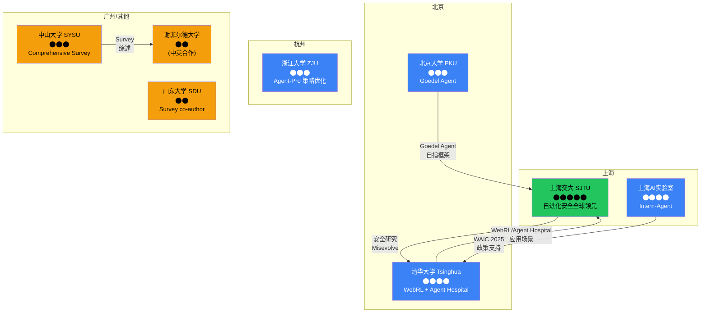

# 中国自进化 Agent 研究团队与趋势

生成时间：2026-05-26
方法：Web 搜索 + raw-papers/ 交叉验证 + 知乎/官网数据
价值等级：⬤⬤⬤⬤ (high — 中国生态独特信号)

---

## 1. Executive Summary

中国自进化 Agent 研究呈现 **学术界驱动 + 产业界跟进** 的模式，与硅谷 **产业界驱动 + 学术界合作** 模式形成对比。关键特征：

1. **4 大高校集群**：SJTU（安全领先）、清华（应用驱动）、浙大（策略优化）、北大（框架创新）
2. **2 大产业力量**：阿里 AgentEvolver（开源框架）、上海AI实验室 Intern·Agent（科学发现）
3. **政府协调**：CAICT 2025年3月联合20+企业发布 Agent 标准术语框架
4. **独特方向**：自进化安全（SJTU）、Agent 医院（清华AIR）、小模型自进化（阿里 7B/14B）

---

## 2. 产业界

### Rank 1: 阿里巴巴 / 通义实验室 — AgentEvolver

**价值**: ⬤⬤⬤⬤⬤ — 中国首个开源自进化 Agent 训练框架
**来源**: [arXiv:2511.10395](https://arxiv.org/html/2511.10395v1), [GitHub](https://github.com/modelscope/AgentEvolver), [VentureBeat](https://venturebeat.com/ai/alibabas-agentevolver-lifts-model-performance-in-tool-use-by-30-using)

| 维度 | 详情 |
|------|------|
| 论文 | AgentEvolver: Towards Efficient Self-Evolving Agent System (Nov 2025) |
| 机构 | Alibaba Group / Tongyi Lab |
| 核心机制 | 自质疑(self-questioning) + 自导航(self-navigating) + 自归因(self-attributing) |
| 关键结果 | 工具使用性能 +30%；7B/14B 小模型可匹敌大模型 |
| 开源 | ModelScope 平台，GitHub 可用 |
| 进化等级 | L3 (闭环自动进化，PPO 训练) |

**洞察**: 阿里的路径是 "小模型自进化"——不依赖 GPT-4 级别大模型，而是让 7B/14B 参数模型通过自生成数据自我改进。这与硅谷偏好大模型进化的路径不同。

### Rank 2: 上海AI实验室 — Intern·Agent

**价值**: ⬤⬤⬤⬤ — 科学发现领域的自进化多 Agent 系统
**来源**: [上海AI实验室](https://www.shlab.org.cn/news/5444184), [arXiv:2505.16938](https://arxiv.org/html/2505.16938v3), [新华网](http://www.news.cn/liangzi/20250730/c7780b4bb3024101a838120fe944d636/c.html)

| 维度 | 详情 |
|------|------|
| 框架 | Intern·Agent（WAIC 2025 发布） |
| 机构 | 上海人工智能实验室 |
| 定位 | 全流程闭环自主科学研究（ASR）多智能体框架 |
| 三大能力 | 生成想法 → 设计方案 → 实验验证 |
| 合作 | 清华AIR 学术报告交流 |
| 进化等级 | L2 (多Agent协作，半自动科研闭环) |

**洞察**: Intern·Agent 将自进化 agent 应用于科学发现领域，类似 AutoResearchClaw 但由中国实验室主导。WAIC 2025 发布，政策支持力度大。

### Rank 3: 字节跳动 Seed

**价值**: ⬤⬤⬤ — 通用智能探索
**来源**: [ByteDance Seed](https://seed.bytedance.com/en/), [RecodeChinaAI](https://recodechinaai.substack.com/p/chinas-three-kingdoms-in-ai-bytedance)

- ByteDance Seed 团队 2023 年成立，聚焦通用智能
- 2026年2月与阿里、DeepSeek 同步发布新模型
- 目前无公开的自进化 agent 专项研究，但资源投入巨大

### Rank 4: 腾讯 / 百度 / 华为

**价值**: ⬤⬤⬤ — 产业参与信号
**来源**: [Stanford DigiChina](https://digichina.stanford.edu/work/lexicon-how-china-talks-about-agentic-ai/), [Financial Content](https://markets.financialcontent.com/wral/article/tokenring-2025-11-25-chinas-tech-titans-unleash-ai-agents-the-next-frontier-in-the-global-innovation-battle)

- CAICT 2025年3月联合腾讯、阿里、华为等 20+ 企业发布 Agent 术语框架
- 腾讯、百度、华为均布局 Agent 平台，但自进化方向尚无公开突破
- 华为在汽车智能驾驶 agent 方向有投入

---

## 3. 学术界

### 高校研究全景

### 详细高校信息

#### 上海交通大学 SJTU — 自进化安全研究全球领先

| 研究者 | 论文 | 方向 | 会议 |
|--------|------|------|------|
| Chen Qian / Weinan Zhang | Your Agent May Misevolve | 自进化涌现风险 | ICLR 2026 |
| Siheng Chen / Yue Hu | EvoMAC | 自进化多Agent软件协作 | 2024 |
| Shuai Shao | Misevolve risks | 自进化安全分析 | ICLR 2026 |

**政府资助**: 上海市"通用人工智能大模型"专项——面向复杂长程任务的智能体调度规划强化学习

#### 清华大学 Tsinghua — 应用驱动的自进化

| 研究者 | 论文 | 方向 | 备注 |
|--------|------|------|------|
| Xiao Liu / Zehan Qi | WebRL (ICLR 2025) | 自进化Web Agent课程RL | THUDM 组 |
| Jing Shao | Misevolve (co-author) | 自进化安全 | 清华参与 |
| AIR | Agent Hospital | AI医生自进化 | WEF 2024 报道 |

**独特优势**: 清华AIR（智能产业研究院）将自进化应用于医疗、生物医药，聂再清教授的 BioMedGPT/ChatDD 项目

#### 浙江大学 ZJU — Agent 策略优化

| 研究者 | 论文 | 方向 | 会议 |
|--------|------|------|------|
| Wenqi Zhang | Agent-Pro | 策略级反思与优化 | ACL 2024 |
| Weiming Lu | 多Agent协作 | Agent 框架 | — |

**独特优势**: Wenqi Zhang 是 ZJU100 青年教授，聚焦 agent 策略级进化

#### 北京大学 PKU — 自指框架

| 研究者 | 论文 | 方向 | 会议 |
|--------|------|------|------|
| Xunjian Yin / Xiaojun Wan | Goedel Agent | 自指递归自改进 | ACL 2025 |
| William Wang (UCSB) | co-author | 跨校合作 | — |

#### 中山大学 SYSU — 综述引领

| 研究者 | 论文 | 方向 |
|--------|------|------|
| Jinyuan Fang | Comprehensive Survey of Self-Evolving AI Agents | 领域标准综述 |

---

## 4. 中国 vs 硅谷：自进化研究差异

| 维度 | 中国 | 硅谷 |
|------|------|------|
| **驱动模式** | 学术界驱动→产业界跟进 | 产业界驱动→学术界合作 |
| **核心方向** | 自进化安全(SJTU)、小模型进化(阿里)、应用场景(清华AIR) | 架构搜索(ADAS)、代码进化(FunSearch)、市场规模 |
| **模型规模** | 7B-14B 小模型自进化(阿里 AgentEvolver) | 大模型(GPT-4o, Gemini)驱动进化 |
| **政策支持** | CAICT标准框架 + 上海市专项基金 + WAIC展示 | 市场驱动，政府间接支持(NSF等) |
| **安全关注** | 高（SJTU Misevolve 全球首个系统性研究自进化风险） | 中（多在安全对齐层面，非自进化特化） |
| **开源程度** | 高（ModelScope/AgentEvolver 开源） | 高（OpenEvolve/DSPy/EvoAgentX 开源） |
| **资本密度** | 中（阿里/字节/腾讯/百度竞争） | 极高（$100M-$200M 级人才争夺） |

---

## 5. 关键趋势

### 5.1 小模型自进化（中国独特路径）

阿里 AgentEvolver 证明 7B/14B 模型通过自生成数据训练可匹敌大模型。这对中国具有战略意义——因为大模型 API 受限（OpenAI/Anthropic 不可用），小模型自进化提供了可行的替代路径。

### 5.2 自进化安全（中国领先）

SJTU 的 "Your Agent May Misevolve" (ICLR 2026) 是全球首个系统性研究自进化 agent 涌现风险的工作。在硅谷大量投入进化能力建设时，中国研究者在风险预防方向建立了先发优势。

### 5.3 应用场景驱动

- 清华 AIR：Agent Hospital（医疗）
- 上海AI实验室：Intern·Agent（科学发现）
- 阿里：工具使用（电商平台 agent）

与硅谷的 "通用能力提升" 路径不同，中国更倾向于从具体应用场景出发构建自进化能力。

### 5.4 政府协调

CAICT 2025年3月联合 20+ 企业发布 Agent 术语框架，显示中国政府正在通过标准化引导产业方向。这与硅谷的自由竞争模式形成对比。

---

## 6. 数据局限

| 维度 | 可靠性 | 说明 |
|------|--------|------|
| 阿里 AgentEvolver | ⬤⬤⬤⬤⬤ | arXiv论文 + GitHub + VentureBeat 报道 |
| 上海AI实验室 Intern·Agent | ⬤⬤⬤⬤ | 官网 + arXiv + 新华网 |
| 高校研究者归属 | ⬤⬤⬤⬤ | raw-papers/ 交叉验证 + 个人主页 |
| 腾讯/百度/华为 | ⬤⬤⬤ | 间接来源，无公开自进化专项研究 |
| 政府政策 | ⬤⬤⬤⬤ | CAICT 公开文件 + 上海市科委公示 |

---

## 7. 建议

1. **追踪 SJTU 安全研究**：自进化安全是中国差异化优势，应纳入论文 paper-drafts/
2. **关注阿里 AgentEvolver 进化**：小模型自进化路径可能更适合中国场景
3. **对标清华 AIR 应用场景**：Agent Hospital 展示了自进化的医疗应用价值
4. **raw-papers/ 补充归属**：建议为所有中文论文补充机构信息

---

*Sources:*
- [arXiv: AgentEvolver (2511.10395)](https://arxiv.org/html/2511.10395v1)
- [GitHub: modelscope/AgentEvolver](https://github.com/modelscope/AgentEvolver)
- [VentureBeat: Alibaba AgentEvolver](https://venturebeat.com/ai/alibabas-agentevolver-lifts-model-performance-in-tool-use-by-30-using)
- [上海AI实验室: Intern·Agent](https://www.shlab.org.cn/news/5444184)
- [arXiv: InternAgent (2505.16938)](https://arxiv.org/html/2505.16938v3)
- [Stanford DigiChina: China Agentic AI Lexicon](https://digichina.stanford.edu/work/lexicon-how-china-talks-about-agentic-ai/)
- [WEF: China AI-Powered Industry Transformation](https://reports.weforum.org/docs/WEF_Blueprint_to_Action_Chinas_Path_to_AI-Powered_Industry_Transformation_2025.pdf)
- [知乎: 自进化智能体综述](https://zhuanlan.zhihu.com/p/1937626679519450682)
- raw-papers/ 交叉验证

*生成 by Researcher Agent | Task: 中国国内团队和趋势 | 2026-05-26*
